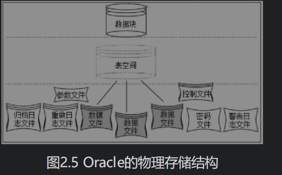
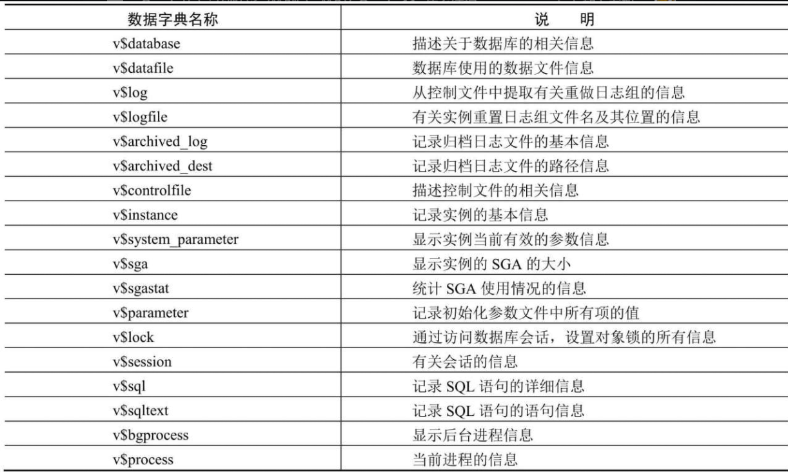

## Oracle 体系结构

> #### 数据库服务器(DataBase Server)
>
> 数据库服务器是指管理数据库的各种软件工具（如SQL*Plus、OEM等）和实例及数据库3个部分
>
>  
>
> #### 数据库实例(DataBase Instance)
>
> 实例是指一组Oracle后台进程以及在服务器中分配的共享内存区域
>
> #### 数据库(DataBase)
>
> 基于磁盘的数据文件、控制文件、日志文件、参数文件和归档日志文件等组成的**物理文件集合**
>
> #### **逻辑存储结构**(面向用户)
>
> > Oracle逻辑存储结构为层次结构,主要由**表空间,段,数据区,数据块**组成
>
> >   
>
> - **数据块(Data Block)**
>
> > Oracle逻辑存储结构最小单元,执行数据库输入输出操作最小存储单位,主要存放表数据,索引数据和族数据  
> >
> > 结构分为
> >
> > 1. 块头(存放数据块物理地址,所属段类型)
> > 2. 表目录(存放表相关信息)
> > 3. 行目录(行地址)
> > 4. 空余空间(用于数据更新,新行插入)
> > 5. 行数据(存放表数据和索引)
>
> - **数据区(Extent数据扩展区)**
>
>   > 连续的数据块构成的存储结构(一个或者多个数据块组成一个数据区),一个或者多个数据区组成一个端(Segment),当段中空间使用完后,Oracle自动为该段扩充数据区
>
> - **段(Segment)**
>
> > 一个或者多个数据区构成,用于**存储表,索引或簇**占用空间的数据对象,一个段只属于特定的数据对象,段内数据区可以不连续,并且可以跨越多个文件
> >
> > - 数据段:保存表中数据记录(以表名字命名)
> > - 索引段:记录存储索引
> > - 回滚段:**保存未提交的操作**
> > - 临时段:使用索引查询的临时空间
>
> - **表空间(TableSpace)**
>
> > 数据库最大逻辑划分区域,通常存放数据表,索引,段. 任何数据对象在创建时必须指定表空间
> >
> > - System  系统表空间,存放Oracle系统内部表和数据字典的数据
>
> #### **物理存储结构**
>
> > 包含数据文件,控制文件,重做日志文件,归档日志文件,参数文件,密码文件,告警日志
> >
> >  
>
> #### **数据字典**
>
> > Oracle 存放关于数据库内部信息的话(用来描述数据库内部的运行和管理情况)
> >
> > 包含
> >
> > - 数据表所有者
> > - 创建时间
> > - 所属表空间
> > - 用户访问权限
> >
> > 在数据库中使用`"_"标识(前缀_后缀)`
> >
> > - dba_ 包含数据库实例的所有对象信息
> > - v$_  当前实例的动态视图
> > - user_  记录用户对象信息
> > - gv_ 系统管理和系统优化使用视图
> > - all_ 记录用户对象授权信息
> >
> >  
> >
> >  
>
> #### **同义词**
>
> > [Oracle](http://lib.csdn.net/base/oracle)的同义词（synonyms）从字面上理解就是别名的意思，和视图的功能类似，就是一种映射关系。本文介绍如何创建同义词语句，删除同义词以及查看同义词语句。
> >
> > 扩展的数据库的使用范围，能够在不同的数据库用户之间实现无缝交互;同义词可以创建在不同一个数据库服务器上，通过网络实现连接。
>
> #### **序列(Sequence)**
>
> > oracle提供的用于产生一系列唯一数字的数据库对象
>
> #### **包**
>
> 建立在存储过程,函数之上,把每个模块的函数与存储过程管理起来,通过包来调用管理存储过程与函数
>
> 

