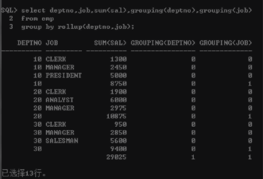
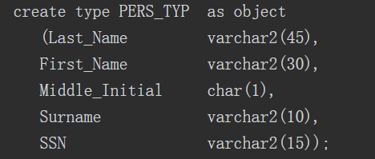

## SQL语言(Structured  Query Language) 

> SQL是Structured Query Language（结构化查询语言）的简称，是用户与数据库交流所需要的标准语言
>
> - **数据查询语言(DQL)** 
>
> > - **函数**
> >
> > > - ASCLL() 与CHA()   ASCLL与字符转换
> > >
> > > - NVL() 替代NULL值
> > >
> > > - || & concat
> > >
> > > - **over() 分析函数(与聚合函数连用,返回某组多行数据)**
> > >
> > >   > partition by 按字段分组
> > >   >
> > >   > order by 按字段排序 (处理空值 nulls last)
> > >
> > >  
> > >
> > >  
> > >
> > >  
> >
> > - #### **条件筛选**
> >
> > > **A {Operator} any (B)  表示A与B中任意一个元素进行operator比较,只要有一个比较值为True,返回该行(exist)**
> > >
> > > **A {operator} ALL (B)  表示A与B中的所有元素进行operator运算符的比较，只有与所有元素比较值都为TRUE，才返回数据行。**
> > >
> > > ~~~sql
> > > -- sal不等于 200,300,760 的行
> > > select * from emp where sal <> all (200,300,760)
> > > ~~~
> > > 
> > >**like 模糊筛选**
> > > 
> > >> % 表示0个或者多个字符
> > > >
> > > > _ 表示一个站位符
> > > >
> > > > 使用转义符 **escape** 实现特殊符转义
> > > >
> > > > ~~~sql
> > > > -- 查询 IT字符开头的数据
> > > > select * from dept_temp where dname like 'IT\_%' escape '\'
> > > > ~~~
> > > 
> > >**IS NULL**
> > > 
> > >> 任何值与NULL比较都为FALSE
> > > 
> > >**单引号与双引号区别**
> > > 
> > >> **双引号: 严格区分字母大小写,并区分关键字**
> > > >
> > > > 单引号: 引用字符串常量
> > 
> >**GROUP BY**
> > 
> >- **ROLLUP**
> > 
> >> group by rollup(A,B,C) 产生分组种类
> > >
> > > - group by A,B,C
> > >
> > > - group by A,B
> > >
> > > - group by A
> > >
> > > - group by NULL
> > >
> > > group by A,rollup(A,B) 产生分组种类
> > >
> > > - group by A,B
> > > - group by A
> > > - group by A,NULL 
> > 
> >- **CUBE**
> > 
> >> group by cube (A,B,C) 产生分组种类
> > >
> > > - group by A,B,C
> > > - group by A,B
> > > - group by A,C
> > > - group by B,C
> > > - group by B,C
> > > - group by A
> > > - group by B
> > > - group by C
> > > - group by NULL
> > >
> > > group by cube((A,B),C)
> > >
> > > - group by A,B,C
> > > - group by A,B
> > > - group by C
> > > - group by NULL
> > 
> >- **GROUPING**
> > 
> >> **与 CUBE 和 ROLLUP 使用 确定统计结构使用的列**
> > >
> > > ~~~sql
> > > -- 使用到显示 1 没有使用显示0
> > > select depton,job,sum(sal),grouping(deptno),grouping(job) from emp 
> > > group by rollup(detno,job)
> > > ~~~
> > >
> > >  
> > 
> >- **GROUPING SETS**
> > 
> >> group by grouping set (A,B,C)
> > >
> > > - group by A
> > > - group by B
> > > - group by C
> > 
> >#### 多表关联查询
> > 
> >> **外连接**
> > >
> > > - LEFT JOIN   
> > > - RIGHT JOIN
> > > - FULL JOIN 完全连接(左连接和右连接去重并集)
> > 
> >> **交叉连接**
> > >
> > > > CROSS JOIN 
> > 
> >**分页查询**
> > 
> >> - **rownum**(**查询时候基于insert排序**,不记录在表中)
> > >
> > >   > 限制返回的记录数  rownum = 1返回1条  **rownum < num 返回前num条数据**
> > >   >
> > >   > 使用别名查询排和分页     
> > >   >
> > >   > ~~~sql
> > >   > -- start =m * n-m  end=m*n   m每页显示条数  第n页数据
> > >   > slect * from (select rownum as index,e.* from table e where rownum <= end ) t t where index > start
> > >   > ~~~
> > >   >
> > >   > rownum不能以任何表的名称作为前缀,不适合排序查询
> > >
> > > - **row_number() over()**
> > >
> > > > 先排序后编码
> > >
> > > - rank() 与dense_rank() 跳跃排序与连续排序
> > >
> > > - **rowId(每行数据唯一标识符,标明数据库中具体物理位置)**
>
> 
>
> - **数据操作语言(DML)**
>
> > - **INSERT 语法**
> >
> >   > Insert into table_name [(column_name)] values()   表达式中可以存在 DEFAULT
> >   >
> >   > Insert into table_name[(column_name)] (selectSubquery) 
> >   
> > - **UPDATE语句**
> >
> > > Update table_name set column_name = express
> > >
> > > *更新字符列或者时间类型是,使用单引号*
> >
> > - **DELETE与TRUNCATE**
> >
> > > TRUNCATE 性能比Delete 高
>
> - **事务控制语言(TCL)**
>
> > - COMMIT
> > - SAVEPOINT (保存点)
> > - ROLLBACK (可以回滚到保存点数据)
>
> - **数据定义语言(DDL)**
>
>  > **表类型**
>  >
>  > - **关系表**
>  >
>  > - **临时表**
>  >
>  >   > 事务级临时表(仅在事务过程中有效,当提交事务后,临时表数据清空)
>  >   >
>  >   > 会话级临时表(数据生命周期仅在连接是有效)
>  >
>  > - **索引组织表**
>  >
>  >   > 以B-TREE方式存储索引列
>  >
>  > - **对象表**
>  >
>  >   >  
>  >
>  > - **外部表**
>  >
>  >   > 允许用户访问的数据源,如文本文件,sql文件(只允许查询)
>  >
>  > - **集群表**
>  >
>  > - **散列集群**
>  >
>  > - __分区表__(范围分区,散列分区及列表分区)   *任何大于2GB的表都考虑对其分区*
>  >
>  > - **分区索引**
>  >
>  > **约束类型**
>  >
>  > > 空值规则  NOT NULL
>  > >
>  > > 唯一列值 UNIQUE
>  > >
>  > > 主键值 PAIMARY KEY
>  > >
>  > > 引用完整值 FOREING KEY (通过其他表值约束该列数据)
>  > >
>  > > 复合内联完整性 ORDER_LINE_ITEM_QTY
>  > >
>  > > 基于触发器完整 CREATE TRIGGER
>  >
>  > **索引**
>  >
>  > > - 唯一索引
>  > > - 非唯一索引
>  > > - 反向键索引(存在123456 反向键索引654321将使用同一个叶键)
>  > > - 基于函数索引
>  > > - 位图索引
>  >
>  > **视图**
>  >
>  > > - 普通视图
>  > >
>  > >   > ~~~sql
>  > >   > -- 定义只读,防止更新该表  Oracle 视图可以更新数据
>  > >   > create view emp_info as select * from employee with read only
>  > >   > ~~~
>  > >
>  > > - 物化视图
>  > >
>  > > 
>
> 
>
>
> >
> > |        数据类型         | 参数             |                             描述                             |
> > | :---------------------: | ---------------- | :----------------------------------------------------------: |
> > |         char(n)         | 1$\le$n$\le$2000 |                     指定**固定字符长度**                     |
> > |       varchar2(n)       | 1$\le$n$\le$4000 |                        可变长的字符串                        |
> > |       number(m,n)       | m$\gt$n          |                       m数字位数 n 小数                       |
> > |          date           |                  |            公元前4712年1月1日到公元4712年12月31日            |
> > |          long           |                  | 可变长字符列，最大长度限制是2GB，**用于不需要作字符串搜索**的长串数据 |
> > |         raw(n)          | 1$\le$n$\le$2000 |   可变长二进制数据，在具体定义字段的时候必须指明最大长度n    |
> > |        long raw         |                  | 可变长二进制数据，最大长度是2GB。Oracle 8i用这种格式来保存较大的图形文件或带格式的文本文件，如Miceosoft Word文档，以及音频、视频等非文本文件。 |
> > | blob clob nclob |                  | 用来保存较大的图形文件或带格式的文本文件，如Miceosoft Word文档，以及音频、视频等非文本文件，最大长度是4GB。 LOB有几种类型 |
> >
> > 
> >
> > **简表语句**
> >
> > ~~~sql
> > -- Create table
> > create table ENERGY_REGION
> > (
> > code          VARCHAR2(12),
> > parent_code   VARCHAR2(12),
> > ancestors     VARCHAR2(255),
> > name          VARCHAR2(255),
> > province_code VARCHAR2(12),
> > province_name VARCHAR2(255),
> > city_code     VARCHAR2(12),
> > city_name     VARCHAR2(255),
> > district_code VARCHAR2(12),
> > district_name VARCHAR2(255),
> > town_code     VARCHAR2(12),
> > town_name     VARCHAR2(255),
> > village_code  VARCHAR2(12),
> > village_name  VARCHAR2(255),
> > "level"       INTEGER,
> > sort          INTEGER,
> > remark        VARCHAR2(255)
> > )
> > tablespace SYSTEM
> > pctfree 10
> > pctused 40
> > initrans 1
> > maxtrans 255
> > storage
> > (
> > initial 64K
> > next 1M
> > minextents 1
> > maxextents unlimited
> > );
> > -- Add comments to the columns 
> > comment on column ENERGY_REGION.code
> > is '城市编码';
> > comment on column ENERGY_REGION.parent_code
> > is '父类编码';
> > comment on column ENERGY_REGION.ancestors
> > is '经纬度';
> > comment on column ENERGY_REGION.name
> > is '城市名称';
> > comment on column ENERGY_REGION.province_code
> > is '省级编码';
> > comment on column ENERGY_REGION.province_name
> > is '省级名称';
> > comment on column ENERGY_REGION.city_code
> > is '市区编码';
> > comment on column ENERGY_REGION.city_name
> > is '市区名称';
> > comment on column ENERGY_REGION.district_code
> > is '县级编码';
> > comment on column ENERGY_REGION.district_name
> > is '县级名称';
> > comment on column ENERGY_REGION.town_code
> > is '镇级区划编号';
> > comment on column ENERGY_REGION.town_name
> > is '镇级名称';
> > comment on column ENERGY_REGION.village_code
> > is '村级区划编号';
> > comment on column ENERGY_REGION.village_name
> > is '村级名称';
> > comment on column ENERGY_REGION."level"
> > is '层级';
> > comment on column ENERGY_REGION.sort
> > is '排序';
> > comment on column ENERGY_REGION.remark
> > is '备注';
> > 
> > ~~~
> >
>
> - **数据控制语言(DCL) 权限控制**
>
> 
