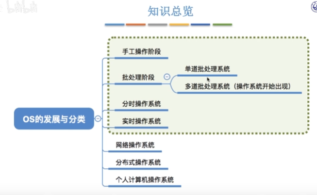

## 操作系统概述

- #### 操作系统功能与特性

>**操作系统定义**：负责管理计算机硬件资源，并为应用程序提供一个统一的接口
>
>操作系统功能：进程，存储，文件，设备，用户接口
> 
> 操作系统特性：并发，共享，虚拟，安全可靠，可扩展
#### **操作系统发展**

>  
>
> 1. 手工操作阶段（用户独占全机，资源利用率极低）
> 2. 批处理阶段
>    - 单道批处理系统（新存储技术磁带引用）
>    - 多道批处理系统（读入多道程序，使用**中断技术**，**操作系统**，无人机交互功能，响应用户时间长）
> 3. 分时操作系统（以时间片轮询方式服务，提供终端控制作业执行）
> 4. 实时操作系统（在严格时间内完成）

**操作系统结构**

> 1. 整体式结构
>    - 将整体划分为模块，模块之间相互调用（组合）
> 2. 层次式结构
>    - 使用置顶向上或者向下设计功能层级，**只有相邻层级**之间存在依赖
> 3. 微核（客户/服务器)
>    - 运行内核
>    
>    - 以客户，服务器方式进行的进程

