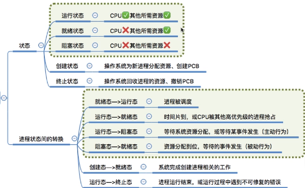
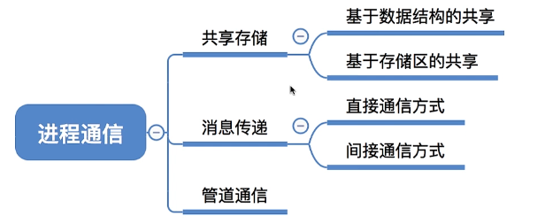
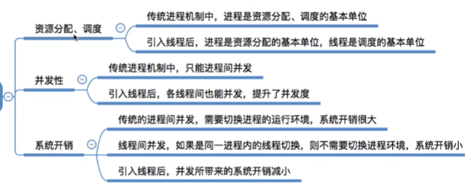
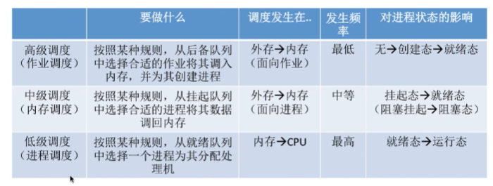

## 进程与线程

- #### **全驱图定义**

> *前驱图是一个有向无循环图，图中的每个结点可用于表示一条语句、一个程序段或进程；结点间的有向边表示在两结点之间存在的偏序或前驱关系“→”，→={（Pi，Pj）|Pi必须在Pj开始前完成}。如果（Pi，Pj）∈→，可写成Pi→Pj，称Pi是Pj的前驱，而Pj是Pi的直接后继*
>
> eg：
>
> P1→P2，P1→P3，P1→P4，P2→P5，P3→P5，P4→P6，P5→P7，P6→P7
>
>  

- #### **程序执行**

> **程序：指令序列，程序段与数据段**
>
> 1. 处理机的操作严格按程序规定的顺序执行，即只有前一操作结束后才能执行后继操作
> 2. 程序执行的封闭性。程序独占全机资源，因而机内各资源的状态（除初始状态外）只有本程序才能改变。程序一旦开始运行，**其执行结果不受外界因素的影响**
> 3. 程序执行结果的确定性。程序执行的结果与它的执行速度无关，任何都不会影响得到最终结果
> 4. 程序结果的可再现性。

- #### **程序并发执行**

> 并发执行的程序特征
>
> 1. 程序执行间断性（多个执行任务存在相互等待资源）
> 2. 程序执行失去封闭性（多个执行任务存在相互影响）
> 3. 程序结构不可再现性
> 4. 程序和计算不再对应

- #### **进程**

> **程序段（指令序列），数据段（程序数据），PCB组成进程，PCB是进程存在的唯一标识**
>
> 1. 进程是程序的一次执行过程
> 2. 进程是程序和数据在处理机上**顺序执行时发生的活动**
> 3. 进程具有独立功能的程序在数据集合上**运行的过程**，是**系统进行资源分配和调度的独立单位**
>
> ---
>
> **PCB组成（操作系统所需的数据都在PCB中)**
>
> 1. 进程描述信息（操作系统分配PID，用户标识符UID）
> 2. 进程控制和管理信息（进程当前状态，进程优先级）
> 3. 资源分配清单
> 4. 处理机相关信息（寄存值，进程切换环境值）
>
> ---
>
> **进程组织方式**
>
> 1. 链接方式
>
>    > **按进程状态**将PCB分为多个队列
>    >
>    > 操作系统持有各个队列的指针
>
> 2. 索引方式
>
>    > 根据进程状态不同，建立几张索引表
>    >
>    > 操作系统持有各个索引表的指针
>
> ---
>
> **进程特征**
>
> 1. 动态性（一次执行，具有生命周期）
> 2. 并发性
> 3. 独立性（**独立运行的基本单位，同时也是系统中独立获得资源和独立调度的基本单位**）
> 4. 异步性（执行不可见）
> 5. 结构性
>
 #### **进程状态与转换**
>**进程三种基本状态**
>
>
>1. 就绪（当前进程已分配**除处理机以外所有必要的资源**）
>2. 执行（占有CPU）
>3. 阻塞（**进程因某种事件而暂停执行状态**）
>
> 
>
>- 执行->就绪状态（通常出现在分时系统中，正在执行的进程时间片用完被暂停）
>- 阻塞->就绪状态（阻塞进程不能直接运行，需要重新获得处理器执行权）
>
>**五状态进程模型**（在基本状态下进一步划分)**
>
>1. 创建（New）操作系统分配系统资源，初始化PCB
>2. 就绪（Ready）
>3. 运行（Run）
>4. 阻塞（Blocked）
>5. 结束（Exit）*回收除进程控制外其他资源*
>
>---
>
>**进程状态转换**
>
> 
>
>1. 运行态到阻塞态（进程主动行为，*进程进行系统调用或请求等待某个事件发生*）
>2. 阻塞态到就绪态（被动唤醒）
>
> 
>
>---
>
>**七状态进程模型（将就绪和阻塞进一步细分）**
>
> 
>
> 
>
>**进程状态**
>
>1. 就绪（Ready） 进程在内存且可以立即进入执行状态
>2. 阻塞（Blocked）**进程在内存等待事件出现**
>3. 阻塞挂起(Suspend) **进程在外存并等待事件出现**
>4. 就绪挂起 （**进程在外存**，需要进入内存执行）
>
>**进程状态转换**
>
>- **挂起（把进程从内存转到外存）**
>- **激活（把进程从外存载入内存）**
>- **事件出现（中断当前进程）**
>- **提交**（完成一个新进程创建过程，新进程进入就绪状态）
>
>**进程挂起场景**
>
>1. 终端用户进程调试（执行状态暂停）
>2. 父进程修改子进程，或挂起自己的子进程
>3. 操作系统优化
>4. 进程对换（缓解内存紧张，将内存中阻塞进程转至外存）
>5. 负载调节
 #### **进程控制**
>进程控制：操作系统对所有进程实现有效管理，具有创建，销毁，进程状态转换功能
>
>原语：操作系统核心，由多条指令组成的指令序列，用来实现特定的操作功能。**指令序列为原子操作**
>
>​	*系统调用：可以在目态下执行，对比原语，原语具有不可中断操作*	
>
>**进程控制相关原语**
>
>> 1. 更新PCB中信息
>>
>>    > a. 将所有的进程控制原语一定都会修改进程状态标志
>>    >
>>    > b. 剥夺当前运行进程的CPU使用权（保存当前运行环境）
>>    >
>>    > c. 某进程开始运行前恢复之前运行环境
>>
>> 2. 将PCB插入合适的队列
>>
>> 3. 分配回收资源
>
>- **创建原语**（申请PCB，为新进程申请分配资源，初始化PCB，将PCB插入就绪队列）
>
>  > 1. 用户登录（创建新线程）
>  > 2. 新作业放入内存
>  > 3. 提供新服务
>  > 4. 应用请求
>
>- **撤销原语**（从PCB集合中找到终止的PCB，进程执行则剥夺CPU权限，终止所有的子线程，将进程拥有的资源归还父类进程或操作系统，删除PCB）
>
>  > 1. 进程正常结束
>  > 2. 异常结束
>  > 3. 外界干预
>
>- **阻塞原语**
>
>  > 1. 运行进程等待系统分配的资源
>  > 2. 需要其他进程通讯，等待其他进程执行
>
>- **唤醒原语**
>
>  > 1. 阻塞进程等待时间发生
>
>---
>
>**UNIX操作系统进程创建操作 fork**（父类进程通过fork函数创建子线程）
>
>  1. 为子进程创建proc结构（进程描述符）
>  2. 赋值唯一标识PID
>  3. 以一次一页方式复制父进程用户地址空间
>  4. 获得子进程继承共享资源指针
>  5. 子线程就绪，加入就绪队列
>  6. 子线程返回标识符0，向父进程发回子进程的PID
>
>---
>
> *子进程得到与父进程**用户地址空间相同的副本***，子进程与父进程唯一的区别在于不同的PID
>
>- exec函数为**父进程运行不同于子线程的代码**
> 1. 在父线程中装入新的程序代码，数据，堆和栈
> 2. 保存进程ID与父进程ID等
> 3. 继承控制终端
> 4. 保留所有文件信息
>
>---
>
>UNIX中**父类进程与子类进程是异步**的，父类进程可能早于子类进程结束，会导致子进程的资源，内存无法返回父进程，引起内存泄漏，wait函数父类进程用来获取子进程的结束状态并回收资源。**父类进程调用wait函数阻塞自身**，等待子进程结束信号唤醒父类进程收回子进程资源。子进程先于父类进程结束，子进程会继续占有部分资源，直到**父类进程执行wait函数收回**（父进程不用阻塞）

#### **进程通讯**

> 进程之间数据交换**（各进程拥有的系统资源不共享）**
>
>  
>
> **共享存储**
>
> > 两个进程**共享一个存储空间**（两个进程对**共享空间的访问必须是互斥**的，由操作系统同步互斥工具实现）
> >
> > 基于数据结构共享：存储方式慢，限制多
> >
> > 基于存储器的共享：存放的位置由共享的进程控制（代码控制）
>
> **管道(pipe)**
>
> > **管道：**用于连接读写进程的一个**共享文件(内存种类开辟固定大小的缓存区)**，并且某时间段内，只能单向传输，如果双向传输，需要设置两个管道。
> >
> > **进程间对管道访问互斥**，数据以直接流方式写入管道，管道**写满**时系统对写**进程阻塞**，等读进程将管道数据**完全取走后**，**管道变空**，读进程将被系统阻塞，并唤醒写进程。**读写进程最多只能有一个**
>
> **消息传递**
>
> > 进程间的数据以**格式化的消息**为单位，通过**操作系统的发送/接收原语**进行数据交换
> >
> > **格式化消息**
> >
> > 1. 消息头（发送进程ID，接收进程ID，消息类型，消息长度）
> > 2. 消息体
> >
> > **消息传递**
> >
> > 1. 直接（消息直接挂到接收进程的**消息缓存队列上**）
> > 2. 间接（中间实体转发）

#### **线程**

>  
>
> 1. **进程是操作系统资源分配的最小单位**
> 2. **线程是CPU调度的基本单位**
>
> ---
>
> **线程属性**
>
> > 1. 线程ID，线程控制块TCP
> > 2. 线程运行状态（就绪，阻塞，运行）
> > 3. 线程不拥有系统资源
> > 4. **同一进程下的不同线程共享进程资源**
> > 5. 共享内存地址空间，同一进程下的线程通讯不需要操作系统干预
> > 6. 切换进程，系统开销大
>
> ---
>
> **线程实现方式**
>
> > - **用户线程（ULT)**
> >
> >   > 用户线程由应用程序通过线程库实现（目态，无需操作系统干预），由程序控制线程切换，调度，状态
> >
> > - **内核线程(KLT)**
> >
> >   > 内核级线程管理工作由操作系统内核完成（调度，切换）
> >
> >   
> >
> >   在同时支持用户线程和内核线程系统中，将n个用户线程映射到m个内核系统线程上（n>=m)，则执行过程中以内核线程为调度单位
> >
> >    
>
> ---
>
> **多线程模型**
>
> - **多对一模型**：**多个用户线程映射到一个内核级线程上**（**每个用户进程只对应一个内核级线程**）
>
>   > 优点：用户线程的切换在用户空间即可完成，不需要切换到核心态，线程管理的系统开销小，效率高
>   >
>   > 缺点：当一个用户级线程被阻塞后，整个进程都被阻塞，并发度不高，多线程不可以在多核处理机上执行
>
> - **一对一模型：** 用户线程与内核线程一一映射
>
>   > 优点：线程阻塞后，其他线程可以继续执行，并发强，可以在多核处理机上并行执行
>   >
>   > 缺点：一个**用户进程**会占用多个内核级线程。线程切换由操作系统控制（管态执行），线程管理成本高，开销大
>
> - **多对多模型**

#### **进程调度**

> **处理机调度概念：**从就绪队列中按照一定的**算法**选择一个进程并将**处理机分配给它运行**。
>
> **作业调度：**
>
> > 按照一定原则**从外存上处于后备队列的作业**中挑选多个作业为其分配资源，并建立相应的进程（PCB），是它们获得竞争处理机的权利。（外存调入内存作业，**并每个线程只调用一次**）
>
> **内存调度：**
>
> > 将暂时不能运行的进程调到外存中等待（提高内存利用率和吞吐量），**暂时调到外存等待的进程状态为挂起状态（PCB并不会一起调入外存，存放在内存挂起队列中）**，**将处于挂起状态的进程重新调入内存执行（发生多次）**
>
> **进程调度：**
>
> > **从就绪队列中按照某种算法获取进程执行**
>
>  
>
> **进程调度（低级调度）的时机**
>
> > **主动放弃：**
> >
> > 1. 进程正常终止
> > 2. 运行过程中发生异常终止
> > 3. 进程主动请求阻塞（I/O等待）
> >
> > **被动放弃：**
> >
> > 1. 时机片用完（运行变就绪）
> > 2. 中断处理
> > 3. 更高优先级进程
> >
> > **不能进行进程调度和切换时机**：
> >
> > 1. 中断处理过程
> >
> > 2. 进程在操作系统**内核程序临界区**中
> >
> >    > 临界区：一个时间段内只允许一个进程使用的资源，各进程需要互斥访问临界资源
> >    >
> >    > 内核临界区：访问内核数据结构（进程的就绪队列和PCB）
> >
> > 3. 在原子操作过程中（原语）
>
> **进程调度方式**
>
> > - 非剥夺调度方式（非抢占式）
> >
> >   > **只允许进程主动放弃当前处理机，其他进程等待该进程执行**
> >
> > - 剥夺调度方式（抢占式)
> >
> >   > 根据进程优先级执行（立即暂停正在执行的进程，将处理机分配给优先级高的进程)
> >
> > -  **进程切换与过程**
> >
> >   > 进程调度：从就绪队列中选择一个运行进程
> >   >
> >   > 进程切换：正在运行的进程让出处理机，由另外一个进程占用处理机过程
> >   >
> >   > *进程切换有代价，过于频繁的进程调度，切换，必然使整个系统的效率降低*
>
> - **进程调度算法**
>
> > **调度算法指标**
> >
> > 1. CPU利用率
> >
> >    > $利用率= \frac{忙碌时间}{总时间}$
> >
> > 2. 系统吞吐量（单位时间完成作业数量）
> >
> >    > $系统吞吐量 = \frac{总共完成作业}{总时间}$
> >
> > 3. 周转时间(作业提交系统到作业完成所用时间)
> >
> >    > 周转时间 = **作业调度时间+进程调度时间+内存调度时间**
> >    >
> >    > 平均周转时间 = $\frac{各作业周转时间之和}{作业数}$
> >    >
> >    > 平均带权周转时间 = $\frac{带权周转时间之和}{作业数}$    带权指的是运行时间
> >    >
> >    > 带权周转时间 = $\frac{作业周转时间}{作业实际运行时间}$ > 1
> >
> > 4. 等待时间(**进程等待处理机状态时间之和**)
> >
> >    > 对于进程：**等待时间就是只的是进程创建后等待被服务的时间和**
> >    >
> >    > > 进程等待时间 = 周转时间-运行时间-阻塞时间
> >    >
> >    > 对于作业：**包含创建进程等待时间和作业等待时间**
> >
> > 5. 响应时间(用户提交请求到首次产生响应所用的时间)
> >
>
> **调度算法**
>
> - **FCFS（先来先服务）**
>
>   >  
>   >
>   > 以等待时间为维度进行优化
>
> - **SJF（短作业优先，要求运行时间短）**
>
>   > 非抢占式：
>   >
>   > ​		短作业、进程优先调度算法，每次调度时选择**当前已到**达且**运行时间最短**的作业进程执行
>   >
>   > 抢占式（SRTN）：最短剩余时间优先算法
>   >
>   > ​		每当有进程加入就绪队列时判断**新进程的运行时间比当前运行的进程剩余时间小则被抢占**
>   >
>   >   
>   >
>   > 以执行时间最短为维度优化 
>
> - **HRRN（高响应比优先）**
>
>   > 响应比 = $\frac{等待时间+要求服务时间}{要求服务时间}$
>   >
>   > 非抢占式算法：执行进程主动放弃处理机时，计算响应比
>   >
>   >  
>
>    
>
> 

 #### **Linux进程与进程管理**
>
> linux 进程控制块结构使用task_struct表示，定义在文件 include\linux\seched.h中
>
> 1. 进程状态（运行，等待，暂停，僵死）
> 2. 进程调度信息
> 3. 进程标识PID，组标识GID（访问文件系统和设备使用）
> 4. 内部通信信息（消息队列，信号量，共享内存）
> 5. 进程指针（父子进程，兄弟进程之间关系）
> 6. 时钟信息
> 7. 文件系统
> 8. 虚拟存储（进程内存空间分配信息）
> 9. 进程上下文（记录进程现场必要信息）
>
> **进程调度**
>
> 普通进程与实时进程
>
> TODO
