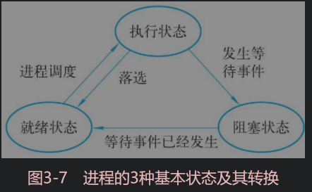
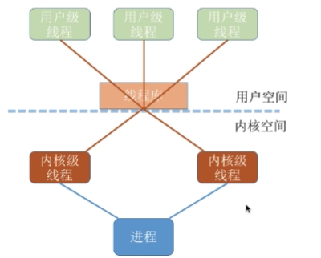

## 进程与线程

- #### **全驱图定义**

> 前驱图是一个有向无循环图，图中的每个结点可用于表示一条语句、一个程序段或进程；结点间的有向边表示在两结点之间存在的偏序或前驱关系“→”。
>
>  
>
> eg：
>
> P1→P2，P1→P3，P1→P4，P2→P5，P3→P5，P4→P6，P5→P7，P6→P7

- #### **进程**

> 并发与并行：
>
> - 并发：允许多个任务同时执行，但它们由同一处理单元同时执行
> - 并行：允许多个任务同时执行，并且它们由不同的处理单元（例如多个处理器）同时执行
>
> 进程：操作系统进行资源分配和调度的基本单位，进程是正在运行的程序实例。实现并发、资源共享、程序执行的基础单元。
>
> 进程性质：
>
> - 独立的内存空间（其他进程无法直接访问）
>
> - 并发执行
>
> - 动态变换（创建、执行、暂停、恢复、终止）
>
> - 资源拥有者（计算机资源申请和使用者）
>
> - 优先级与调度
>
> - 异步
>
>   
>
> **进程结构（PCB）**
>
> - 进程标识符（PID）
> - 状态（运行、就绪、等待、停止）
> - 优先级
> - 堆栈指针
> - 指令指针
> - 文件描述符
> - 计时信息
> - 进程队列
>
> 
>
> **进程组织方式**
>
> 1. 线性
>
> 2. 链接方式
>
>    > **按进程状态**将PCB分为多个队列
>    >
>    > 操作系统持有各个队列的指针
>
> 3. 索引方式
>
>    > 根据进程状态不同，建立几张索引表
>    >
>    > 操作系统持有各个索引表的指针
>
 #### **进程状态与转换**
>**进程三种基本状态**
>
>
>1. 就绪（进程驻留在内存中，等待 CPU 执行）
>2. 执行
>3. 阻塞（**进程因某种事件而暂停执行状态**）
>
> 
>
>
>
>**五状态进程模型**（在基本状态下进一步划分)**
>
>1. 创建（New）操作系统分配系统资源，初始化PCB
>
>2. 就绪（Ready）
>
>3. 运行（Run）
>
>4. 等待（Blocked）
>
>5. 结束（Exit）回收除进程控制外其他资源
>
>   
>
>**进程状态转换**
>
> 
>
>
>
>**七状态进程模型（将就绪和阻塞进一步细分）** 
>
> 
>
>**进程状态**
>
>1. 就绪（Ready） 进程在内存且可以立即进入执行状态
>2. 阻塞（Blocked）**进程在内存等待事件出现**
>3. 阻塞挂起(Suspend) **进程在外存并等待事件出现**
>4. 就绪挂起 （**进程在外存**，需要进入内存执行）
>
>**进程状态转换**
>
>- **挂起（把进程从内存转到外存）**
>- **激活（把进程从外存载入内存）**
>- **事件出现（中断当前进程）**
>- **提交**（完成一个新进程创建过程，新进程进入就绪状态）
>
 #### **进程控制**
>进程控制：创建，撤销，阻塞。唤醒
>
>原语：一种由若干条机器指令构成的、用于完成特定功能的不可中断的过程。它是操作系统提供给用户的最底层、最基本的系统调用接口。
>
>原语特性：
>
>1. 互斥访问：确保多个进程或线程无法同时访问共享资源
>
>2. 同步：进程或线程之间的通信，确保有序和一致的执行
>
>3. 内存管理：控制对物理内存的访问，分配和释放内存块
>
>   
>
>**进程控制相关原语**
>
>- **创建原语**（申请PCB，为新进程申请分配资源，初始化PCB，将PCB插入就绪队列）
>  1. 创建新线程
>  2. 新作业放入内存
>  3. 提供新服务
>  4. 应用请求
>- **撤销原语**（从PCB集合中找到终止的PCB，进程执行则剥夺CPU权限，终止所有的子线程，将进程拥有的资源归还父类进程或操作系统，删除PCB）
>  1. 进程正常结束
>  2. 异常结束
>  3. 外界干预
>
>- **阻塞原语**
>
>  1. 运行进程等待系统分配的资源
>  2. 需要其他进程通讯，等待其他进程执行
>
>- **唤醒原语**
>
>  阻塞进程等待时间发生
>
>  
>
>**Unix中Fork函数**：创建子进程
>
>1. 主要用于创建新的进程，从而实现并发或并行操作
>2. 子进程有自己独立的进程 ID、进程组 ID 和内存映射
>3. 共享父进程数据和资源
>
>UNIX中**父类进程与子类进程是异步**的，父类进程可能早于子类进程结束，会导致子进程的资源，内存无法返回父进程，引起内存泄漏，wait函数父类进程用来获取子进程的结束状态并回收资源。**父类进程调用wait函数阻塞自身**，等待子进程结束信号唤醒父类进程收回子进程资源。子进程先于父类进程结束，子进程会继续占有部分资源，直到**父类进程执行wait函数收回**（父进程不用阻塞）

#### **进程调度**

> 作业：用户提交给操作系统的程序或任务，是一个完成特定计算任务的逻辑实体
>
> **处理机调度概念：**从就绪队列中按照一定的**算法**选择一个进程并将处理机分配给它运行。
>
> **作业调度**：从外存上处于后备队列的作业中挑选多个作业为其分配资源，并建立相应的进程（PCB），是它们获得竞争处理机的权利。
>
> **内存调度：**将暂时不能运行的进程调到外存中等待（提高内存利用率和吞吐量），暂时调到外存等待的进程状态为挂起状态（PCB并不会一起调入外存，存放在内存挂起队列中）**，**将处于挂起状态的进程重新调入内存执行
>
> **进程调度**：从就绪队列中按照某种算法获取进程执行
>
>  
>
> 
>
> 进程调度（低级调度）的时机
>
> - 主动放弃
>
>   1. 进程正常终止
>   2. 运行过程中发生异常终止
>   3. 进程主动请求阻塞（I/O等待）
> - 被动放弃
>     1. 时机片用完（运行变就绪）
>      2. 中断处理
>      3. 更高优先级进程
>
> - 不能进行进程调度和切换时机
>
>   1. 中断处理过程
>
>   2. 进程在操作系统内核程序临界区中
>
>   3. 在原子操作过程中（原语）
>
> **进程调度方式**
>
> - 非剥夺调度方式（非抢占式）
>
>    只允许进程主动放弃当前处理机，其他进程等待该进程执行
>
> - 剥夺调度方式（抢占式)
>
>   根据进程优先级执行（立即暂停正在执行的进程，将处理机分配给优先级高的进程)
>
> - 进程切换与过程
>
>   进程调度：从就绪队列中选择一个运行进程
>
>   进程切换：正在运行的进程让出处理机，由另外一个进程占用处理机过程
>
>   进程切换有代价，过于频繁的进程调度，切换，必然使整个系统的效率降低
>
> 
>
> **进程调度算法**
>
> - **调度算法指标**
>
>   1. CPU利用率：$利用率= \frac{忙碌时间}{总时间}$
>
>   2. 系统吞吐量：单位时间完成作业数量，$系统吞吐量 = \frac{总共完成作业}{总时间}$
>
>   3. 周转时间：作业提交系统到作业完成所用时间
>
>      - 周转时间 = **作业调度时间+进程调度时间+内存调度时间**
>
>      - 平均周转时间 = $\frac{各作业周转时间之和}{作业数}$
>
>      - 平均带权周转时间 = $\frac{带权周转时间之和}{作业数}$​    带权指的是运行时间
>
>      - 带权周转时间 = $\frac{作业周转时间}{作业实际运行时间}$​​ > 1
>
>   4. 等待时间：进程等待CPU执行的时间
>
>      - 对于进程：等待时间就是只的是进程创建后等待被服务的时间和
>      - 对于作业：包含创建进程等待时间和作业等待时间
>      - 进程等待时间 = 周转时间-运行时间-阻塞时间
>   
>   5. 响应时间(用户提交请求到首次产生响应所用的时间)
>   
>      
>
> **调度算法**
>
> - **FCFS（先来先服务）**
>
>   >  
>   >
>   > 以等待时间为维度进行优化
>
> - **SJF（短作业优先，要求运行时间短）**
>
>   > 非抢占式：
>   >
>   > 短作业、进程优先调度算法，每次调度时选择**当前已到**达且**运行时间最短**的作业进程执行
>   >
>   > 抢占式（SRTN）：最短剩余时间优先算法
>   >
>   > 每当有进程加入就绪队列时判断**新进程的运行时间比当前运行的进程剩余时间小则被抢占**
>   >
>   >  
>
> - **HRRN（高响应比优先）**
>
>   > 响应比 = $\frac{等待时间+要求服务时间}{要求服务时间}$
>   >
>   > 非抢占式算法：执行进程主动放弃处理机时，计算响应比
>   >
>   >  
>
> - **RR(时间轮转)**
>
>   > 抢占式算法，让每个进程在一定**时间间隔**内都可以得到响应。
>   >
>   > 时间片：每个进程都在时间片内完成作业，则RR算法等价于FCFS
>   >
>   >   
>
> - **优先级调度算法**：进程中设置优先级，操作系统根据优先级调度进程
>
>   > 操作系统更偏向I/O型进程，有利于资源利用率，系统吞吐量的提高
>   >
>   >   

#### **进程互斥与同步**

> 临界区：确保在同一时刻只有一个进程访问临界区
>
> 临界区特点：有空让进；无空等待；多个选一，让权等待，有限等待
>
> **进程异步**：各并发执行的进程以各自独立的，不可预知的速度向前推进
>
> **进程同步：** 约束进程执行的顺序
>
> **进程互斥：**在一个时间段内只允许一个进程使用的资源，也叫临界资源（互斥访问）
>
> **实现进程同步方法：**
>
> - 互斥锁
>
> - 信号量PV
>
>   > P：申请资源，V：释放资源
>  >
>   > 互斥操作：当P，V出现在同一个进程，与其他进程互斥
>
> - 条件变量
>
> - 事件
>
> - 管程：模块化，抽象数据结构，信息屏蔽
>
> - 消息传递
>
> - 屏障点
>
> - 中断屏蔽方法
>
> **进程同步模型**
> 
>   - 生产消费模型：生产者和消费者共用缓存区（锁），每次使用时检测缓存区是否为空，为空则消费者等待并唤醒生产者进行生产，缓存区满则生产者等待并唤醒消费者进行消费
>- 读写模型：允许多个进程同时读取文件，并且只允许一个进程进行写操作，当写操作时，所有的读取操作会被阻塞，直到写入操作完成。

#### **进程通讯**

>  
>
> **共享存储**：
>
> - 多个进程访问同一个逻辑内存区域（需要控制进程同步）
>
> **管道/命名管道**
>>
> - 基于文件读写完成进程同步
> 
> **消息队列**
> 
> - 进程间的数据以**格式化的消息**为单位，通过**操作系统的发送/接收原语**进行数据交换
>- 消息格式
>   - 消息头（发送进程ID，接收进程ID，消息类型，消息长度）
>>  - 消息体
> - 消息传递
>   - 直接（消息直接挂到接收进程的**消息缓存队列上**）
>   - 间接（中间实体转发）

#### **进程死锁问题**

> 死锁概念：进程都在等待另一个进程释放锁，导致系统僵死，无法往下执行
>
> 死锁必要条件
>
> 1. 互斥条件：临界值互斥（其他进程进程必须等待该进程释放资源才能使用）
> 2. 占有和等待条件：进程申请其他资源时，保持它已经占有的资源不释放
> 3. 不剥夺条件：占有的资源不能由其他进程抢占
> 4. 循环等待条件：存在一个进程资源的循环等待链
>
> 死锁预防策略：（破坏死锁必要条件，预防死锁发生）
>
> 1. 增加临界资源数量
> 2. 进程申请阻塞后释放占有的资源
> 3. 进程执行时申请到所有的资源
>
> 死锁避免：
>
> 1. 分析安全序列
> 2. 银行家算法：
>    - 记录进程已分配给各个进程的资源数量，以及系统还剩余的资源数量
>    - 当进程请求分配资源时，分析安全序列
>
> 死锁检测与解除
>
> 1. 资源分配图：判定是否存在环路
> 2. 剥夺资源
> 3. 撤销进程

#### **线程**

>  
>
> 1. **进程是操作系统资源分配的最小单位**
> 2. **线程是CPU调度的基本单位**
>
> ---
>
> **线程属性**
>
> 1. 线程ID，线程控制块TCP
> 2. 线程运行状态（就绪，阻塞，运行）
> 3. 线程不拥有系统资源
> 4. **同一进程下的不同线程共享进程资源**
> 5. 共享内存地址空间，同一进程下的线程通讯不需要操作系统干预
> 6. 切换进程，系统开销大
>
> ---
>
> **线程实现方式**
>
> > - **用户线程（ULT)**
> >
> >   > 用户线程由应用程序通过线程库实现（目态，无需操作系统干预），由程序控制线程切换，调度，状态
> >
> > - **内核线程(KLT)**
> >
> >   > 内核级线程管理工作由操作系统内核完成（调度，切换）
> >
> >   
> >
> >   在同时支持用户线程和内核线程系统中，将n个用户线程映射到m个内核系统线程上（n>=m)，则执行过程中以内核线程为调度单位
> >
> >    
>
> ---
>
> **多线程模型**
>
> - **多对一模型**：**多个用户线程映射到一个内核级线程上**（**每个用户进程只对应一个内核级线程**）
>
>   > 优点：用户线程的切换在用户空间即可完成，不需要切换到核心态，线程管理的系统开销小，效率高
>   >
>   > 缺点：当一个用户级线程被阻塞后，整个进程都被阻塞，并发度不高，多线程不可以在多核处理机上执行
>
> - **一对一模型：** 用户线程与内核线程一一映射
>
>   > 优点：线程阻塞后，其他线程可以继续执行，并发强，可以在多核处理机上并行执行
>   >
>   > 缺点：一个**用户进程**会占用多个内核级线程。线程切换由操作系统控制（管态执行），线程管理成本高，开销大
>
> - **多对多模型**

