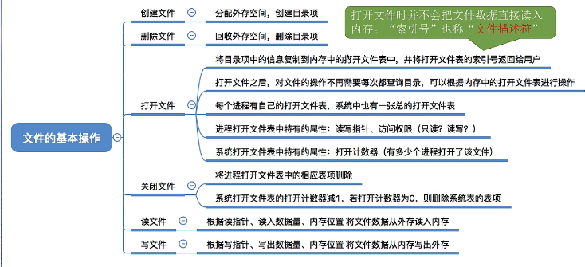
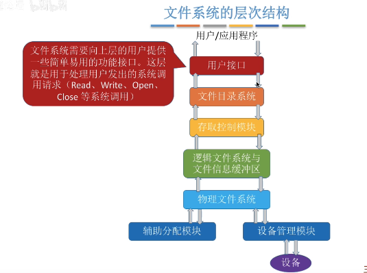

## 文件系统

>   
>
> **文件属性**
>
> - 文件名
> - 标识符：文件标识符，供操作系统识别
> - 类型
> - 位置
> - 大小
> - 创建时间
> - 修改时间
> - 文件所有者
> - 保护信息（权限）
> - 文件共享
> - 文件内容大小不等于占用磁盘空间

#### **文件逻辑结构**

> - **无结构文件（流式文件）**
>
>   文件内部数据由二进制流或字符组成（流式文件），文件数据没有明显的结构特性（无逻辑结构）
>
> - **有结构文件（记录文件）**:由一组相似的记录组成，每条记录有为若干个数据项
>
>   1. 顺序：物理块中可以用顺序存储和链式存储
>
>       
>
>   2. 索引：实现文件随机存取（引起多次寻道次数）
>
>      索引表（记录文件指针，定长记录的顺序文件）
>
>      索引顺序文件（解决索引表太大问题）
>
>   3. 顺序存储：快速写入，高并发性，修改慢，存在文件碎片，索引：快速查找，高效插入和删除，支持复杂查询，实现和维护索引比文件顺序存储更复杂

#### **文件目录**

>  
>
> **文件控制块FCB：** 包含文件基本信息（**文件名，物理地址**，逻辑结构，物理结构），存储控制信息（读写权限，访问用户），使用信息（创建，修改时间）
>
> **目录结构：**
>
> - 单级目录，实现按名存取，不允许文件名重复
>
> - 两级目录结构
>
>   主文件目录（MFD），用户文件目录（UFD） 
>
>   允许不同用户的文件重名，不能对文件分类
>
> - 多级目录结构（树形目录结构）
>
>   读取文件时，磁盘I/O操作与文件所在层级有关，树形目录不便于实现文件共享
>
> **FAT文件系统**：常用于：闪存盘、SD 卡和小型存储设备
>
> - 引导扇区：描述卷的信息
> - 文件分配表：包含使用，为使用区域
> - 根目录

#### **文件存储空间管理**

> **文件卷：** 存储空间划分，将物理磁盘划分为一个个文件卷（逻辑卷），文件卷包含**目录区和文件区**，目录区包含文件目录信息（FCB），用于磁盘存储空间管理信息，文件区存放文件数据。文件卷可以由多个物理盘组成。
>
> **空闲表法：**  记录空闲块的起始位置和空闲块数（连续分配方式）
>
>  
>
> **空闲链表法**
>
> - 空闲盘块链（离散分配）
>
> - 空闲盘区链（空闲块相邻在一起）
>
> - 位示图法（使用二进制位对应磁盘块，0代表磁盘空闲，1表示磁盘被分配）
>
>   > 字号i，位号j表示二维数组中列与行，n为字长， 物理块 = ni+j
>
> - 成组链接法

#### **磁盘的结构**

> 磁盘：使用磁性材料记录二进制数据
>
> 磁道：将磁盘划分一个一个同心圆
>
> 扇区：将磁道划分圆弧扇区，每个扇区存放的数据量相同，最内侧数据密度大
>
>  

#### **磁盘调度算法**

> **磁盘一次读写操作需要的时间**
>
> 1. 寻址时间
>
>    > 启动磁头臂时间 s  移动单个磁道时间m，n为跨越的磁道，**寻道时间 = $T_S = s + m \times n$**
>
> 2. 延迟时间
>
>    > 通过旋转磁盘，使磁头定位到目标扇区所需要的时间  $T_R = \frac{1}{2} \times \frac{1}{r} =  \frac{1}{2r}$  (r为磁盘转速)
>
> 3. 传输时间
>
>    > 从磁盘读出或向磁盘写入数据经历的时间   传输时间$T_t = \frac{1}{r} \times \frac{b}{N} = \frac{b}{rN}$  (r为磁盘转速，b为磁盘读写速度，N为每个磁道上字节数)
>
>    **延迟时间和操作时间无法通过操作系统优化**
>
> **磁盘调度算法**（优化磁盘调度时间）
>
> 1. 先来先服务FCFS
>
>    > 大量进程竞争使用磁盘，请求访问磁道分散，则FCFS性能差，寻道时间长
>
> 2. 最短寻找时间优先 SSTF
>
>    > SSTF优先处理距离当前磁头进的磁道，保证每次寻道的时间最短，可能产生饥饿
>
> 3. 扫描算法SCAN
>
>    > **只有磁头移动到外侧磁道时候才能往内移动** 不会产生饥饿
>    >
>    > Look算法，如果磁头移动方向没有访问的扇区，可以立即改变移动方向
>
> 4. 循环扫描算法（C-SCAN）
>
>    > 磁头朝某个特定方向移动时才处理磁道的访问请求，返回时直接快速移动致起始段（**返回不处理请求**）
>
> **减少磁盘延迟时间方法**
>
> 磁盘物理地址（柱面号，盘面号，扇区号）
>
> 
>
> **RAID技术**：独立磁盘冗余阵列，提高数据可靠性、可用性和性能
>
> - RAID0：数据被分成多个块并分别存储在不同的硬盘上，可以提高读写性能，读写速度最快，无数据冗余
> - RAID1：数据被完全复制到另一个硬盘上，提供了数据冗余，实际可用容量为所有磁盘容量的一半
> - **RAID 5**：数据和校验信息交替存储在多个磁盘上，提供了数据冗余和性能

#### **文件基本操作**

>  

#### **文件共享**

> 基于索引结点的共享方式（硬链接）
>
> 基于符号链的共享方式（软链接）

#### **文件保护**

> 口令保护：用户访问文件时提供口令（口令存放在FCB中）
>
> 加密保护：
>
> 访问控制：ACL访问控制表

#### **文件系统层次结构**

>  
>
>  

  

