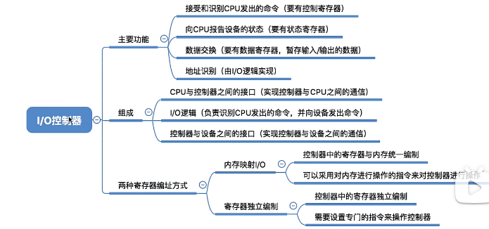
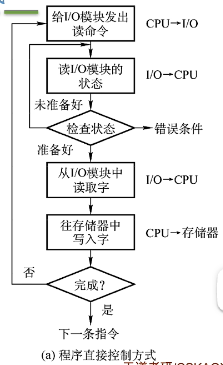
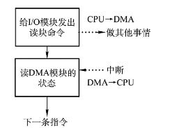
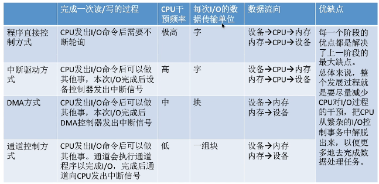
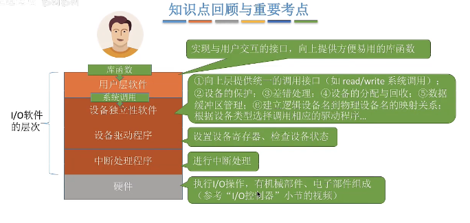

## I/O设备管理

*I/O设备就是可以将数据输入计算机，或者可以接收计算机数据的外部设备，属于计算机中硬件部件*

#### **I/O设备分类**

> **使用特性分类**
>
> - 人机交互类外部设备（数据传输速度低）
> - 存储设备
> - 网络通讯设备
>
> **信息交换为单位分类**
>
> - 块设备（物理块为交换单位，可寻址，可随机读写）
> - 字符设备（以字符为单位交换，**不可寻址**，采用中断驱动方式）

#### **I/O控制器**

> *I/O控制器是CPU与设备之间的中介，用于实现CPU对设备的控制*
>
> **I/O控制器的功能**
>
> - 接收和识别CPU的指令（I/O寄存器）
> - 向CPU报告设备状态(状态寄存器)
> - 数据交换（数据寄存器）
> - 地址识别
>
> **I/O控制器组成**
>
> - CPU与控制器的接口
> - I/O逻辑
> - 控制器与设备接口
>
> **I/O设备与CPU通讯**
>
> - 内存映像I/O
> - 寄存器独立编址
>
>  

#### **I/O控制器**

> - **程序直接控制方式**
>
>   > 轮询方式：**CPU不停循环检查控制器的状态**  
>   >
>   > **数据传输单位：字**
>   >
>   > **数据流向**：（读写都需要CPU介入）
>   >
>   > - 读操作（数据输入）：I/O设备 -> CPU -> 内存
>   > - 写操作(数据输出)：内存->CPU->I/O设备
>   >
>   >  
>   >
>   > ---
>   >
>   > 实现简单，在读写指令后，加上循环检查指令实现；CPU和I/O设备只能串行工作，CPU需要轮询检查，长期处于忙碌状态，CPU利用率低。
>
> - **中断驱动方式**
>
>   > 使用中断方式可以将等待I/O的进程阻塞，执行其他进程，I/O完成后，I/O控制器向CPU发出中断信号，CPU接收中断信号，转去执行**中断处理程序**。 CPU在每个指令末尾检查中断
>   >
>   > 中断处理过程：
>   >
>   > 1. CPU从I/O控制器读取一个字节数据传输到CPU寄存器，在写入主存
>   > 2. CPU恢复等待I/O进程的运行环境
>   >
>   > ---
>   >
>   > CPU不需要不停轮询检查，CPU利用率等到明显提升，传输效率低，每个字需要在I/O设备与内存之间多次传输，且进过CPU
>
> - **DMA方式** （Direct Memory Access）
>
>   > 数据以块为单位进行传输
>   >
>   > 数据流向是从设备直接放入内存，或者从内存直接到设备
>   >
>   > 数据仅在传输一个或者多个数据块的**开始和结束需要CPU控制**
>   >
>   > **DMA控制器**
>   >
>   >  
>   >
>   > ---
>   >
>   > 数据以块为单位进行交换，CPU介入频率降低，CPU与I/O设备性能得到提升
>   >
>   > CPU每发出一条I/O指令，只能读写一个或连续多个的数据块
>
> - **通道控制方式**
>
>   > 通道：专门处理I/O数据的物理硬件，通道可以识别或执行一系列的通道指令
>   >
>   >  
>
>    

#### **I/O软件层次结构**

>   
>
> 逻辑设备表（LUT）
>
> Spooling 假脱机技术：用户层实现
>
> I/O调度，设备保护，设备分配与回收，缓冲区管理：设备独立性软件

#### **Spooling技术**

> *脱离主机的控制进行的输入输出操作*
>
> 假脱机技术：使用软件方式模拟脱机技术
>
> 独占性设备：只允许一个进程串行使用的设备
>
> 共享设备：运行多个进程同时使用设备
>
>  

#### **设备的分配与回收**

> 静态分配：
>
> 动态分配：

