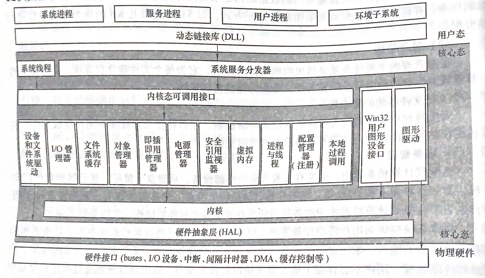
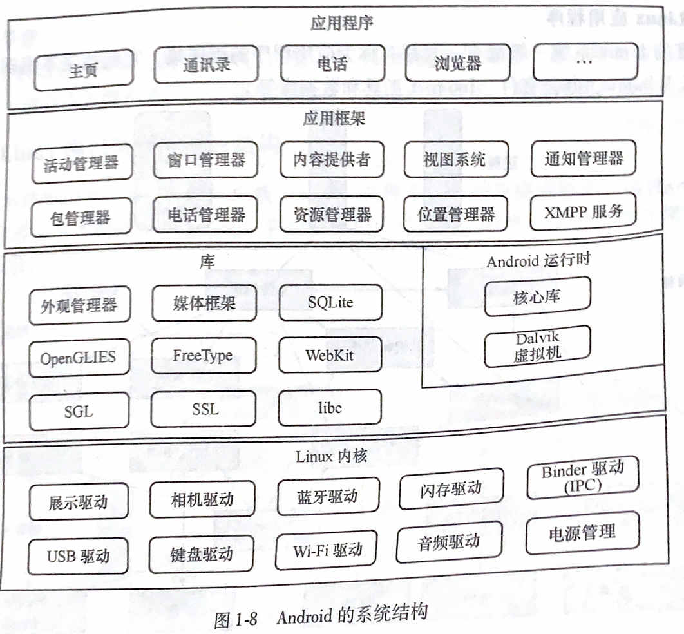

## 操作系统概述

- #### 操作系统功能与特性

>
> 操作系统定义：操作系统是计算机系统中的系统软件，是能有效地**组织和管理**计算机系统中的硬件和软件资源，合理地组织计算机工作流程，控制程序的执行，并向用户**提供各种服务功能**，使得用户能够方便地使用计算机，使整个计算机系统能高效运行的一组程序模块的集合
>
> - **操作系统功能**
>   - 进程管理
>     1. 控制（创建，销毁，转换）
>     2. 同步（协调多个进程执行顺序）
>     3. 通信（进程之间数据交互）
>     4. 调度
>   - 存储管理
>     1. 内存分配与回收
>     2. 存储保护
>     3. 内存扩充
>   - 文件管理
>     1. 文件存储空间管理
>     2. 目录管理
>     3. 文件系统安全性
>   - 设备管理
>  - 用户接口
> - **操作系统特性**
>
>   - 并发性 （多个事件在同一**时间间隔**内执行）
>  - 共享性
>   - 随机性
>
- #### **操作系统体系**

>- **Windows操作系统**
>
>  -  
>
>  - 内核（提供线程调度，处理，异常处理，中断处理，供执行体使用）正在运行的线程不能优先于内核）
>
>  - 硬件抽象层（HAL）
>
>    *多硬件平台可移值性库，与各种硬件相关*
>
>  - 执行体
>
>  - 系统进程和线程 
>
>- **UNIX操作系统**
>
>  -  
>  - 内核
>  - 系统调用
>  - 应用层
>
>- **Linux操作系统**
>
>  - 内核（系统调用，内存管理，进程管理，设备驱动，文件系统，网络管理）
>  - Shell（用户与内核交互操作接口）
>  - 文件系统
>  - 应用程序
>
>- **Android操作系统**
>
>  -  
>  - Android使用Linux内核完成对硬件扩展

#### **操作系统发展**

> 1. 手工操作
> 2. 检测程序（高级语言出现）
> 3. 多道批处理（输入输出与处理器并行处理）
> 4. 分时与实时系统
> 5. UNIX通用系统（1960 基于C语言编写，可移值，可以在多种环境下运行）
> 6. 个人计算机系统（ 1970 MS DOS，Windows，Linux 都基于UNIX）
> 7. Android系统（2003）

#### **操作系统分类**

> - 批处理操作系统
>
> - 分时（使用时间轮片方式处理任务）
>
> - 实时操作系统（严格规定时间内处理完任务）
>
>   1. 实时时钟管理
>   2. 过载防护
>   3. 高可靠性
>   
> - 嵌入式操作系统
>
> - 个人计算机系统（单用户多任务）
>
> - 网络操作系统
>
> - 分布式操作系统
>
>   1. 实现资源深度共享
>   2. 自治性强
>
>   
>
