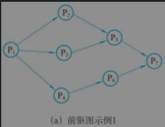
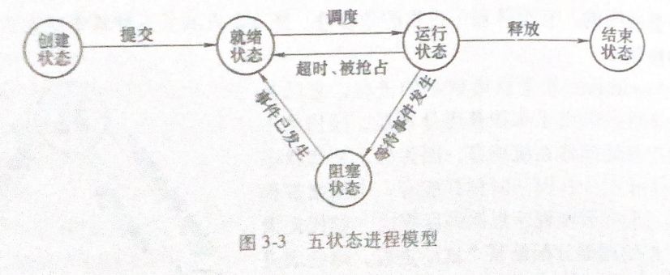

## 进程与线程

- **全驱图定义**

> *前驱图是一个有向无循环图，图中的每个结点可用于表示一条语句、一个程序段或进程；结点间的有向边表示在两结点之间存在的偏序或前驱关系“→”，→={（Pi，Pj）|Pi必须在Pj开始前完成}。如果（Pi，Pj）∈→，可写成Pi→Pj，称Pi是Pj的前驱，而Pj是Pi的直接后继*
>
> eg：
>
> P1→P2，P1→P3，P1→P4，P2→P5，P3→P5，P4→P6，P5→P7，P6→P7
>
>  

- #### **程序顺序执行**

> 顺序执行的程序特征
>
> 1. 处理机的操作严格按程序规定的顺序执行，即只有前一操作结束后才能执行后继操作
> 2. 程序执行的封闭性。程序独占全机资源，因而机内各资源的状态（除初始状态外）只有本程序才能改变。程序一旦开始运行，**其执行结果不受外界因素的影响**
> 3. 程序执行结果的确定性。程序执行的结果与它的执行速度无关，任何都不会影响得到最终结果
> 4. 程序结果的可再现性。

- #### **程序并发执行**

> 并发执行的程序特征
>
> 1. 程序执行间断性（多个执行任务存在相互等待资源）
> 2. 程序执行失去封闭性（多个执行任务存在相互影响）
> 3. 程序结构不可再现性
> 4. 程序和计算不再对应

- #### **多道程序设计**

> *让多个程序同时进入计算机执行* 主要提供计算机处理效率，提升系统效率

- #### **进程**

> 多道程序工作环境下，程序的并发执行特征使用进程概述，进程包括程序段，数据段，及进程控制块3部分
>
> **进程：** 
>
> 1. 程序在处理机上执行时**所发生的活动**称为进程（Dijkstra）
> 2. 进程可以和别的计算并发
> 3. 进程是一个**程序及其数据**在处理机上**顺序执行**时所发生的活动
> 4. 程是程序在一个数据集合上的运行过程，是系统进行资源分配和调度的一个**独立单位**（Peter Denning）。
>
> **程序与进程区别：**
>
> 1. 进程是**程序的一次执行**，完成程序的特定功能的指令有序序列（一个进程可以执行几个程序）
> 2. 进程是系统进行资源**分配和调度**的一个独立单位，程序则是以多个用户进程共享一个编译程序
> 3. 程序可用作为一种软件**资源长期保存**，进程是临时的，有生命周期，表现在它由创建而产生，完成任务后撤销
> 4. 进程具有结构，描述进程变化过程
>
> **进程特征**
>
> 1. 动态性
> 2. 并发性
> 3. 独立性（独立运行的基本单位，同时也是系统中独立获得资源和独立调度的基本单位）
> 4. 异步性（执行不可见）
>
> **进程基本状态及其转换**
>
> 1. 就绪（当前进程已分配到处理机以外所有必要的资源）
> 2. 执行
> 3. 阻塞（进程因某种事件而暂停执行状态）
>
>  
>
> - 执行->就绪状态（通常出现在分时系统中，正在执行的进程时间片用完被暂停）
> - 阻塞->就绪状态（阻塞进程不能直接运行，需要重新获得处理器执行权）
>
> 
>
> **五状态进程模型**（在基本状态下进一步划分)
>
> 1. 创建（New）
> 2. 就绪（Ready）
> 3. 运行（Run）
> 4. 阻塞（Blocked）
> 5. 结束（Exit）
>
> - **主要状态转换**
>
>   1. 创建
>   2. 提交
>   3. 调度运行
>   4. 释放（进程完成、失败导致终止。包括异常退出）
>   5. 超时(时间片用完，优先级高进程对其进行抢占)
>   6. 事件等待
>   7. 事件出现
>
>    
>
>  
>
> **七状态进程模型**
>
> *五状态进程模型没有区分进程空间地址，进程的数据载入时间存在影响*
>
> 

