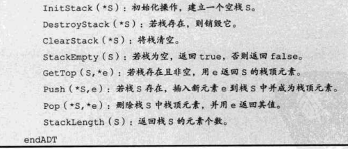
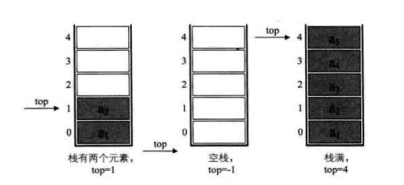
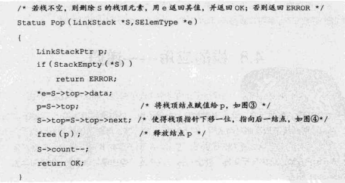
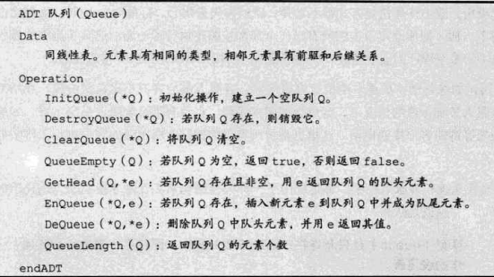

## 栈和队列

> __栈是限定在尾表进行插入和删除的线性表__
>
> __队列是只允许在一端进行插入操作,另一端进行删除操作的线性表__
>
> - 栈的抽象数据类型
>
>   > ~~~c
>   > ADT 栈 (Stack)
>   >     Data 
>   >       同线性表,元素具有相同类型,元素之间关系一对一
>   > Operation
>   > ~~~
>   >
>   > 
>
> - 栈的结构定义
>
>   > ~~~c
>   > typedef int SElemType;
>   > typedef struct
>   > {
>   >     SelemType data[MAXSIZE];
>   >     int top;  // 栈顶指针
>   > } SqStack;
>   > ~~~
>   >
>   > 
>   >
>   > ~~~c
>   > Status Push(SqStack * S,SElemType e)
>   > {
>   >     if(S->top ==MAXSIZE - 1){
>   >         return ERROR;
>   >     }
>   >     S->top++;
>   >     S->data[S->top] = e;
>   >     return OK;
>   > }
>   > Status Pop(SqStack *s,SElemType *e)
>   > {
>   >     if(S->top == -1)
>   >         return ERROR;
>   >     *e=S->data[S->top];
>   >     S->top--;
>   >     return OK;
>   > }
>   > ~~~
>   >
>   > eg:对于一个栈给定序列abc,试写出输出所有序列
>   >
>   > 1. abc(a+ a- b+ b- c+ c-)
>   > 2. acb(a+ a-,b+,c+,c-,b-)
>   > 3. bac(a+,b+,b-,a-,c+,c-)
>   > 4. bca(a+,b+,b-,c+,c-,a-)
>   > 5. cba(a+,b+,c+,c-,b-,a-)
>
>   #### 两栈共享空间
>
>   > ~~~c
>   > typedef struct
>   > {
>   >     SElemType data[MAXSIZE];
>   >     int top1;
>   >     int top2;
>   > }SqDoubleStack;
>   > ~~~
>   >
>   > 判断满栈条件
>   >
>   > S->top1+1 == S->top2
>   >
>   > 判断空栈条件
>
> #### 栈的链式存储结构及实现
>
> > 
> >
> > 链栈的空条件为 top = NULL    
> >
> > - __链栈的结构定义__
> >
> > 
> >
> > - 入栈
> >
> > ~~~c
> > Status Push (LinkStack *S,SElemType e)
> > {
> >     LinkStackptr s = (LinkStackPtr)malloc(sizeof(StackNode));
> >     s->data = e;
> >     s->next = S->top;  //将top指向s下一指针域
> >     S->top = s;   // 将top指向指针
> >     S->count++;
> >     return OK;
> > }
> > ~~~
> >
> > - 出栈
> >
> > 
> >
> > _栈的入栈和出栈没有任何循环操作,时间复杂度为O(1)_
>
> #### 栈的应用
>
> - 递归
>
>   > _直接调用自己或通过一系列的调用语句间接调用自己的函数_
>   >
>   > __每个递归定义必须至少有一个判断条件终止递归不在进行(即不在引用自身的条件)__
>   >
>   > 执行过程中使用递归工作站保存返回地址和计算中间参数及结果
>   >
>   > 递归求n阶乘
>   >
>   > ~~~c
>   > int fac(int n)
>   > {
>   >    if(n<=1)
>   >    {
>   >      return 1;  
>   >    } 
>   >     else{
>   >         return fac(n-1)*n;
>   >     }
>   > }
>   > ~~~
>   
> - 字符匹配(入栈,出栈逻辑判断)
>
> - 字符回文判断(判断字符是否中心对称)
>
> - 四则运算表达式求值
>
>   > __后缀表达式 9 3 1 - 3 * + 10 2 / + __
>   >
>   > > 从左到右遍历表达式的每个数字和符号,遇到数字进栈,遇到符号,就处于顶栈两个数字出栈,进行算数运算,其结果再次入栈
>   >
>   > __中缀表达式转后缀表达式(9 + (3 - 1) * 3 + 10 / 2    => 9 3 1 - 3 * + 10 2 / + )__
>   >
>   > > 从左到右遍历中缀表达式每个数字和字符,数字输出,成为后缀表达式一部分,遇到符号则与栈顶符号比较优先级(右括号或优先级低于栈顶符号)低则输出栈顶弹出并入中缀表达式__(遇右括号或优先级低于栈顶符号的输出否则输入栈)__
>   >
>   > - 将中缀表达式转化为后缀表达式(栈用来进出运算符号)
>   > - 将后缀表达式进行计算(栈用来进出运算数字)
>

#### 队列定义

> __队列是一种先进先出FIFO的线性表,区别于栈(先进后出)__,允许插入的一端为队尾,允许删除的一端为队头
>
> ###### 抽象数据类型
>
> > 
>
> ###### 循环队列(受限制的线性表)
>
> > _收尾相接的的顺序存储结构称为循环队列_
> >
> > > __循环队列判断满队与空队条件__
> > >
> > > - (rear + 1) % QueueSize == front  满队条件
> > > - (rear-front+QueueSize) % QueueSize 计算队列长度公式
> > > - __Q->real = (Q->real+1)%QueueSize__ 入队尾指针加1
> > > - __Q->front = (Q->front+1) % QueueSize__ 出队头指针加1
>
> ###### 队列的链式存储结构及实现
>
> 
>
> > 
> >
> > - 判断空链对条件  Q->rear == Q->front
> > - 入队 p->next = null ; Q->rear->next = p ;  Q->rear = p;
> > - 出队 Q->front->next->data
