## 树和二叉树

> - 树的定义
>
>   
>
> - 树的基本术语
>
>   > - 一个结点拥有的子树称为该结点的度(Degree)
>   > - 树中结点最大的度为该树的度
>   > - 度数为零的结点为叶子(Left)
>   > - 该结点的子结点称为双亲或父节点
>   > - 树中最大的层级为树的深度(高度)
>   > - 森林(没有根节点的树)
>
> - 树的抽象数据类型
>
> 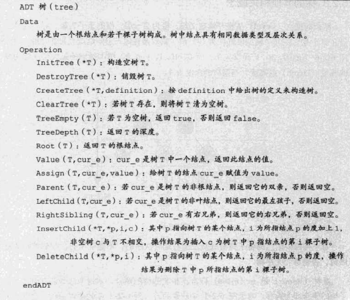
>
> -   
>
> ###### 树的存储结构
>
> > 双亲表示法(子结点存储父节点指针) 
> >
> > 孩子表示法(把每个结点孩子指针用链表存储起来)
> >
> >  
> >
> > 孩子兄弟表示法(二叉树实现)
> >
> > data | firstChild | rigthChild
> >
> > firstChild  存储第一个孩子结点指针
> >
> > rigth 存储该结点右兄弟结点指针
> >
> >  
> >
> > 
>
> #### 二叉树(Binary Tree)
>
> >  
> >
>
> > __二叉树不存在结点大于2的度__
>
> ###### 二叉树性质
>
> > 1. 在二叉树的第i层最多有$2^{i-1}$个结点(i>=1)
> > 2. 深度为k的二叉树至多有$2^k-1$个结点
> > 3. 存在任意二叉树T,其叶子结点数为$n_0$,度为2的结点数为$n_2$ 则$n_0=n_2+1$
> > 4. 具有n个结点的__完全二叉树__的深度为$\log_2n+1$
>
> ###### 二叉树的存储结构
>
> > - 顺序存储结构
> >
> > 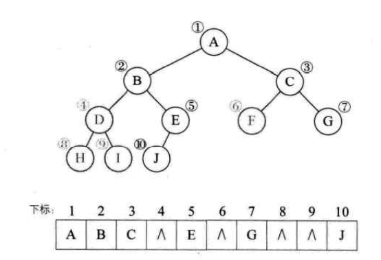 
> >
> > > 适用于完全二叉树
> >
> > - 二叉链表
> >
> > >  
> > >
> > > 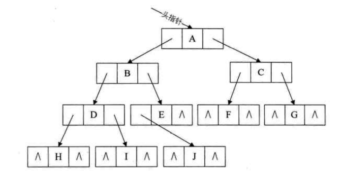 
>
> ###### 遍历二叉树(非空)
>
> > _二叉树遍历是从`根节点出发,按照某种次序依次访问二叉树中所有结点,使得每个结点只访问一次_
>
> - __前序遍历__
>
>   > 访问根结点->前序遍历左子树->前序遍历右子树
>   >
>   > ~~~c
>   > T->data;
>   > PreOrderTraveres(T->lchild);
>   > PreOrderTraverse(T->rchild);
>   > ~~~
>
> - __中序遍历__
>
>   > 中序遍历左子树->访问根结点->中序遍历右子树
>   >
>   > ~~~c
>   > PreOrderTraveres(T->lchild);
>   > T->data;
>   > PreOrderTraverse(T->rchild);
>   > ~~~
>
> - __后序遍历__
>
>   > 后序遍历左子树->后序遍历右子树->访问根结点
>   >
>   > ~~~c
>   > PreOrderTraveres(T->lchild);
>   > PreOrderTraverse(T->rchild);
>   > T->data;
>   > ~~~
>
> ###### 非递归遍历算法
>
> > ~~~c
> > void Inorder(BinTree bt)
> > {
> >     SeqStack S; BInTNode *p;
> >     InitStack(&S);Push(&S,bt);
> >     while(!StackEmpty(&S)){
> >         while(GetTop(&S))
> >         Push(&S,GetTop(&S)->data);
> >         p=Pop(&S);
> >         if(!StackEmpty(&S)){
> >             GetTop(&S->data);
> >             p = Pop(&S);
> >             Push(&S,p->rchild);
> >         }
> >     }
> > }
> > ~~~
>
> ###### 推导遍历结果
>
> > 已知前序遍历序列和中序遍历序列,可以确定唯一一个二叉树
> >
> > 已知后序遍历和中序遍历序列,可以确定唯一一个二叉树
>
> #### 线索二叉树(解决空间利用问题)
>
> >  _指向前驱和后继的指针称为线索,加上线索的二叉树链表称为线索链表_
> >
> > 使用中序遍历出序列将对应的空指针域指向前驱和后继
> >
> > __H D I B J E A F C G __ 中序遍历
> >
> >  
> >
> > 
> >
> >  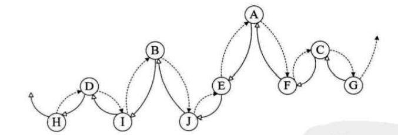
> >
> > 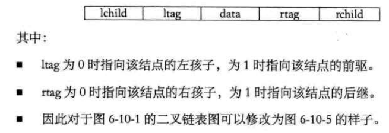 
> >
> > 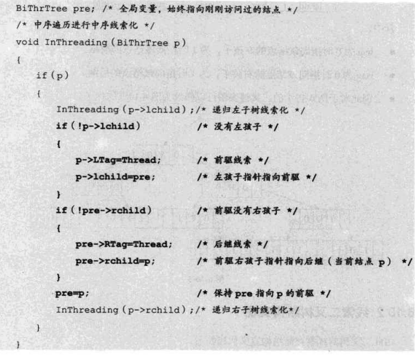 
>
> ####  树与森林与二叉树转换
>
> ###### 树转二叉树
>
> > 1. 兄弟结点连线
> > 2. 树中结点只保留与它第一个孩子结点连线(__兄弟结点变成右子结点__)
> >
> > 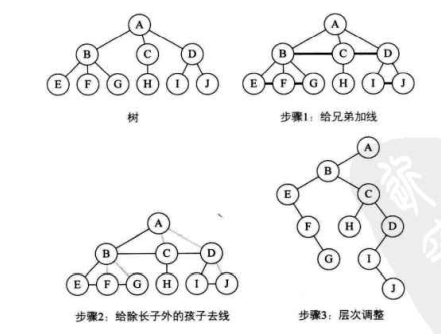 
>
> ###### 森林转为二叉树
>
> > 1. 将森林中每棵树转为二叉树
> > 2. 第一个二叉树不动,依次把二叉树的根结点作为前一个二叉树根节点的右孩子
> >
> > 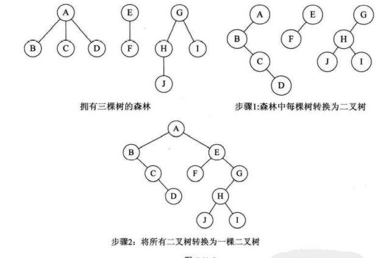 
>
> ###### 二叉树转为树
>
> > 1. 将每一层右子结点与父节点相连
> > 2. 去掉右子结点连线
> >
> > 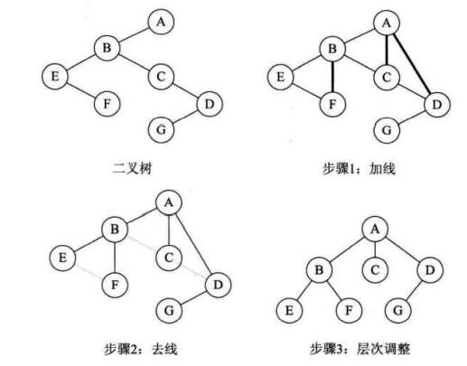 
>
> ###### 二叉树转为森林
>
> > 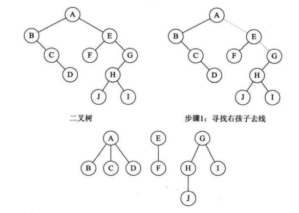 
>
> #### 赫夫曼树及其应用
>
> > 从树中一个结点到另一个结点之间的分支构成两个结点之间的路径,路径上的分支数目称作路径长度.树的路径长度就是从根结点到每个结点路径长度之和
> >
> > WPL:__带权路径长度WPL最小的二叉树称为赫夫曼树__
> >
> > ###### 构造赫夫曼树
> >
> > > 1. 将叶子结点顺序排列数列
> > > 2. 取两个最小权值结点构造成一个新结点$N_1$代入步骤1中数列
> > > 3. 重复1,2步骤
> > >
> > > eg: 存在数列 __A5, E10, B15, D30, C40__构造赫夫曼树
> > >
> > > 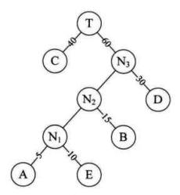 
> > >
> > > WPL = $40\times 1 + 30\times 2+15\times3+10\times4+5\times4$ = 205
> >
> > ###### 赫夫曼编码
> >
> > >构建赫夫曼树,使用0,1字符代替左子树和右子树经过路径,构成编码表
> > >
> > > 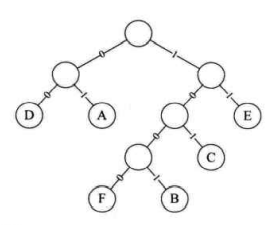 
> > >
> > > 
> > >
> > >

