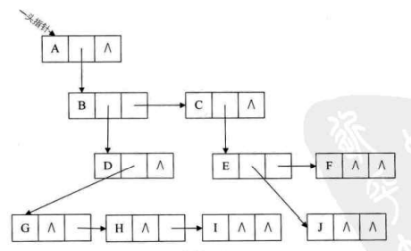

## 树和二叉树

> - 树的定义
>
>   
>
> - 树的基本术语
>
>   > - 一个结点拥有的子树称为该结点的度(Degree)
>   > - 树中结点最大的度为该树的度
>   > - 度数为零的结点为叶子(Left)
>   > - 该结点的子结点称为双亲或父节点
>   > - 树中最大的层级为树的深度(高度)
>   > - 森林(没有根节点的树)
>
> - 树的抽象数据类型
>
> 
>
> -  
>
> ###### 树的存储结构
>
> > 双亲表示法(子结点存储父节点指针) 
> >
> > 孩子表示法(把每个结点孩子指针用链表存储起来)
> >
> >  
> >
> > 孩子兄弟表示法(二叉树实现)
> >
> > data | firstChild | rigthChild
> >
> > firstChild  存储第一个孩子结点指针
> >
> > rigth 存储该结点右兄弟结点指针
> >
> >  
> >
> > 
>
> #### 二叉树(Binary Tree)
>
> >  
> >
> > 

