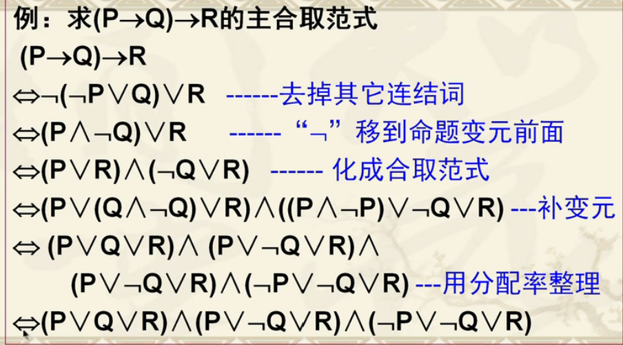
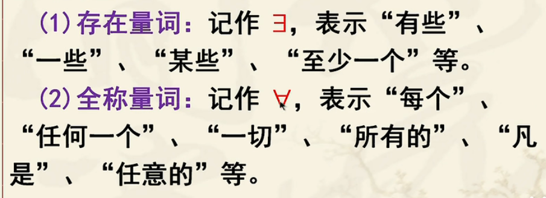

## 命题逻辑(proposition logic)

> **命题：具有真假意义的陈述语句均为命题**（唯一真值的陈述句，不能在某些条件下，出现即为真又为假的结果）
>
> 论证：用证据证明论题的真实性
>
> 驳论：别人提出观点，用论证反驳它，这种论证叫驳论
>
> **悖论：一个论点通过理性推理否定了自身**  _eg：“这句话是假的”如过这句话是真的，那么通过这句话我们可以得知这句话是假的，因为一句话不可能又真又假，所以这是个悖论_
>
> **悖论不是命题**
>
> **结论：从一定的前提推论得到的结果，对命题做出总结性的判断**
 #### **复合命题与联结词**
>
>- $\lnot$   否定
>- $\land$ 合取  P$\land$Q 当且仅当P，Q为T时 则为T 否则都为F 
>- $\lor$ 析取   P$\lor$Q 当且仅当 P  Q 为F时 为F    **异或(P,Q之间具有相斥性) ** $(P\land\,\lnot Q)\lor(\lnot P\land Q)$
>- $\to$  条件  P$\to$Q 当且仅当P为真，Q为F时，  P$\to$Q 为F
>- $\leftrightarrow$ 双条件  当P与Q同时为真时  P$\leftrightarrow$ Q真
>- **联合词的执行顺序   $\lnot$   $\land$  $\lor$  $\to$  $\leftrightarrow$** 

#### **命题公式**
>命题公式中三种数据类型
>
>1. 命题常项
>
>2. 常值命题
>
>3. 命题变元（没有命题指派下，不是命题)
>
>---
>
>- 单个命题变元和常项是原子命题公式
>- 真值表  (P$\land$Q)$\to$R   真值表的条数是$2^n$种 n表示元命题个数
>- 命题符号化
>
>	1. 将语句分解成原子命题
>	2. 将大写字母赋值命题
>	3. 使用逻辑联结词连接原子命题
>
>|  P   |  Q   |  R   | P$\land$Q | (P$\land$Q)$\to$R |
>| :--: | :--: | :--: | :-------: | :---------------: |
>|  F   |  F   |  F   |     F     |         T         |
>|  F   |  F   |  T   |     F     |         T         |
>|  F   |  T   |  F   |     F     |         T         |
>|  F   |  T   |  T   |     F     |         T         |
>|  T   |  F   |  F   |     F     |         T         |
>|  T   |  F   |  T   |     F     |         T         |
>|  T   |  T   |  F   |     T     |         T         |
>|  T   |  T   |  T   |     T     |         T         |
>
>-  **如果命题A真言表结果都为真，则A为重言式，永真式，反之为矛盾式或永假式**
>-  **可满足式**：对于命题公式A，若A不是[矛盾式](https://baike.baidu.com/item/矛盾式)，则称A是可满足式。                                                                                                                                                                                                                                                                                                                                                                                                                                                                                                                                                                                                                                                                                                                                                                                                                                                                                                                                                                                                                                                                                                                                                                                                                                                                                                                                                                                                                                                                                                                                                                                                                                                                                                                                                                                                                                                                                                                                                                                                                                                                                                                                                                                                                                                                                                                                                                                                                                                                                                                                                                                                                                                                                                                                                                                                                                                                                                                                                                                                                                                                                                                                                                                                                                                                                                                                                                                                                                                                                                                                                                                                                                                                                                                                                                                                                                                                                                                                                                                                                                                                                                                                                                                                                                                                                                                                                                                                                                                                                                                      
>- $\Leftrightarrow$等价命题   命题的真值表相同则为等价命题 （P $\Leftrightarrow$ Q 则 P$\leftrightarrow$Q是重言式）
>
>**等价公式**
>
> 
>
> 
>$$
>P \to Q \Leftrightarrow \lnot P \lor Q \Leftrightarrow \lnot Q \to \lnot P
>$$
>**蕴含公式**
>
>当且仅当P $\to$ Q是永真式时，则P蕴含Q 记作 P$\Rightarrow$Q
>
>> | 条件 | 结果 |
>> | :--: | :--: |
>> | 如果 | 那么 |
>> |  才  | 只有 |
>> |      | 仅当 |
>
> 

#### **命题逻辑推理**

> **简单合取式，析取式不包含其他联结词的公式**
>
> *简单析取式是重言式：当且仅当它同时含某个命题变元及它的否定式*
>
> *简单合取式是永假式：当且仅当它同时含某个命题变元及它的否定式*
>
> *合取范式：由简单析取式合取构成*
>
> *析取范式：由合取范式析取构成*
>
> ---
>
> **对于任何一个公式都存在与之等值的合取公式或析取公式**
>
> 1. 任何公式都可以由联结词{$\lnot ， \land,\lor$}表示
>
> 2. $$
>    A \leftrightarrow B ⇔(A→B)∧(B→A) ⇔ (\lnot A \lor B) \land(A\lor \lnot B) ⇔ (A \land B)\lor(\lnot A\land \lnot B) \\
>    $$
>
> ---
>
> - **主析取范式：**所有真值为T的指派所对应的**小项的析取**，构成该公式的主析取范式
>
>   > **小项：** n个命题变元的**简单合取式**($\land 和 \lnot$ 联结词组成的公式,**且每个变元的符号只能出现一次**)
>   >
>   > > 1. 小项编码 $m_{101} ⇔ P \land \lnot Q \land R$
>   > > 2. **小项赋值与编码相同时，为永真式，编码不同时为永假式**
>   > > 3.  **全体小项的析取式为重言式**
>   > > 4.  
>   > > 5.  
>
> - **主合取范式：**所有真值为T的指派所对应的**大项的合取**，构成该公式的主析取范 
>
>   > **大项：**  n个命题变元的**简单析取式**($\lor 和 \lnot$ 联结词组成的公式,**且每个变元的符号只能出现一次**)
>   >
>   > > 1. 大项编码 $m_{010} ⇔ P \lor \lnot Q \lor R$
>   > > 2. **大项赋值与编码相同时，为永真式，编码不同时为永假式**
>   > > 3.  **全体大项的析合式为永假式**
>   > > 4.  
>   > > 5. 
>
> 
>
#### **自然推理系统**
>判断有效结论的过程就是论证过程，采用**真值表法，主范式，推理法**
>
>
>
> 
>
>

## 谓词逻辑

> **谓词逻辑是将命题逻辑表达不出来的逻辑继续细化。**
>
> 个体：独立存在的具体或抽象事物，通常使用小写字母表示
>
> 个体常项：具体或特定的个体
>
> 个体变元：泛指某一个个体
>
> 谓词：**刻化个体属性**或者表达个体之间的关系，通常使用大写字母表示
>
> > 当谓词是常项时，表示0元谓词是命题；
> >
> > 当谓词是变项是，表示0元谓词是命题变元；
>
> ---
>
> eg： A表示 “是大学生” ，$w$表示“王强” 则王强是大学生 可以用A(w)表示该语句
>
> - 由一**个谓词**，**一些个体变量**组成的**表达式**称为谓词变项或者命题函数**（命题函数不是命题）**
>
>   - 命题函数中个体变量具有指定事物时，才是命题
>
>   eg：使用谓词表达下述命题
>
>   ~~~
>    小张年龄超过18岁，身体健康，具有大学本科学历，则可以参加飞行员招录考试
>    设：小张表示a，A(x)：x超过18岁，B(x)：x身体健康，C(x)：x大学毕业，E(x)：x参加飞行员考试
>    题目代表的命题为 A(a) && B(a) && C(a) -> E(a)
>   ~~~
>
#### **命题函数**

> 含有n个变元的命题函数是以个体域为定于域，以{F，T}为值域的n元函数
>
>  *命题函数不是命题，只有定义域存在足够的具体客体，或用足够的量词约束后才为命题*
>
> **量词：**
>
>  
>
>  **量词辖域：** 自由变元与约束变元，自由变元没有量词约束
>
> 约束变元换名：将A中某量词辖域内的一个约束变元的所有出现及相应的指导变元替换公式中未出现的变元符号
>
> **谓词命题公式化中（一般）**
>
> - 存在量词使用$\land$联结
> - 所有量词使用$\to$联结
> - 命题公式化中不存在自由变元

#### **谓词等价式与蕴函式**
>
>$$
>x\in \{ a_1,a_2,a_3,a_4 \} \\
>\forall xA(x) \Leftrightarrow A(a_1) \land A(a_2) \land A(a_3)\land A(a_4) \\
>∃xA(x) \Leftrightarrow A(a_1) \or A(a_2) \or A(a_3)\lor A(a_4)
>$$
>
> 

#### **前束范式**

>**前束范式：**以量词开头，它的作用域延伸到整个公式，该公式称为前束范式
>
>- 所有量词前面无联结词
>- 所有量词都在公式左边
>- 所有量词的辖域延伸到公式末尾
>
>谓语公式转为前束公式
>
>1. 不同辖域同名变元进行换名
>2. 使用等价公式进行替代提取量词
>3. 量词前置
>
>**谓语演算推理**
>
>- 全称量词消去规则（记为$\forall -$)
>$$
>P是谓词，c是论域中任意一个个体，论域中全部个体都有P(x)，那么对某个个体的c亦有P(x)，可以得到结论P(c)\\
>\frac{∀xP(x)}{\therefore P(c)}
>$$
>
>- 全称量词引入规则(记为$\forall +$)
>
>$$
>\frac{P(x)}{\therefore\forall xP(x)}
>$$
>

 

