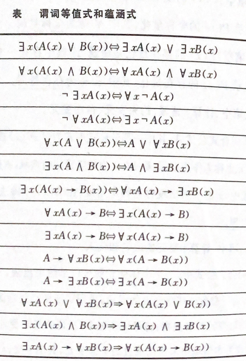

## 谓词逻辑

> **谓词逻辑是将命题逻辑表达不出来的逻辑继续细化。**
>
> 个体：独立存在的具体或抽象事物，通常使用小写字母表示
>
> 个体常项：具体或特定的个体
>
> 个体变元：泛指某一个个体
>
> 谓词：**刻化个体属性**或者表达个体之间的关系，通常使用大写字母表示
>
> > 当谓词是常项时，表示0元谓词是命题；
> >
> > 当谓词是变项是，表示0元谓词是命题变元；
>
> ---
>
> eg： A表示 “是大学生” ，$w$表示“王强” 则王强是大学生 可以用A(w)表示该语句
>
> - 由一**个谓词**，**一些个体变量**组成的**表达式**称为谓词变项或者命题函数**（命题函数不是命题）**
>
>   - 命题函数中个体变量具有指定事物时，才是命题
>
>   eg：使用谓词表达下述命题
>
>   ~~~
>    小张年龄超过18岁，身体健康，具有大学本科学历，则可以参加飞行员招录考试
>    设：小张表示a，A(x)：x超过18岁，B(x)：x身体健康，C(x)：x大学毕业，E(x)：x参加飞行员考试
>    题目代表的命题为 A(a) && B(a) && C(a) -> E(a)
>   ~~~
>
#### **命题函数**

> 含有n个变元的命题函数是以个体域为定于域，以{F，T}为值域的n元函数
>
>  *命题函数不是命题，只有定义域存在足够的具体客体，或用足够的量词约束后才为命题*
>
> **量词：**
>
>  
>
>  **量词辖域：** 自由变元与约束变元，自由变元没有量词约束
>
> 约束变元换名：将A中某量词辖域内的一个约束变元的所有出现及相应的指导变元替换公式中未出现的变元符号
>
> **谓词命题公式化中（一般）**
>
> - 存在量词使用$\land$联结
> - 所有量词使用$\to$联结
> - 命题公式化中不存在自由变元

#### **谓词等价式与蕴函式**
>
>$$
>x\in \{ a_1,a_2,a_3,a_4 \} \\
>\forall xA(x) \Leftrightarrow A(a_1) \land A(a_2) \land A(a_3)\land A(a_4) \\
>∃xA(x) \Leftrightarrow A(a_1) \or A(a_2) \or A(a_3)\lor A(a_4)
>$$
>
> 

#### **前束范式**

>**前束范式：**以量词开头，它的作用域延伸到整个公式，该公式称为前束范式
>
>- 所有量词前面无联结词
>- 所有量词都在公式左边
>- 所有量词的辖域延伸到公式末尾
>
>
>
>谓语公式转为前束公式
>
>1. 不同辖域同名变元进行换名
>2. 使用等价公式进行替代提取量词
>3. 量词前置
>
>
>
>**谓语演算推理**
>
>- 全称量词消去规则（记为$\forall -$)
>$$
>P是谓词，c是论域中任意一个个体，论域中全部个体都有P(x)，那么对某个个体的c亦有P(x)，可以得到结论P(c)\\
>\frac{∀xP(x)}{\therefore P(c)}
>$$
>
>- 全称量词引入规则(记为$\forall +$)
>
>$$
>\frac{P(x)}{\therefore\forall xP(x)}
>$$
>

