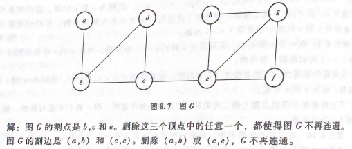

## 图的应用

- #### **图**

  > **G = (V,E)中，V是非空有限顶点，E是边集，当G中顶点之间存在边时，使用（u，v）或<u，v>表示存在的边。|V| 表示顶点数，|E|表示边数。**
  >
  > ---
  >
  > **特殊图**
  >
  > - 零图：|E| = 0
  >
  > - 平凡图：|V| = 1
  >
  > - 有向图：<u,v> $\neq$ <v,u> 
  >
  > - 无向图： (u,v)  = (v,u)
  > - 多重图：两个顶点之间边数量大于1
  > - 简单图：不含多重边及环的图（指向自身的边称为环）
  > - k度正则图：各顶点度数相等的图
  > - **完全图：每个顶点都与其余的n-1个顶点邻接 （n-1)n / 2 为边数**
  >
  > 
  >
  > **图的属性：**
  >
  > - **度：**关联的边数。顶点v的度数，记为deg(v)
  >
  > -   
  >
  > - **图中顶点度数总和等于边数的两倍** （有向图所有顶点入度，顶点出度等于边数）
  >
  >   > 有向图中 Sum d($v_i$) =2m ，且 $\sum_{i=1}^{n} d^+(v_i) = \sum_{i=1}^{n} d^(-v_i) = m$
  >   >
  >   > **图中奇度顶点的个数必然为偶数个数**
  >
  > - **图的同构：** $G_1 \approxeq G_2$
  >
  >   1. 边数相同
  >   2. 顶点数相同
  >   3. 度数相同的顶点数相同
  >   4. 度数序列相同
  >
  >   
  >
  > - 通路：连接顶点构成的边
  >
  > - 回路：通路的起始顶点与结束顶点相同 
  >
  > - 简单回路：所有的边都不同
  >
  > - 初级回路：所有的顶点都不同（除顶尾点不同外）
  >
  > - 无向图 G = <V,E>中每个顶点的度数至少为2，则G包含一条初级回路
  >
  > - 连通图：图G中任意两个不同的顶点都是**连通的**，则为连通图
  >
  > - 设G=<V,E>，|V| = n ，若从顶点u到v（u不等于v）存在通路则从u到v必存在长度小于或等于 n-1
  >
  > - 强连通：图中任意顶点**相互可达**
  >
  > - 弱连通：无向图中任意顶点可达
  >
  > - 割点：删除w及与w相关的边后，该图不在连通，则w称为割点
  >
  > - 桥：删除e边后，该图不在连通，则e为改图的桥
  >
  > -  
  >
  > 

- #### 图的表示
  
  >- 邻接矩阵
  >  $$
  >  M(G)=\left[
  >  	\begin{matrix}
  >  		1 & 1 & 1 \\
  >  		0 & 1 & 0 \\
  >  		1 & 0 & 1
  >  	\end{matrix}
  >  \right]\\M[i][j] = 
  >  \begin{cases}
  >  1,若（v_i，v_j）\in E,1 <= i,j<=n \\
  >  0,若（v_i，v_j）\notin E,1 <= i,j<=n ,
  >  \end{cases}
  >  $$
  >
  >- 关联矩阵
  >  $$
  >  M[i][j] = 
  >  \begin{cases}
  >  2, &v_i的自环是e_j\\
  >  1,& v_i关联e_j且e_j不是自环\\
  >  0,& v_i不关联e_j
  >  \end{cases}
  >  $$
  >
  >- 邻接表
  >
  >  > 每个顶点使用链表记录与其相联的顶点消息
  >
  >---
  >
  >
  >
  
- #### **欧拉图**

  > 欧拉通路：图 G 上有一条经过所有顶点、所有边的**简单路径**（边不重复，点可以重复）
  >
  > 欧拉回路：图 G 上有一条经过所有顶点、所有边的**简单回路**（边不重复，点可以重复）
  >
  > **欧拉图：**有欧拉回路的连通**无向图**
  >
  > **欧拉有向图：**有欧拉回路的连通**有向图**
  >
  > **欧拉图判断**
  >
  > - 无向图：不存在度数为奇数的顶点
  > - 有向图：每个顶点的出度均等于入度
  
- #### **哈密顿图**（H图）
  
  >哈密顿通路：给定无向图G中，通过图中每个结点一次而且仅一次的路径。
  >
  >半哈密顿图：有哈密顿路径而没有哈密顿回路的图
  >
  >- 任意两个不相邻的顶点度数之和大于顶点数
  
- #### **最短通路**
  
  > **迪克斯屈算法**
  >
  > 1. 选择顶点a，从顶点a出发找出最小的边的顶点b
  > 2. 从顶点b出发，找出最小的边的顶点c（循环）
  
- #### **平面图（特殊哈密顿图）**
  
  > **平面图：**边不交叉，并且在同一个平面上（除顶点外无边相交）
  >
  > - 平行边与环不影响平面性
  >
  > - G为平面图，G的子图也为平面图
  >
  >   - 设连通平面图G，面的次数之和等于其边数的两倍
  >
  > - 欧拉公式：**设有一个连通平面图G，共有n个顶点和m条边，其平面表示中共有r个面，则n-m+r = 2成立**
  >
  > - 设G是有v个顶点m条边的通路简单平面图，$若v >= 3 则 m <=3v-6$代入欧拉公式有
  >
  > $$
  >  2 = v - m + r \leqq v-m + \frac{2}{3}m \\
  >   2 \leqq v - \frac{m}{3}，6\leqq 3v -m ， m \leqq 3v-6
  > $$
  > 
  > 
  >- 设G是有一个v个顶点m条边的连通简单平面图，若$v \geq 3$ 且没有长度为3的回路，则 $m \leqq 2v - 4$
  >
  
- #### **树（连通无回路图）**
  
  > **森林：**每个连通分支（至少两个）都是树的无向图
  >
  > T是树存在以下特性
  >
  > 1. T中任意两个顶点之间存在唯一路径
  > 2. T中无回路且顶点n等于边m+1
  > 3. T是连通的，且任意边为桥
  >
  > **根树：**设T是有向树，其中一个顶点入度为0，其余入度均为1
  >
  > **根树应用：**
  >
  >  
  >
  >  二叉树（判定树） 
  >
  > **最优树：(树的权值最小)** 
  >
  > 
  >
  > 
  
  
  
    

