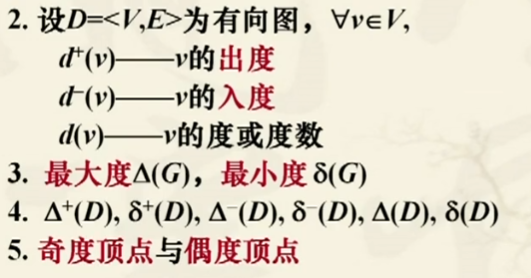
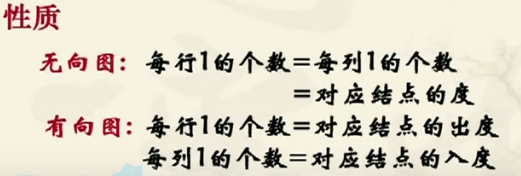

## 图的应用

- #### **图**

  > **G = (V,E)中，V是非空有限顶点，E是边集，当G中顶点之间存在边时，使用（u，v）或<u，v>表示存在的边。|V| 表示顶点数，|E|表示边数。**
  >
  > ---
  >
  > **特殊图**
  >
  > - 零图：|E| = 0
  >
  > - 平凡图：|V| = 1
  >
  > - 有向图：<u,v> $\neq$ <v,u> 
  >
  > - 无向图： (u,v)  = (v,u)
  > - 多重图：两个顶点之间边数量大于1
  > - 简单图：不含多重边及环的图（指向自身的边称为环）
  > - 完全图：每个顶点都与其余的n-1个顶点邻接
  >
 #### **图的属性**

> - **度：**关联的边数。顶点v的度数，记为deg(v)
> -   
> - 图中顶点度数总和等于边数的两倍
> - 有向图中 Sum d($v_i$) =2m ，且 $\sum_{i=1}^{n} d^+(v_i) = \sum_{i=1}^{n} d^(-v_i) = m$
> - 任何图中，**奇度数的个数是偶数个**

#### **图的连通性**

  >**图的同构：** $G_1 \approxeq G_2$
  >
  >1. 边数相同
  >2. 顶点数相同
  >3. 度数相同的顶点数相同
  >4. 度数序列相同
  >
  >---
  >
  >- 通路：连接顶点构成的边
  >- 回路：通路的起始顶点与结束顶点相同 
  >- 简单回路：所有的边都不同
  >- 初级回路：所有的顶点都不同（除顶尾点不同外）
  >
  >---
  >
  >- 无向图 G = <V,E>中每个顶点的度数至少为2，则G包含一条初级回路
  >
  >- 连通图：图G中任意两个不同的顶点都是**连通的**，则为连通图
  >- 设G=<V,E>，|V| = n ，若从顶点u到v（u不等于v）存在通路则从u到v必存在长度小于或等于 n-1
  >- 强连通：图中任意顶点**相互可达**
  >- 弱连通：无向图中任意顶点可达
  >- 割点：删除w及与w相关的边后，该图不在连通，则w称为割点
  >- 桥：删除e边后，该图不在连通，则e为改图的桥
  >
  >-  
  >
  >---
- #### 图的表示
  
  >
  >$$
  >M(G)=\left[
  >	\begin{matrix}
  >		1 & 1 & 1 \\
  >		0 & 1 & 0 \\
  >		1 & 0 & 1
  >	\end{matrix}
  >\right]
  >$$
  >
  >对于简单图，邻接矩阵M可定义如下
  >$$
  >M[i][j] = 
  >\begin{cases}
  >1,若（v_i，v_j）\in E,1 <= i,j<=n \\
  >0,若若（v_i，v_j）\notin E,1 <= i,j<=n ,
  >\end{cases}
  >$$
  >
  >
  >
  > 
  >
  >  
  >
  >
  
- #### **图的应用**

  > **欧拉路的条件是经过图中每条边一次且仅一次**（E图）
  >
  > - 顶点度为奇数的顶点为奇点，度数为偶数 的顶点为偶点，无向图中奇点的个数一定为偶数个
  > - **欧拉通路：连通图G中，经过G中每条边且只经过一次的通路，**具有欧拉回路的图为欧拉图**
  >   - 无向连通图G是欧拉图的充分必要条件是**G是连通的且无奇度数顶点**
  > - 无向图G具有一条**欧拉通路**的充分必要条件是**G是连通的且恰有两个奇点**
  >
  > ---
  >
  > **哈密顿图**（H图）
  >
  > - 给定无向图G，若存在一条路L，经过**图中每一个顶点且仅经过一次**，则L称为哈密顿路，简称H-路。
  >
  > ---
  >
  > **平面图（特殊哈密顿图）**
  >
  > - 平面图：若一个图G能画在平面S上，且使G的边仅在端点处相交，则称图G为可嵌入平面S，G称为可平面图
  >
  > - 设连通平面图G，面的次数之和等于其边数的两倍
  >
  > - 欧拉公式：**设有一个连通平面图G，共有n个顶点和m条边，其平面表示中共有r个面，则n-m+r = 2成立**
  >
  > - 设G是有v个顶点m条边的通路简单平面图，$若v >= 3 则 m <=3v-6$代入欧拉公式有
  >   $$
  >   2 = v - m + r \leqq v-m + \frac{2}{3}m \\
  >   2 \leqq v - \frac{m}{3}，6\leqq 3v -m ， m \leqq 3v-6
  >   $$
  >   
  >   
  > - 设G是有一个v个顶点m条边的连通简单平面图，若$v \geq 3$ 且没有长度为3的回路，则 $m \leqq 2v - 4$
  >
  > 
  >
  > #### **树及其遍历**
  >
  > - **树：一个连通且无回路的无向图称为树，设T为树，则T无回路，且T的任何两个顶点间有唯一一条路，且有n-1条边，删去任何一条边后便不再连通，增加任何一条边，将得到唯一的一个回路**
  >
  > 
  >

  

    

