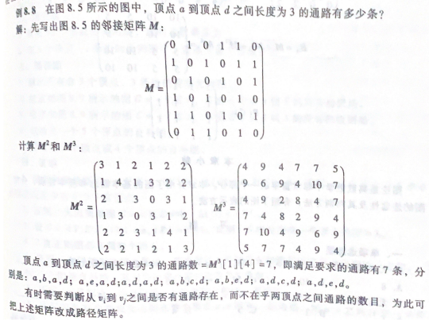

## 图的应用

- #### **图**

  > **G = (V,E)中，V是非空有限顶点，E是边集，当G中顶点之间存在边时，使用（u，v）或<u，v>表示存在的边。|V| 表示顶点数，|E|表示边数。**
  >
  > ---
  >
  > **特殊图**
  >
  > - 零图：|E| = 0
  >
  > - 平凡图：|V| = 1
  >
  > - 有向图：<u,v> $\neq$ <v,u> 
  >
  > - 无向图： (u,v)  = (v,u)
  > - 多重图：两个顶点之间边数量大于1
  > - 简单图：不含多重边及环的图（指向自身的边称为环）
  > - 完全图：每个顶点都与其余的n-1个顶点邻接
  >
  > ---
  >
  > **边与图关系**
  >
  > - 度数：关联的边数。顶点v的度数，记为$deg(v)$
  > - 图G=<V,E>，**顶点度数总和**等于边数的两倍  $\sum_{v \in V}deg(v) = 2|E|$
  > - 对于任意的图G，奇顶点必为偶数个
  > - 设G = <V,E>是一个有向图，以**顶点v为起点的有向边的个数为出度，记为$deg^+(v)$，以顶点v为终点的有向边的个数为度入，记为$deg^-(v)$**，有向图中所有顶点的入度和等于所有顶点的出度和
  > - 设含n个顶点的简单无向图 G = <V,E>中，若每个顶点都与其余的n-1个顶点邻接，则称G为n阶**有向完全图**
  > - n阶（无向）完全图中共有 $\frac{n(n-1)}{2}$条边，n阶有向完全图共有 n(n-1)条边
  > - 补图：设G = <V,E> 是n阶无向简单图，以V为顶点集，所有属于$K_n$但不属于G的边为边集所构成的图，称为G相对于$K_n$的补图，记作 $G^{\sim}$  (补图与图的交集为完全图)
  > - 正则图：每个顶点的度数都为k，则图称为k-正则图
  > - 子图：设图G = <V,E> 存在 $G^` = <V^`,E^`>$，且 $E^`\subseteqq E, V^`\subseteqq V$ 则$G^`$是G的子图
  > - 生成子图：$G$的子图包含G的所有结点，且$E^`\subseteqq E$
  >
  > -  
  >
  >    
  >
  > ---
  >
  > **图的连通性**
  >
  > 
  >
  > $顶点v_i到v_j具有间接相连的边，则为通路， \\ \Gamma为通路的长度（边数），\\若v_i = v_j 则\Gamma为回路，\\若所有的边均不相同，\\则\Gamma为简单通路，\\若简单通路所有顶点不同则\Gamma为初级通路或路径$
  >
  > - 无向图 G = <V,E>中每个顶点的度数至少为2，则G包含一条初级回路
  > - 连通图：图G中任意两个不同的顶点都是**连通的**，则为连通图
  > - 设G=<V,E>，|V| = n ，若从顶点u到v（u不等于v）存在通路则从u到v必存在长度小于或等于 n-1
  > - 强连通：图中任意顶点**相互可达**
  > - 弱连通：无向图中任意顶点可达
  > - 割点：删除w及与w相关的边后，该图不在连通，则w称为割点
  > -  桥：删除e边后，该图不在连通，则e为改图的桥
  > -  
  >
  > ---
  >
  > **图的表示**
  >
  > - 邻接矩阵表示
  >
  > $$
  > M(G)=\left[
  > 	\begin{matrix}
  > 		1 & 1 & 1 \\
  > 		0 & 1 & 0 \\
  > 		1 & 0 & 1
  > 	\end{matrix}
  > \right]
  > $$
  >
  > 对于简单图，邻接矩阵M可定义如下
  > $$
  > M[i][j] = 
  >  \begin{cases}
  >  1,若（v_i，v_j）\in E,1 <= i,j<=n \\
  >  0,若若（v_i，v_j）\notin E,1 <= i,j<=n ,
  >  \end{cases}
  > $$
  >  
  >
  > 由邻接矩阵可以计算任意两个顶点之间的通路数目，对于布尔矩阵M ，定义它的幂$M^2 = M \times M , M^k = M \times M^{k-1} \ \  k>1 $
  >
  >  
  >
  >  

- #### **图的应用**

  > - 顶点度为奇数的顶点为奇点，度数为偶数 的顶点为偶点，无向图中奇点的个数一定为偶数个， 不存在奇数个奇点图像
  >
  > - 欧拉通路：连通图G中，经过G中每条边且只经过一次的通路，**具有欧拉回路的图为欧拉图**
  >   - 无向连通图G是欧拉图的充分必要条件是**G是连通的且无奇点**
  > - 无向图G具有一条**欧拉通路**的充分必要条件是**G是连通的且恰有两个奇点**
  >
  > 
  >
  > **欧拉路的条件是经过图中每条边一次且仅一次**
  >
  > ---
  >
  > **哈密顿图**
  >
  > - 给定无向图G，若存在一条路L，经过图中每一个顶点且仅经过一次，则L称为哈密顿路，简称H-路。
  > - 若图G = <V,E>具有哈密顿回路，则对于顶点集V的每个非空子集S，均有W（G-S) <=  |S|  成立，其中W（G-S）表示G - S中连通分量数。
  > - 设G具有n个顶点的简单图，如果G中每一对顶点度数只和大于等于n-1，**则G中存在一条哈密顿路**，如果G中每一对顶点度数只和大于等于n，**则G中存在一条哈密顿回路**
  >
  > ---
  >
  > **平面图**
  >
  > - 平面图：若一个图G能画在平面S上，且使G的边仅在端点处相交，则称图G为可嵌入平面S，G称为可平面图
  >
  > - 设连通平面图G，面的次数之和等于其边数的两倍
  >
  > - 欧拉公式：**设有一个连通平面图G，共有n个顶点和m条边，其平面表示中共有r个面，则n-m+r = 2成立**
  >
  > - 设G是有v个顶点m条边的通路简单平面图，$若v >= 3 则 m <=3v-6$代入欧拉公式有
  >   $$
  >   2 = v - m + r \leqq v-m + \frac{2}{3}m \\
  >   2 \leqq v - \frac{m}{3}，6\leqq 3v -m ， m \leqq 3v-6
  >   $$
  >
  > - 设G是有一个v个顶点m条边的连通简单平面图，若$v \geq 3$ 且没有长度为3的回路，则 $m \leqq 2v - 4$
  >
  > 
  >
  > #### **树及其遍历**
  >
  > - **树：一个连通且无回路的无向图称为树，设T为树，则T无回路，且T的任何两个顶点间有唯一一条路，且有n-1条边，删去任何一条边后便不再连通，增加任何一条边，将得到唯一的一个回路**
  >
  >   
  >
  >   

  

    

