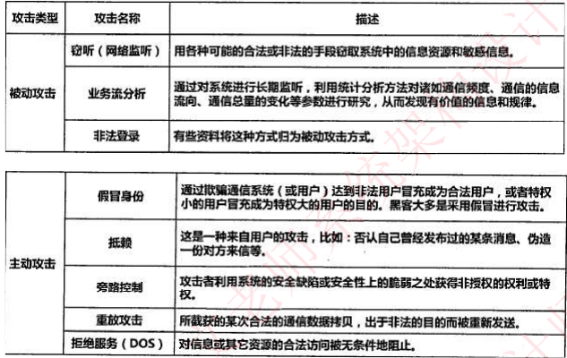

## 系统工程

> 系统工程：利用计算机作为工具，对系统结构，元素，信息和反馈进行分析，已达到最优规划，最优设计，最优管理，控制的目的
>
> 系统工程法：
>
> - 霍尔三维结构
>   1. 时间维度：规划，拟定方案，研制，生产，安装，运行，更新
>   2. 逻辑维度：明确问题，确定目标，系统综合，分析，优化，决策，实施
>   3. 知识维度：工程，医学，建筑，商业，法律，管理，社会科学，艺术
> - 切克兰德法：（比较与探寻）
>   1. 认识问题
>   2. 根底定义
>   3. 建立概念模型
>   4. 比较探寻
>   5. 选择
>   6. 设计与实施
>   7. 评估与反馈
> - 并行工程：提高质量，降低成本，缩短产品开发周期和上市时间
> - 综合集成法（钱学森）
>
> **系统工程生命周期**
>
> 1. 探索与研究：识别用户需求，探索创意和技术
> 2. 概念：细化用户需求，探索可行性，提出实现解决方案
> 3. 开发：细化系统，创建解决方案描述，构建系统，验证并确认系统
> 4. 生产：检验与验证
> 5. 使用：满足用户需求
> 6. 保障：提供持续性的系统能力
> 7. 退役：存储，归档或退出系统
>
> **系统开发方法**
>
> 1. 计划驱动
> 2. 渐进迭代式开发
> 3. 精益开发
> 4. 敏捷开发

#### **系统配置与性能评价**

> 系统指标：
>
> - **计算机指标：**主频，运算速度，运算精度,内存容量,存储器存取周期,数据处理速率PDR：,吞吐率,响应时间,部件利用率,RASIS特性：可靠，可用，可维护，完整，安全
>
> - 路由器指标：设备吞吐量，端口吞吐量，全双工线速转发，路由表能力，丢包率，延时，时延抖动，VPN支持
>
> - 交换机指标：最大ATM端口数，支持网络类型，最大SONET端口数，最大MAC地址表
>
> - **操作系统指标**：可靠性，系统吞吐率，响应时间，资源利用率，可移植
>
> - **数据库系统指标**：数据库大小，表数量，单表大小，允许记入数量，单行记入大小，索引数量，最大并发事务处理能力，负载均衡能力，最大连接数
>
> - **WEB服务器**：最大并发连接数，响应延迟，吞吐量
>
>  
>
> **性能评价方法**
>
> -  常用方法
>
>   > 等效指令速度
>   >
>   > 数据处理速率PDR
>
> - 基准程序法：程序中最大，最频繁核心部分作为计算机性能的标准程序
>
>   > 整数
>   >
>   > 浮点（MFLOPS）
>   >
>   > SPEC
>   >
>   > TPC：事务处理
>
> **Amdahl定理**：对性能瓶颈部件采取高速度后系统性能改进程度

#### **系统安全**

> **信息安全要素**
>
> - 机密：确保消息不暴露未授权的实体或进程
> - 完整：只有允许的人才能修改数据，并能识别数据是否以被篡改
> - 可用：授权后的实体才能访问数据
> - 可控：授权范围及允许的数据行文和流向
> - 可审查：对于安全问题提供调查依据
>
> 信息安全范围
>
> - 设备：稳定，可靠，可用
> - 数据：秘密，完整，可用
> - 内容：政治健康，符合法规，符合道德
> - 行为：秘密，完整，可用
>
> 网络安全措施目标：访问控制，认证，完整性，审计，保密
>
> 
>
> **信息安全技术**
>
> - 单向加密
>
>   - 信息摘要：记录数据特征信息，当数据改变时，摘要信息也发生改变。固定长度，不能通过摘要信息还原数据。通常检测数据是否被改动
>     1. MD5
>     2. SHA-1（安全性高于MD5）
>
> - 双向加密
>
>   - **对称加密技术**：**加密数据与解密数据的秘钥一致（不公开密钥加密算法），加密强度不高，密钥分发困难**
>     1. DES/3DES密钥加密块算法：分组打乱，通过多次异或操作完成加密解密。56位密钥，64位数据块，速度快，密钥易产生，**容易暴力破解**
>     2. AES（高级加密标准）：
>        - 支持128,192,256位密钥加解密
>        - Padding填充方式
>          - NoPadding：明文必须16字节整数
>          - PKCS5Padding：使用缺少数量字符进行填充
>          - ISO10126Padding：使用随机字符填充
>     3. RC-5：
>     4. IDEA：比DES加密性好，对计算机功能要求低
>   - **非对称加密**：加密数据慢（公钥作为加密密钥，私钥作为解密密钥）
>     1. RSA512/1024
>     2. ECC
>     3. 背包算法
>     4. D-H
>
> - 数字签名：确定发送方身份（无法确保数据机密性）
>
> 
>
> **信息安全抗攻击技术**
>
> - 拒绝服务攻击/分布式拒绝服务DDos：消耗计算机资源，破坏或更改配置信息，使服务器失效
>
>   防御方式
>
>   1. 加强数据包特征识别，通过特征字符串确定攻击服务器和攻击者位置
>   2. 设置防火墙监视本地端口使用情况，判断是否存在外部主机主动扫描端口情况
>   3. 对通信数据进行ip统计
>   4. 尽可能修复已发现的问题和系统漏洞
>   
> - ARP欺骗：欺骗MAC地址，收到的数据被其他主机监听
>
>   防御方式
>
>   1. 固化arp表，阻止arp欺骗
>   2. 使用ARP服务器，通过服务器分发MAC地址
>   3. 采用双向绑定分发防止ARP
>   4. ARP防护软件
>
> - DNS欺骗：冒充域名服务器，将查询的Ip地址转为攻击者IP地址，使用户访问到攻击者页面，导致用户信息泄漏
>
>   防御方式
>
>   1. 被动监听检测：捕获所有DNS请求和应答包，在一定时间间隔内，同一个请求返回不同的应答则可能收到DNS欺骗攻击
>   2. 虚假报文探测：发送一个非正常DNS请求包，如果有应答则收到DNS攻击
>   3. 交叉检查
>
> - IP欺骗
>
> - 端口扫描
>
>  
>
> **网络安全技术**
>
> - 防火墙
> - 入侵检测系统IDS：检测外网请求行为是否合法（通过历史行为，特定模式操作匹配）
> - 入侵防御IPS 实时检测入侵行为，并直接阻断
> - 杀毒软件
> - 蜜罐系统：伪造一个蜜罐引诱黑客工具，了解黑客攻击手段和原理
> -  

#### **系统架构设计**

> **目的：解决软件构件复用，质量，维护问题**
>
> 架构设计概述：为软件提供一个结构，行为和属性的高级抽象，有构件描述，构件的相互作用，指导构件集成的模式（指定系统的组织结构和拓扑结构，并显示系统需求和构件之间对应的关系，提供一些设计决策原理）
>
> 构件：一个独立可交付功能单元，外界通过接口访问其访问
>
> 面对构件编程COP：
>
> - 多态（可替代性）
> - 模块封装
> - 后期绑定与装载
> - 安全
>
> 
>
> **基于架构软件开发方法**
>
> - ABSD：架构驱动，强调由业务，质量，功能需求组合驱动架构设计
>   1. 基础功能分解，使用已有的模块内聚耦合技术
>   2. 选择架构风格实现质量和业务需求
>   3. 软件模板使用
>
> 
>
> **软件架构风格**
>
> - 数据流：按照一定顺序从前向后执行 （批处理序列，管道-过滤器）
> - 调用返回：构件之间相互调用关系（面向对象，主子查询，层次结构）
> - 事件驱动：通过事件触发，异步方式执行（进程通信，事件驱动系统）
> - 虚拟机：定义一套规则供使用者使用，基于规则开发构件（解释器，规则系统）
> - 仓库：以数据为中心，所有操作都围绕数据进行（数据库，超文本）
> - C2架构：构件之间通过中间件通信（构件之间不允许直接连接）
> - 层次结构
>
>   1. 两层C/S架构：客户端，数据库服务（已不用）
>   2. 三层C/S架构：表现层，处理层，数据层（瓶颈在于各层通信效率）
>   3. B/S架构（0客户端架构）：浏览器与WEB服务器（数据处理能力差，安全性难以控制，数据查询等响应速度上低于C/S架构，数据交互性不强）
> - RIA应用架构：数据能够缓存在客户端，由客户端进行计算发送给服务器（小程序）
> - MVC：View（接收用户输入操作）Controller（业务逻辑处理）Model（数据持久化）View（结果返回给View）
> - MVP：Controller中替换Persenter，完全切View和Model之间联系（脱离页面进行单元测试）
> - MVVM：数据模型数据双向绑定
>
>  
>
> **面向服务的SOA架构**
>
> 实施SOA关键目标是企业IT资产重用最大化
>
> SOA：所有的功能都被定义成了独立的服务，所有的服务通过服务总线(ESB)或流程管理器来连接。这种松散耦合的结构使得能够以最小的代价整合已经存在的各种异构系统（服务提供者与使用者分离，重用服务）
>
> **SOA中关键技术**
>
> - 发现服务：UDDI，DISCO
> - 描述服务： WSDL，XML Schema
> - 消息格式：SOAP，REST
> - 编码格式：XML，JSON
> - 传输协议：HTTP，TCP/IP，SMTP
>
> **企业服务总线ESB：**
>
> 1. 提供透明性消息路由和寻址服务
> 2. 提供服务注册和命名管理
> 3. 提供多消息传递
> 4. 提供多种传输协议
> 5. 提供多种数据格式及相互装换
> 6. 提供日志和监控功能

#### 系统质量属性与架构评估

> 系统质量属性
>
> - 易理解
> - 可扩展
> - 可重用
> - 可测试
> - 可维护
> - 可移植
> - 性能
> - 安全
> - 可伸缩
> - 鲁棒（容错）
>
> **面向架构评估质量属性**
>
> 1. 性能
> 2. 可靠
> 3. 可用
> 4. 安全
> 5. 可修改
> 6. 功能
> 7. 可变
> 8. 互操作性
>
> 
>
> **系统架构评估系统架构评估**
>
> - SAMM：输出问题描述，需求声明和架构描述
>
>    
>
> - **ATAM架构权衡分析**
>
> - CBAM成本效益分析
>
> 

