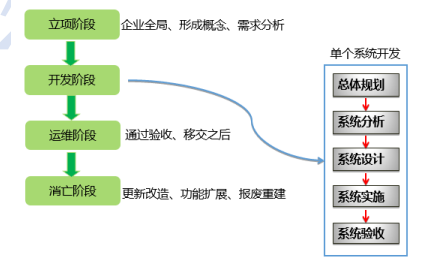
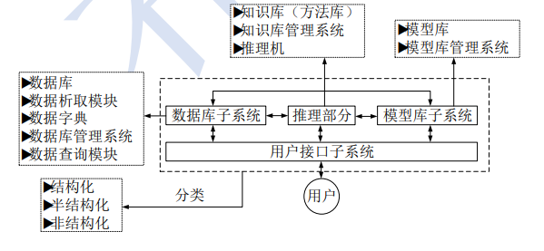

## 信息系统

> 信息属性：真伪，动态（随着时间变化），层次（战略，策略，执行），传递，**滞后（信息落后于数据，需要加工）**，扩压，分享，不完全
>
> 信息系统：以计算机硬件，网络，通信设备，计算机软件，信息资源，信息用户和规章制度组成的以处理信息流为目的的人机一体化系统
>
> **信息系统的5个基本功能：输入，存储，处理，输出，控制**
>
> 信息系统分类
>
> - 业务数据处理TPS/DPS：计算机应用协助企业局部事务管理
> - 管理信息系统MIS：围绕企业管理的全局计算机应用系统
> - 决策支持系统DSS：帮助决策者利用数据和模型解决半结构化决策问题和非结构化决策问题
> - 专家系统ES（人工智能）
> - 办公自动化系统OAS：综合性办公事务管理系统
>
> 信息系统生命周期（生产，开发，运行，消亡）
>
> -  
>
> 
>
> **信息系统战略规划**：从企业战略出发，构建企业基本的信息架构，对企业内、外信息资源进行统一规划、管理与应用，利用信息控制企业行为，**辅助企业进行决策，帮助企业实现战略目标**
>
> - **数据处理为核心**（围绕职能部门需求的信息系统规划）
>   1. BSP-CU矩阵：自上而下识别系统目标，自下而上设计信息系统，对组织机构的变动具有适应性
>   2. CSF关键成功因素：找实现目标的关键信息集合，从而确定开发优先次序
>   3. SST战略集合转换：把战略目标看成信息集合，把战略目标转变成信息系统的战略目标
> - **企业内部管理信息系统为核心**
>   1. SDP：战略数据规划
>   2. IE：信息工程
>   3. SG：战略栅格
> - **考虑企业内外玩家以集成为核心，围绕企业战略需求**
>   1. VCA：价值链分析
>   2. SAM：战略一致性模型
>
> 
>
> **政府信息化与电子政务**
>
>  应用领域：
>
> 1. 政务信息查询：面向社会公众和企业组织，为其提供政策、法规、条例和流程的查询服务
> 2. 公共政务办公：借助互联网实现政府机构的对外办公，例如申请、申报等，提高政府的运作效率，增加透明度。
> 3. 政府办公自动化：以信息化手段提高政府机构内部办公的效率，如公文报送、信息通知和信息查询等
>
> 电子政务分类：
>
> - G2G：政府上下级之间电子政务活动（计划管理、社会经济统计等；政府 之间的通信系统，包括各种紧急情况的通报、处理和通信系统）
> - B2G：政府向企业提供的各种公共服务（企事业单位从合法业务活动的环 境，包括产业政策、社保等各种规定；政府向企事业单位颁发的各种营业执照、许可证）
> - C2G：政府面向公众所提供的服务（社区公安和水、火等 于公共安全有关的信息等，还包括户口、各种证件的管理）
> - G2E：指政府与政府公务员即政府雇员之间的电子政务（行政办公和员工管理体系）
>
> 
>
> ####  **企业信息化与电子商务**
>
> - **ERP：企业资源计划（物料，资金链，信息流）** 全面一体化管理信息系统（需要个性化开发与部署，存在多个子系统，子系统之间互通）
>
>   1. 物料需求
>   1. 制造资源
>   1. 企业资源
>
> - **CRM：客户关系管理**：将客户看作资产；目的是与客户建立长期和有效的业务关系，最大限度地增加利润；核心是客户价值管理，提高客户忠诚度和保有率
>
>   1. 客户服务与支持
>   2. 商机管理：包括商机产生、商机获取和管理、商业活动管理和电话营销等
>   3. 触发中心，挖掘中心：确定目标客户群，分析客户价值
>
> - **SCM：供应链管理**：
>
>   1. 信息流：客户订单，生产计划，采购合同，入库单，完工报告单，提货发运单
>   2. 资金流
>   3. 物流
>
> - **产品数据管理PDM**：文档管理系统（管理所有与产品相关信息（包括零件信息、配置、文档、CAD文件、结构、权限信息等）和所有与产品相关过程（包括过程定义和管理）的技术）
>
>   1. 数据库文档管理
>   2. 产品结构与配置管理
>   3. 生命周期管理与流程管理
>   4. 集成开发接口
>
> - **商业智能BI**：商业报表
>
>   1. 需求分析，数据仓库建模，数据抽取，建立BI分析报表，用户培训与数据模拟测试，系统改进与完善
>
>   2. 数据仓库+ 数据挖掘+OLAP
>
>      > 数据仓库特点：面向主题，与时间关联，反应历史数据变化
>      >
>      > 数据仓库形成
>      >
>      > - ETL
>      > - 数据集市
>      > - 数据分析，OLAP（联机分析处理）服务器，将数据以多维度取值
>      >   1. 决策树
>      >   2. 神经网络
>      >   3. 遗传算法
>      >   4. 关联规则挖掘
>      > - 数据展现：报表工具，分析工具，数据挖掘工具
>      >   1. 关联分析：挖掘出数据间隐藏关系
>      >   2. 因果分析
>      >   3. 标签分类分析
>      >   4. 聚类分析：标签分类的逆过程
>
> - **DSS决策支持系统**：管理科学、运筹学、控制论、和行为科学为基础，以计算机技术、仿真技术和信息技术为手段，针对半结构化的决策问题，支持决策活动的具有智能作用的人机系统。
>
>   1. **结构化决策**：指对某一决策过程的规则进行**确定性描述与建模**，以适当的算法产生决策方案，并能**从 多种方案中选择最优解**
>   2. **非结构化决策**：决策过程复杂，不可能用确定的模型和语言描述其决策过程，无最优解
>   3. DSS模块结构
>      -  
>
> 
>
> **业务流程分析方法**（实体，对象，活动）
>
> 1. 价值链
>
> 2. 客户关系（CRM）
>
> 3. 供应链
>
> 4. 基于ERP分析
>
> 5. **业务流程重组（BPR）**：对企业的业务流程进行根本性的再思考和彻底性的再设计，使其成本、质量、 服务和速度等方面的业绩显著性增强
>
>    > 基本原则：以流程为中心的原则，团队管理原则（以人为本），以客户为导向的原则
>    >
>    > 过程：拟定变革计划，建立项目团队，分析目标流程，重新设计目标流程，实施新的设计，持续改进，重新开始
>    >
>    > 基于BRP系统规划：战略规划，流程规划，数据规划，功能规划，系统实施
>
> 6. **业务流程管理（BPM）**：规范化流程，以持续提高业务绩效为目的
>
>    > PDCA闭环管理过程：明确业务流程成果，开发和计划系统的方法，确保全面实现以上成果；
>    >
>    > 流程管理包含三个层面：**规范流程、优化流程和再造流程**
>
> BPM与BPR区别：BPM 与 BPR 管理思想最根本的不同就在于流程管理并不要求对所有的流程进行再造。构造卓越的业 务流程并不是流程再造，而是根据现有流程的具体情况，对流程进行规范化的设计
>
> 
>
> #### **电子商务**
>
> - 分类
>   1. B2C：企业对消费者
>   2. B2B：企业对企业
>   3. C2C：消费者对消费者
>   4. O2O：线上对线下
> - **企业应用集成**
>   1. 页面集成
>   2. 数据集成：为企业提供全面的数据共享。ETL、数据仓库、联邦数据库都可视为数据集成
>   3. 控制集成：借助于远程过程调用或远程方法调用、面向消息的中间件
>   4. 过程集成：各种业务信息的交换进行定义、授权和管理，以便改进操作、减少 成本、提高响应速度
>   5. 消息集成
>   6. 共享数据库
>   7. 文件集成

#### **未来信息综合技术**

> **信息物理系统CPS：** 控制系统，嵌入式系统延伸，通过感知，计算，通讯，控制信息技术构建物理空间与信息空间中人，机，物，环境，信息要素相互映射，适时交互，高效协同的复杂系统
>
> - CPS体系架构
>   1. 单元级CPS：智能终端
>   2. 系统级CPS：通过工业网络实现更大范围，更宽领域的数据流动
>   3. Sos级：多个系统CPS组成的工序
> - CPS技术体系
>   1. 总体技术：系统架构，异构系统集成，安全技术，试验验证技术
>   2. 支撑技术：智能感知，嵌入式软件，数据库。人机交互，中间件，SDN，物联网，大数据
>   3. 核心技术：虚实融合控制，智能装备，MBD，数字孪生，现场总线，工业以太网
>
> **人工智能AI**：计算机延伸和扩展人的智能，感知环境，获取知识并使用最佳结果的系统应用
>
> - 人工智能关键技术
>   1. **自然语言处理NLP**：机器翻译，语义理解，问答系统
>   2. **计算机视觉**
>   3. **人机交互HCI**
>   4. **虚拟或现实增强实现（VR，AR）**
>   5. **机器学习ML**
>
> **机器人4.0**：云-边-端融合的机器人系统和架构，云端提供高性能的计算和知识存储，边缘端实现数据处理并实时协同共享，机器终端完成操作交互功能
>
> - 核心技术
>   1. 云-边-端无缝协同计算
>   2. 持续学习与协同学习
>   3. 知识图谱
>   4. 场景自适应
>   5. 数据安全
>
> **边缘计算：**将数据处理，应用程序的运行服务实现由网络中心下放到网络边缘节点上**（在网关上采集并处理数据）**。
>
> - 基本概念
>
>   1. 云边缘：云服务的延伸，依赖于云服务或需要与云服务协同处理
>   2. 边缘云：靠近终端的云计算点，为终端设备提供计算服务
>   3. 云化网关：提供协议，接口转换，边缘计算能力
>
> - 边缘计算：联接，数据第一入口，约束（适配现场环境），分布
>
> - 边缘计算协同：
>
>   1. 资源协调：具有本地资源调度管理能力，同时可与云端协同
>   2. 智能协同：边缘节点AI模型执行推理，实现分布式智能
>   3. 应用协同：提供开发，测试，应用周期管理能力
>   4. 业务协同：实现数字孪生，微服务化应用
>
>   
>
> **数字孪生**：利用物理模型、传感器更新、运行历史等数据，集成多学科、多物理量、多尺度、多概率的仿真过程，在虚拟空间中完成映射，从而反映**相对应的实体装备的全生命周期过程**
>
> - 关键技术
>   1. 建模：使用数据实体描述或代替复杂系统
>   2. 仿真：验证和确认数据的可行和有效性，**保证数据实体和物理实现有效闭环**
>   3. VR，AR，MR支撑
>
> **云计算**：云平台和应用（**客户端通过网络获得计算与存储能力**）
>
> - SaaS软件即服务：应用上云，通过标准浏览器向客户提供应用服务
> - PaaS平台即服务：提供分布式开发环境
> - IaaS基础实施服务：提供云内存，云I/O设备，云存储和云计算能力
>
> 

