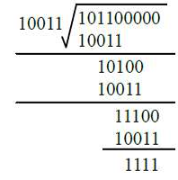

## **总览**

> 1. 码距：编码A改变到B需要改变的位数
>
> 2. 奇偶校验码：统计二进制中编码0,1的个数（50%准确率）
>
> 3. CRC循环冗余校验 
>
>    FCS = 数据 % 多项式 
>
>    CRC = 数据 + FCS
>
>     
>
> 4. 计算机硬件
>
>    ALU：算术逻辑单元
>
>    AC：累加寄存器（运算结果，操作数存放区）
>
>    DR：数据缓存区（内存指令，数据存放区）
>
>    PSW：状态条件寄存器（保存当前被中断执行程序的状态）
>
>    IR：指令寄存器（暂存指令）
>
>    PC：程序计数器（存放指令地址）
>
>    AR：地址寄存器（当前访问内存地址）
>
>    ID：指令译码器
>
> 5. 指令组成：操作码 + 操作数（寄存器中地址）
>
> 6. CISC与RISC：
>
>     
>
> 7. 流水线：取指和执行操作阶段时间上重叠
>
>    **流水线周期：最长耗时段为流水线周期**
>
>    **流水线执行时间：一条指令总执行时间  + （指令条数 -1） $\times$ 流水线周期**
>
>    **流水线吞吐率： 指令条数  /  流水执行时间**
>
>    **加速比：不使用流水线执行时间 / 流水线执行时间**
>
> 8. 分级存储体系：解决存储容量，成本，速度之间矛盾
>
> 9. **局部性原理**
>
>    时间局部性：在相邻的时间里访问同一数据项
>
>    空间局部性：相邻的空间地址会被连续访问
>
> 10. Cache地址映射
>
>    - 直接映像：Cache块与内存块相同命中，地址转换简单，不灵活，造成资源浪费
>    - 全相联映像：任意Cache块可以与内存块相连，地址转换复杂，速度慢，**利用率高，不容易冲突**
>    - 组组相联：组号相同，组内全相联映像
>
> 11. 磁盘调度
>
>     存取时间 = 寻道时间 + 等待时间
>
>     调度算法
>
>     - SCAN：优先访问磁道附近一侧数据读取
>
> 12. 内存与接口同比编码方式
>
>     - 程序轮询：CPU主动查询外设数据完成传输，效率低
>     - 程序中断：设备主动向CPU发生中断（效率高）
>     - DMA（直接主存存取）
>
> 13. DBS：数据库系统（数据库，硬件，软件，人员）DBMS：数据库管理系统
>
> 14. 范式
>
>     - 1NF：属性不可切分
>     - 2NF：消除非主属性对候选建的依赖
>     - 3NF：消除非主属性对候选建传递依赖
>     - BCNF：消除主键对候选建的传递依赖
>