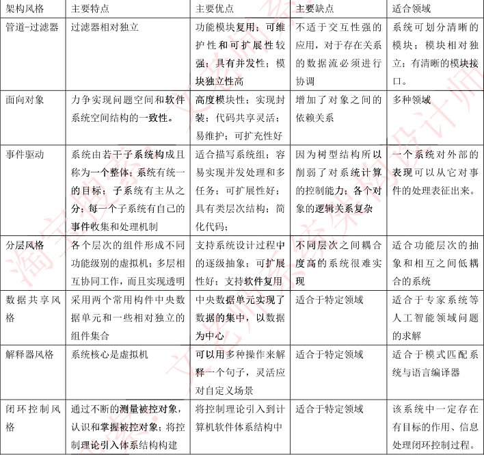
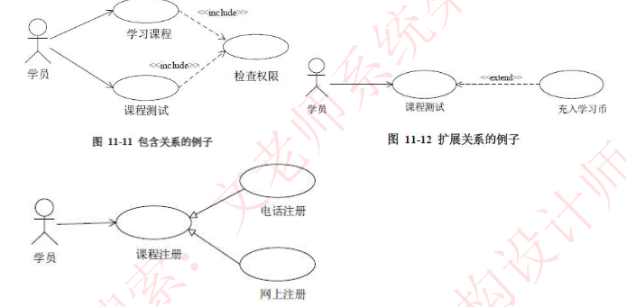
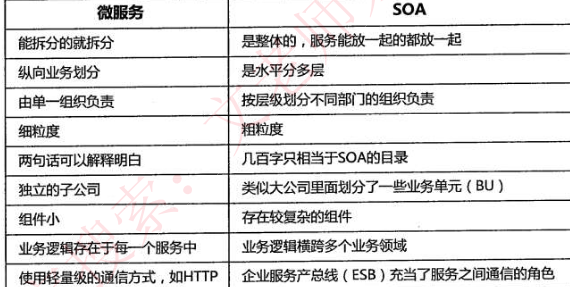
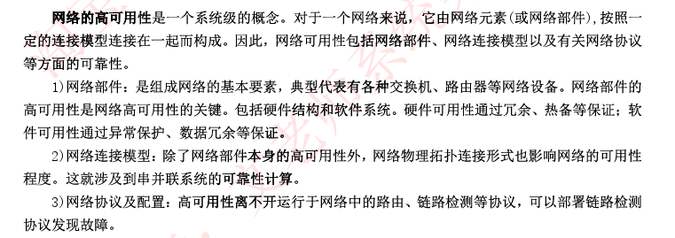
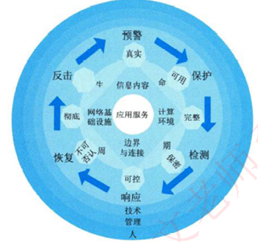
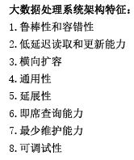

## 案例分析

- **软件质量属性及名称** （系统质量属性与架构评估）

  > 软件质量属性：
  >
  > - 开发阶段属性：易理解，可扩展，可重用，可测试，可维护，可移植
  > - 运行阶段属性：性能，安全，可伸缩，互操作性，可靠，可用，鲁棒
  >
  > **性能：系统响应能力**（响应时间，吞吐量）。通过增加计算资源，减少计算开销，引入并发机制，采用资源淘汰、调度策略提升
  >
  > 可用性：系统能够正常运行的时间比例
  >
  > 可靠性：在意外或错误使用的情况下维持软件系统功能特性的基本能力
  >
  > 健壮性：系统能够承受压力或变更的能力
  > 安全性：系统向合法用户提供服务的同时能够阻止非授权用户使用的企图或拒绝服务的能力
  >
  > 可修改性：能够快速地以较高的性能价格比对系统进行变更的能力
  >
  > 可变性：体系结构经扩充或变更成为新体系结构的能力。
  >
  > 可测试性：指软件发现故障并隔离、定位其故障的能力特性，以及在一定的时间和成本前提下，进行测试设计、测试执行的能力
  >
  > 功能性：系统所能完成所期望工作的能力
  >
  > 互操作性：系统与外界或系统与系统之间的相互作用能力
  >
  > 
  >
  > 
  
- #### **软件架构风格**

  > 软件架构风格：描述特定软件系统组织方式的惯用模式。组织方式描述了系统的组成构 件和这些构件的组织方式，惯用模式则反映众多系统共有的结构和语义
  >
  > 面向对象风格：将数据表示和基本操作封装在对象中。这种模式的构件是对象，对象维护自身表示的完整性，对象之间通过消息机制进行通信，对象交互时需要知道彼此的标识，通过对象之间的协作完成计算过程
  >
  >  
  >
  >  
  >
  >  
  >
  >  
  >
  > **MVC架构**：有助于管理复杂的应用程序。实现业务逻辑与界面设计分离，便于应用测试
  >
  > - 控制器：负责从视图中提取数据，控制用户输入，并向模型发生数据
  > - 模型：处理应用数据逻辑部分，表现业务数据和业务逻辑
  > - 视图：应用程序中数据展示部分，用户与系统的交互页面
  >
  >  
  >
  > **J2EE架构**：具有支持异构环境，可伸缩性（负载均衡），灵活性，易维护性特点
  >
  > - 客户端层
  > - 服务器组件层：JSP，Servlet
  > - EJB层：服务器端组件模型，包含 Session，Entity，Message-Driven
  > - 企业信息系统层：
  >
  > 
  >
  > **面向服务架构SOA**：将应用程序的不同功能单元（服务）通过这些服务之间定义良好的接口契约联系起来，独立于实现服务的硬件平台，操作系统和编程语言。
  >
  > 
  >
  > **企业服务总线 ESB**：通过消息转换，解释，以及路由实现连接各个服点节点之间通信
  >
  > - 描述服务元数据和服务注册管理
  > - 服务请求和服务提供者之间传输数据
  > - 发现，路由，匹配和选择能力，以支持服务之间的动态交互，解耦服务请求和服务提供
  >
  > 

- #### **需求工程**

  > **结构化：**
  >
  > - 自顶向下，逐步分解，面向数据
  > - 模型：数据流图，行为模型，数据模型（E-R），数据字典（数据元素，数据结构，数据流，数据存储，加工逻辑，外部实体）
  > -  
  > -  
  >
  > 
  >
  > 流程图：以图形化的方式展示应用程序从数据输入开始到获得输出为止的逻辑过程，描述 处理过程的控制流
  >
  > 数据流图：说明业务处理过程、系统边界内所包含的功能和系 统中的数据流
  >
  > 流程图与数据流图区别：
  >
  > 1. 数据流图中的处理过程可并行；流程图在某个时间点只能处于一个处理过程
  > 2. 数据流图展现系统的数据流；**流程图展现系统的控制流**。
  > 3. 数据流图展现全局的处理过程，过程之间遵循不同的计时标准；流程图中处理过程遵循一致的计时标准。
  > 4. 数据流图适用于系统分析中的逻辑建模阶段；流程图适用于系统设计中的物理模阶段
  >
  > 
  >
  >  高质量数据流图设计原则
  >
  > 1. 复杂性最小化原则：DFD分层架构，将消息划分小且独立的子集
  > 2. 接口最小化原则：各个元素之间的接口数或连接数最小化
  > 3. 数据流一致性原则：是否存在流出流入数据，是否存在**数据流入加工**（椭圆形表示数据加工处理）
  >
  
- #### **数据库系统**
  
  > ORM技术：关系数据库与对象之间映射
  >
  > 1. ORM降低开发和学习成本
  > 2. 不需要使用SQL进行操作数据库
  > 3. 减少程序代码量
  > 4. 降低由SQL代码质量带来影响
  > 5. 不太容易处理复杂查询语句
  > 6. 性能较比SQL差
  >
  > 
  >
  > **关系数据库与NoSQL数据库对比**
  >
  >  
  >
  >  
  >
  >  
  >
  > **封锁协议**
  >
  > - X锁（排他锁，写锁）：只允许锁的事务运行读取和修改，不允许再次加锁
  > - S锁（共享锁，读锁）：允许锁的事务进行读取，不允许修改（存在锁版本控制，读取不同状态数据）
  >
  >  
  >
  > 
  >
  > 
  >
  > **反规范化技术**：
  >
  > - 增加冗余列
  >- 增加派生列
  > - 重新组表
  >- 水平分割表
  > - 垂直分割表
  >
  
- **Web应用开发**
  
  > - 应用层负载技术：http从定向，反向代理服务器
  >
  > - 传输层负载技术：DNS域名解析（无法灵活配置），NAT负载均衡，将外部IP影射多个IP地址
  >
  > - CDN内容分发网络：通过分布式缓存服务器及全局负载技术，使其用户就近访问资源
  >
  > - 微服务：SOA技术延深，强调业务彻底组件化和服务化，微服务包含完整的业务功能，开放一种或多种接口为其他服务使用，并且可以包含一个自己私有的数据库
  >
  >    
  >
  >    
  >
  
- #### **通信网络架构设计**
  
  >  
  >
  > **网络安全**
  >
  > 1. 防火墙
  > 2. VPN：虚拟专用网络
  > 3. 访问控制技术
  > 4. 网络安全隔离
  > 5. 网络安全协议：SSL，SET，HTTPS
  > 6. 网络安全审计：对网络进行测试评估，最大限制保障业务安全正常运行
  >
  > 
  >
  > **高可用网络构建**
  >
  > 1. 使用冗余引擎和冗余电源，为关键用户群提高可靠性
  > 2. 与具备冗余系统的汇聚层采取双归属性连接，获得默认网关冗余，实现主备交换机快速故障切换
  > 3. 通过链路汇聚提供宽带利用率，降低网络链路复杂度
  > 4. 通过配置动态ARP及检查IP源地址，防止非法访问
  
- #### **安全架构设计**
  
  > **安全威胁种类**
  >
  > - 信息泄漏：信息被泄漏给非授权实体
  > - 破坏信息完整性：数据被非授权用户进行修改，删除
  > - 拒绝服务：对信息或其他资源的合法访问被无条件阻止
  > - 非法使用（非授权访问）：
  > - 窃听，窃取：通过某种手段窃取信息系统中敏感信息
  > - 假冒：通过欺骗系统（或用户）成为合法用户
  > - 旁路控制：利用系统安全缺陷或脆弱出获得非授权的权利
  > - 授权侵犯（内部攻击）：将权限授权其他非人
  > - 木马
  > - 陷阱门，业务欺骗：诱导用户提供系统关键数据
  > - 抵赖：否认或伪造用户数据
  > - 重放：截取用户通信数据，进行重新发送
  > - 计算机病毒
  > - 人员渎职
  > - 媒体废弃：信息从废弃的磁盘，文件中恢复获取
  > - 物理入侵：绕过物理设备控制获得对系统访问
  >
  > 
  >
  > **信息安全整体架构设计** WPDRRC
  >
  > - 环节：预警，保护，检测，响应，恢复，反击
  >
  > - 要素：人员，策略，技术
  >
  >    
  >
  >  
  >
  > 安全保证体系：
  >
  > 1. 安全区域策略确定：定时审计评估，安装入侵检测系统，统一授权，认证
  > 2. 统一配置和管理防病毒系统
  > 3. 网络安全管理
  >
  > 信息安全体系架构：
  >
  > 1. 物理，系统，网络，应用，安全管理
  
- #### **系统架构的脆弱性分析**
  
  > 软件脆弱性原因：输入验证错误，权限检查错误，操作序列化，边界检查，软件设计错误
  >
  > 产生破坏效果：非法执行代码，非法更改目标对象，访问数据对象，拒绝服务攻击
  >
  > 
  >
  > **典型软件架构脆弱分析**
  >
  > - 分层架构
  >
  >   1. 底层错误，程序无法正常运行
  >   2. 层级之间通信脆弱，层级之间通信需要层层传递，降低通信性能下降
  >
  > - C/S，B/S架构
  >
  >   1. 客户端软件安全性（客户端反编译，数据截取）
  >   1. 网络协议，开放性
  >
  > - 事件驱动架构
  >   1. 不能确定响应事件组件执行顺序
  >   2. 组件之间交换数据弱，逻辑性复杂
  >   3. 事件驱动容易进入死循环
  >   4. 高并发低
  > - MVC架构
  >   1. 增加系统结构，降低运行效率低
  >   2. 视图，控制器，模型数据访问低，视图可能需要多次请求控制器，模型数据才能展示足够的数据
  > - 微服务架构
  >   1. 开发人员需要处理分布式系统的复杂结构
  >   2. 服务之间的通信机制是导致分布式架构瓶颈
  
- #### **大数据架构设计**

  >  
  >
  > 
  >
  >  Lambda架构构建大规模分布式数据处理系统（机器学习，物理网，流处理）
  >
  > - 批处理层
  > - 速度处理层
  > - 服务层（响应查询）
  > -  
  >
  > - Lambda架构：容错性好，查询灵活度高，易伸缩，易扩展，全场景覆盖带来编码开销，重新部署和迁移成本高
  >
  >   
  >
  > Kappa架构：在Lambda基础上，删除BatchLayer架构，将数据通道以消息队列进行代替（数据存在在消息队列中，当进行离线分析或在计算时重新消费）
  >
  > - 消息中间件缓存的数据量和回溯数据性能有瓶颈
  > - 依赖实时计算系统能力
  >
  >  
  >
  > 

  

