## 英语

- ### **Parts of  Speech**

  > 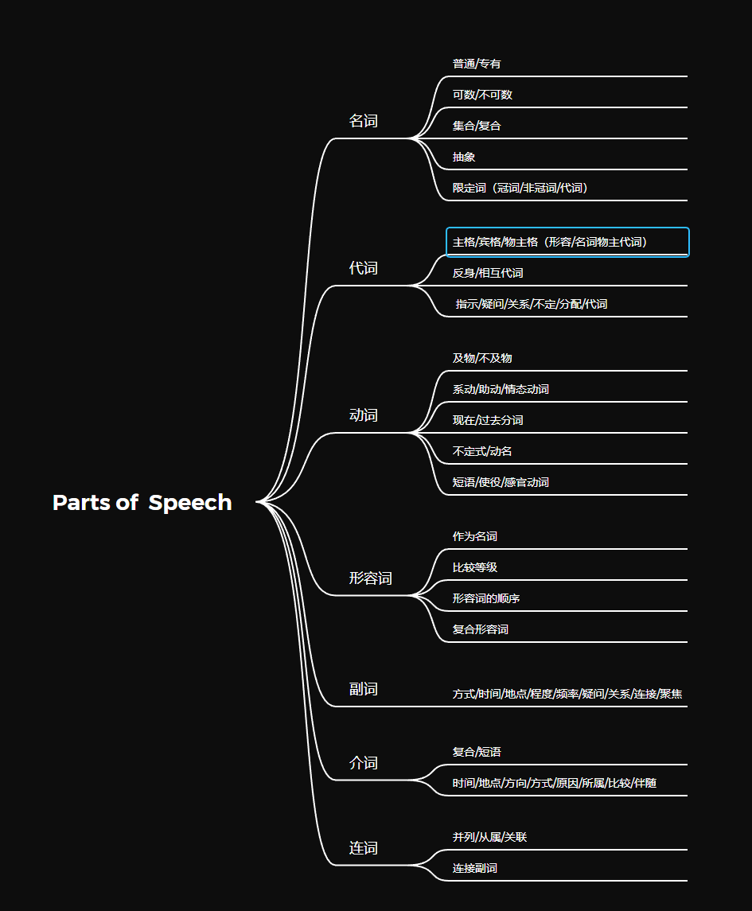  
  >
  > 1. 定冠词(the)：用于特指双方已知或唯一的事物（ 序数词/最高级/乐器名词/地理名称/特定/组织群体/历史事件）
  >
  > 2. 不定冠词（a/an)：用于非特定或首次提及的单数可数名词前，表示一个或一类中的任何一个
  >
  > 3. 零冠词：泛指这一类的不可数名词，抽象名词
  >
  > 4. 量化词：可数名词（many, few,each,every, a number of），不可数名词（much, little, a piece of,a large amount of），通用（some，any，a lot of/lots of，most，all，enough）
  >
  > 5. 集合名词（family，police，team）：表示一组人或事物的整体概念的名词
  >
  >    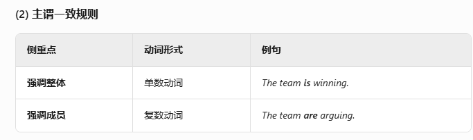 
  >
  > 6. 复合名词：由两个或多个词组合而成的新名词，含义常与组成词不同
  >
  >    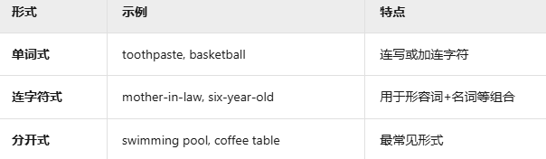 
  >
  > 7. 抽象名词：概念、状态、品质或情感的名词。谓语动词通常单数动词
  >
  >    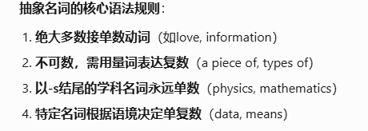 
  >
  > 8. 人称代词
  >
  >    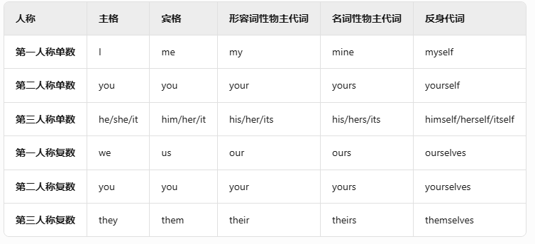 
  >
  >    - 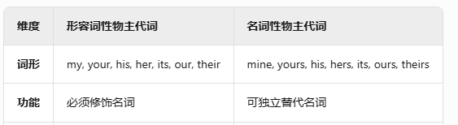 
  >    - 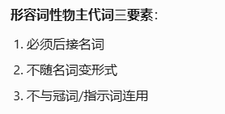 
  >
  > 9. 反身代词：表示动作的承受者与执行者是同一主体，或用于强调
  >
  >    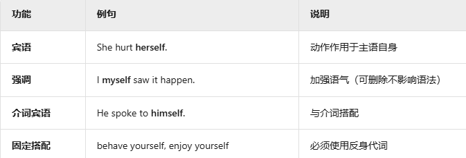 
  >
  > 10. 相互代词：表示两个或多个主体之间的相互关系（**each other**，**one another**）两者相互关系/三者及以上相互关系，无复数形式，存在所有格
  >
  >     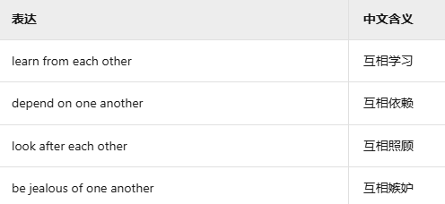 
  >
  > 11. 指示/疑问/关系/不定/分配代词
  >
  >     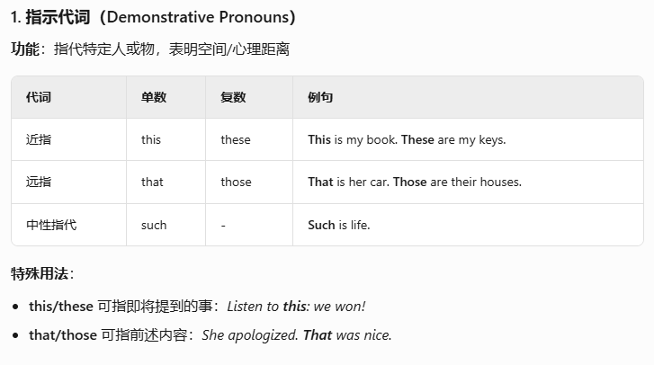 
  >
  >     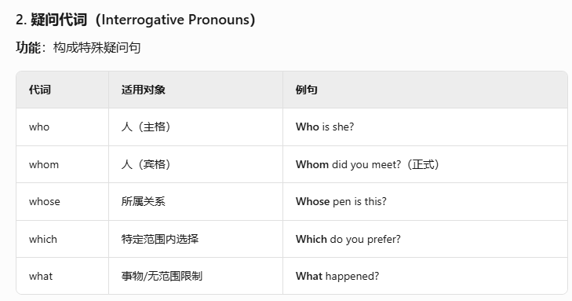 
  >
  >     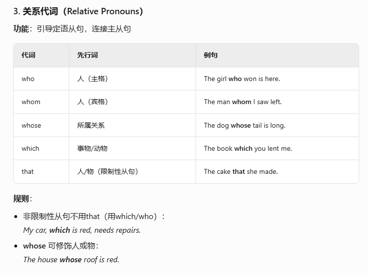 
  >
  >     - that：先行词含最高级/序数词/all/any/only/vary/人和物
  >     - which：非限制性从句（逗号），介词
  >
  >     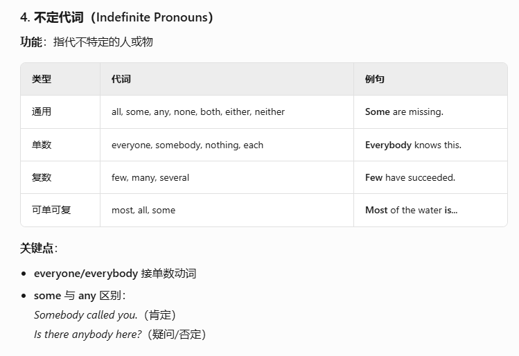 
  >
  >     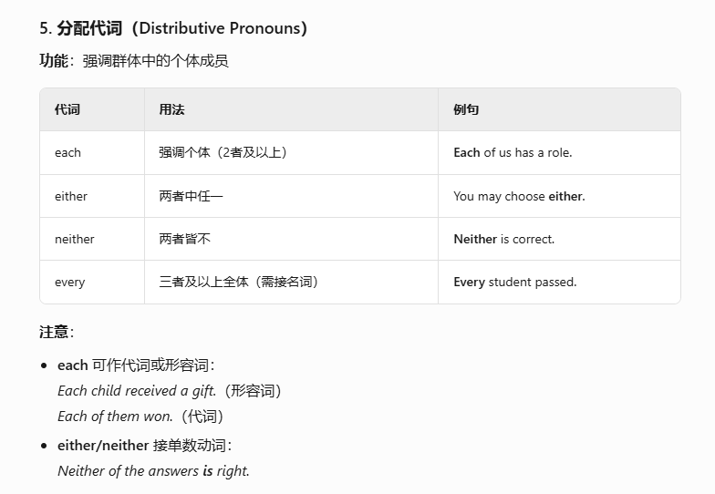 
  >
  > 12. 及物动词/不及物动词：可转换为被动语态，必须带宾语
  >
  > 13. 过去时（did）：描述已经完成的动作或状态，虚拟语气
  >
  >     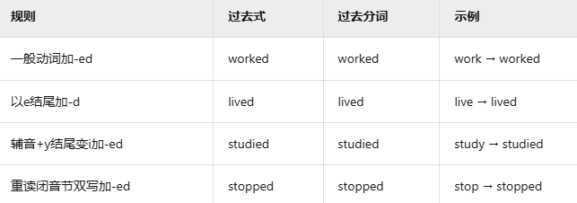 
  >
  >     - 虚拟语气：动词过去时表达假设、愿望或与事实相反的情况
  >
  >      
  >
  >     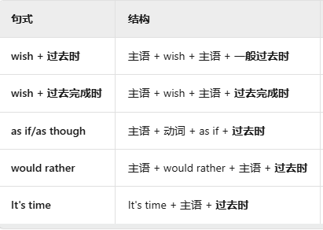 
  >
  > 14. 过去分词（done）：用于完成时/被动语态/形容词化
  >
  >     - 完成时态：现在完成时强调与现在的关联（常搭配already/yet/recently）
  >
  >     - 过去完成时需有明确过去时间参照（如when/before从句）
  >
  >     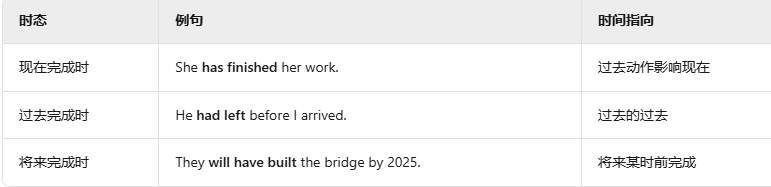 
  >
  >     - 被动语态：强调动作承受者而非执行者
  >
  >     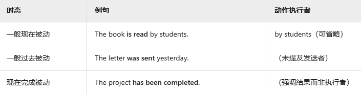 
  >
  >     - 形容词化：过去分词作定语或表语，表示被动或完成状态
  >     - a **breaking** window（正在破裂的窗户，主动进行）
  >     - a **broken** window（已破裂的窗户，被动完成）
  >
  >     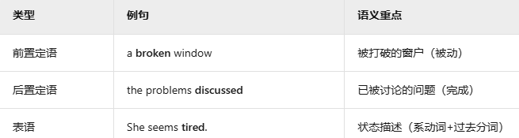 
  >
  >     - 独立主格（名词 + 过去分词）
  >
  >       **The work finished**, we went home
  >
  >       **All things considered**, it's a good plan
  >
  > 15. 不定式动词：充当句子成分，补充句子时态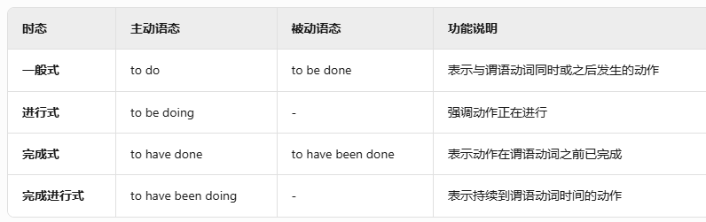
  >
  > 16. 动名词：充当句子成分，补充句子时态
  >
  >     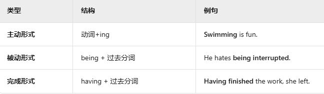 
  >
  >     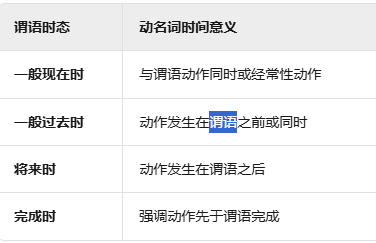 
  >
  >     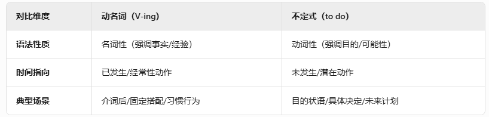 
  >
  >     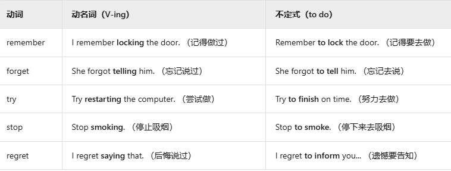 
  >
  > 17. 系动词/感官动词：连接主语和表语，表达状态或变化，无被动语态，感官动词（主语+表语）或不表示实际动作
  >
  > 18. 助动词：帮助形成不同的时态、语态、语气以及强调
  >
  >     | **助动词** | 功能                |      **主语单数**       |     **主语复数**     | **现在时** | **过去时** | **过去分词** |
  >     | :--------: | ------------------- | :---------------------: | :------------------: | :--------: | :--------: | :----------: |
  >     |     be     | 构成进行时/被动语态 | am (I) / is (he/she/it) |  are (we/you/they)   | am/is/are  |  was/were  |     been     |
  >     |    have    | 构成完成时          |     has (he/she/it)     | have (I/we/you/they) |  have/has  |    had     |     had      |
  >     |     do     | 构成疑问/否定/强调  |    does (he/she/it)     |  do (I/we/you/they)  |  do/does   |    did     |     done     |
  >
  > 19. 情态助动词：表达句子的语气、态度或观点，及未来时态
  >
  >     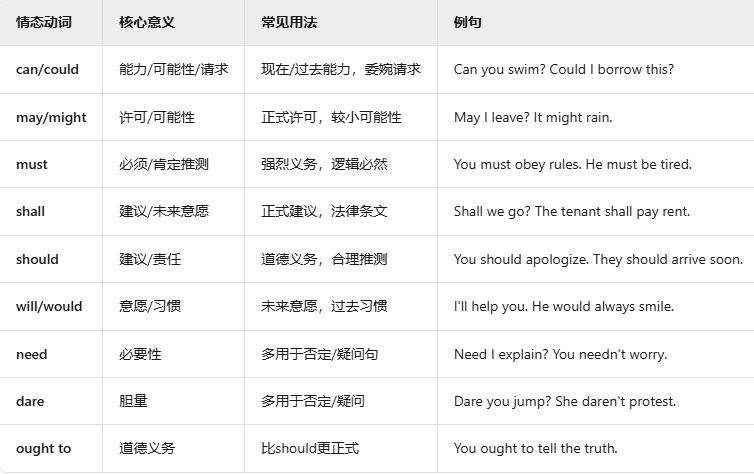  
  >
  >     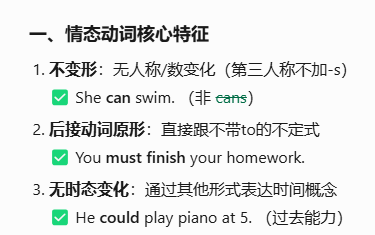  
  >
  > 20. 动词短语：由"动词+介词/副词"构成的固定搭配，整体意义常与字面不同
  >
  > 21. 使役动词：让某人做某事或使某事发生的情况
  >
  >     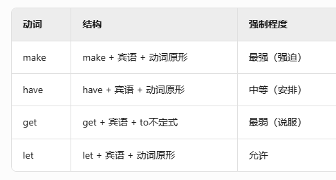 
  >
  >     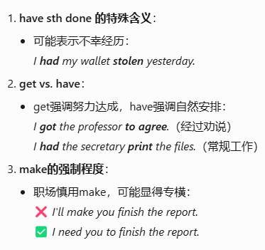 
  >
  > 22. 形容词：修饰名词或代词，描述人或事物的性质、状态或特征
  >
  >     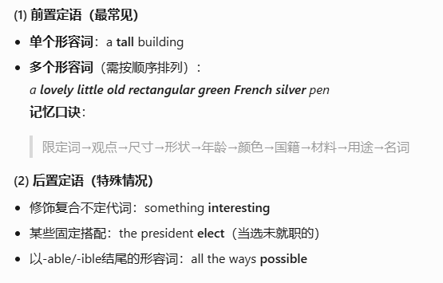 
  >
  >     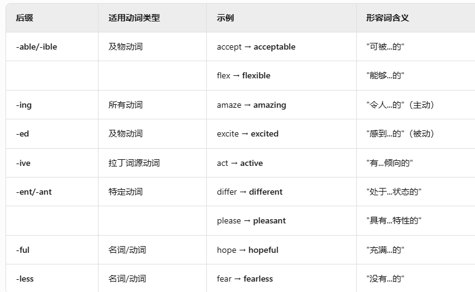 
  >
  >     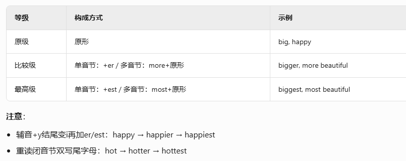  
  >
  > 23. 副词：修饰动词、形容词、其他副词或整个句子
  >
  >     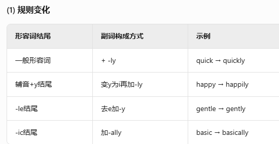 
  >
  >     时间副词：now，recently，soon
  >
  >     地点副词：here，upstairs，everywhere
  >
  >     程度副词：very，almost，too
  >
  >     方式副词：carefully，well，fast
  >
  >     频率副词：always，often，rarely
  >
  >     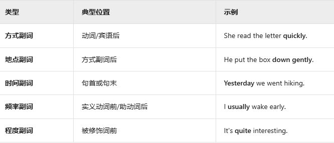  
  >
  > 24. 介词：表示名词/代词与其他句子成分的关系（时间、地点、方式等）
  >
  >     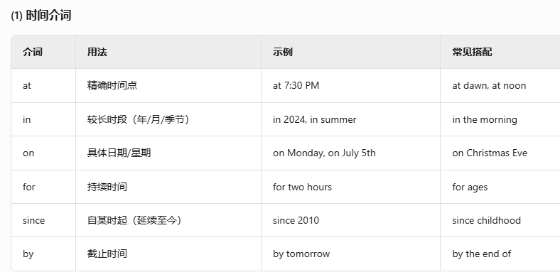  
  >
  >     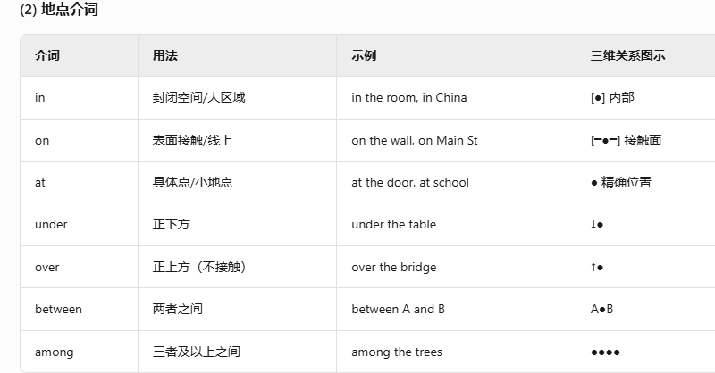 
  >
  >      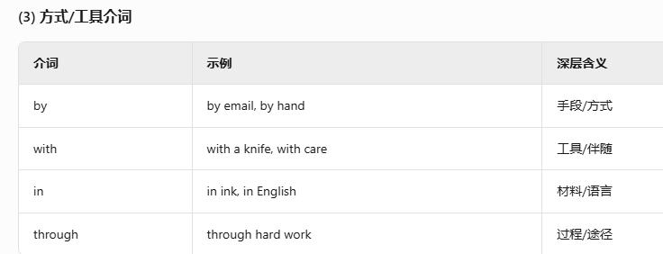 
  >
  >      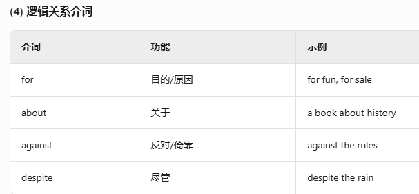 
  >
  > 25. 连词：连接单词、短语或句子的虚词
  >
  >     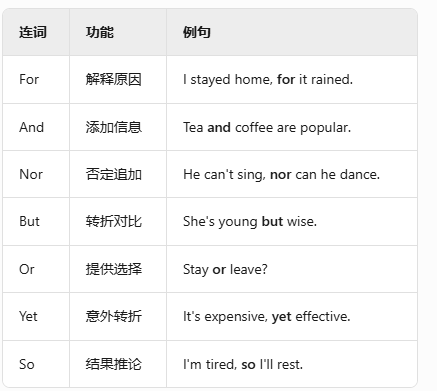 
  >
  >     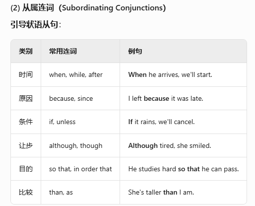 
  >
  >     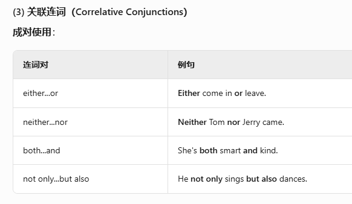 
  >
  >     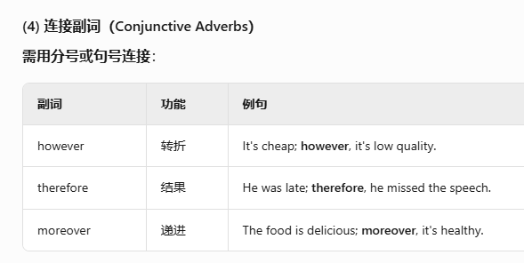 
  >

**Sentence Structure**

> 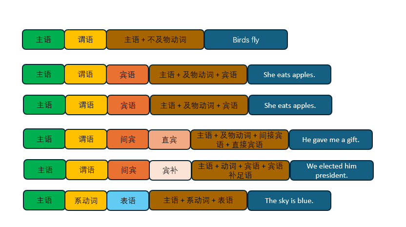 
>
> 1. 主语（名词、代词、动名词、不定式或从句）
>
> 2. 谓语（说明主语的动作或状态，必须包含动词，时态变化）
>
>    -  时态变化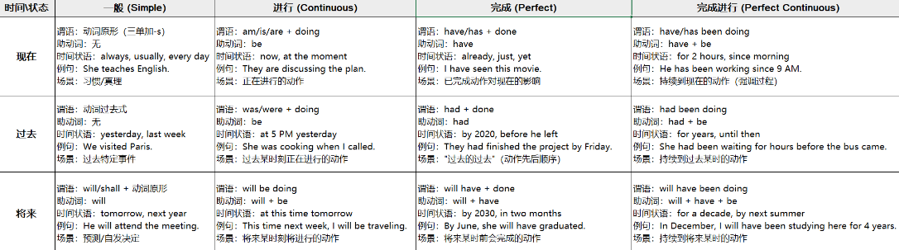 
>
>      1. 一般现在时（v）：习惯/真理/永久事实（Water **boils** at 100°C，always/usually/every day）
>      2. 现在进行时（be doing）：正在进行的动作/临时状态（She **is studying** for exams，now/at present/currently）
>      3. 一般完成时（have done）：已完成动作对现在的影响（I **have visited** Paris twice，already/just/yet/since）
>      4. 一般完成进行时（have been  doing）：持续到现在的动作/强调过程（He **has been working** since 8 AM，for 2 hours/all morning）
>      5. 一般将来（will/shall v)：预测/即时决定（It **will rain** later，tomorrow/next year/soon）
>
>    - 被动语态： **be + 过去分词（done）**，其中be受时态变化
>
>      |      **时态**      |  **主动语态结构**   |    **被动语态结构**    |      **时间状语**      |                    **例句（主动→被动）**                     |
>      | :----------------: | :-----------------: | :--------------------: | :--------------------: | :----------------------------------------------------------: |
>      |   **一般现在时**   |       do/does       |    am/is/are + done    |   every day, usually   |   She **writes** emails. → Emails **are written** by her.    |
>      |   **现在进行时**   |  am/is/are + doing  | am/is/are being + done |   now, at the moment   | They **are repairing** the road. → The road **is being repaired**. |
>      |   **现在完成时**   |   have/has + done   |  have/has been + done  |  since 2020, already   | He **has finished** the report. → The report **has been finished**. |
>      |   **一般过去时**   |         did         |    was/were + done     |  yesterday, last week  | They **built** this bridge in 1990. → This bridge **was built** in 1990. |
>      |   **过去进行时**   |  was/were + doing   | was/were being + done  |   at 8 PM yesterday    | She **was washing** the car. → The car **was being washed**. |
>      |   **过去完成时**   |     had + done      |    had been + done     |  by 2010, before left  | We **had packed** the boxes. → The boxes **had been packed**. |
>      |   **一般将来时**   |       will do       |     will be + done     |  tomorrow, next month  | They **will announce** the results. → The results **will be announced**. |
>      |   **将来进行时**   |    will be doing    |       无被动形式       | at this time tomorrow  |                                                              |
>      |   **将来完成时**   |  will have + done   | will have been + done  | by 2030, in two years  | She **will have completed** the project. → The project **will have been completed**. |
>      | **现在完成进行时** | have/has been doing |       无被动形式       | for hours, all morning |                                                              |
>      |   **过去将来时**   |      would do       |    would be + done     |      the next day      | He said they **would sell** the house. → The house **would be sold**. |
>      | **过去将来完成时** |  would have + done  | would have been + done |    by last December    | We thought she **would have signed** the contract. → The contract **would have been signed**. |
>      
>    - 情态动词
>
>      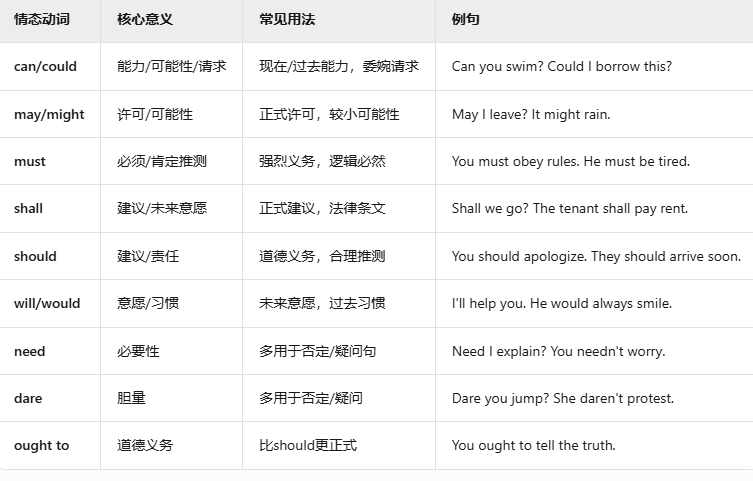 
>
>      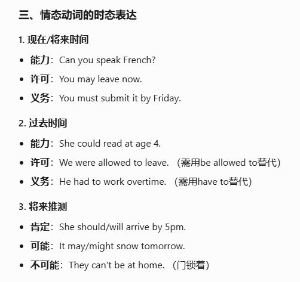 
>
>       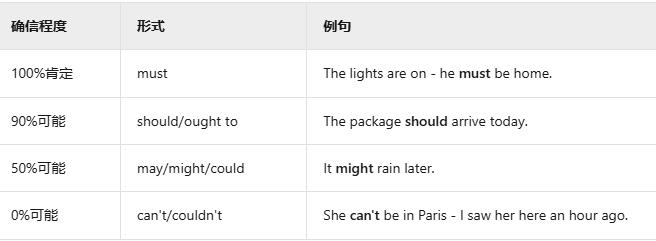 
>
>      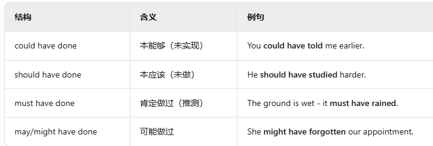  
>
> 3. 非谓语（可作主语/宾语/定语/状语，无人称和数的变化，可带宾语/状语）
>
>    - 不定式
>      1. to + 动词原形：表目的/计划/将来/抽象概念（**To learn** English takes time and effort）
>      2. to be done：当强调动作的承受者而非执行者（The car needs **to be washed**）
>      3. to be doing：强调正在进行的动作，主句的动作同时发生（She pretended **to be listening**, but she was actually thinking about her vacation.）
>      4. to have done：当强调动作已完成且关注的是动作的承受者时（It is expected that the report will **have been finished** by Friday）
>    - 动名词（名词性质，作主语/宾语/表语.介词）
>      1. doing：I enjoy **listening** to music（做宾语，其中listen为不及物动词需要添加to）
>      2. being done：表示被动和正在进行的状态（He was excited about **being chosen** for the project team.）
>      3. having done：强调某个动作在另一个动作之前已经完成时（**Having finished** his homework, Tom went out to play with his friends.）
>    - 分词（doing/done，形容词性质 ）
>      1. doing：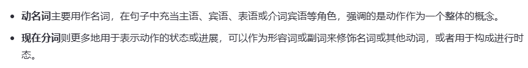 
>      2. done：表被动/完成
>
> 4. 宾语（动作的承受者或行为的对象，通常位于**及物动词**或**介词**之后）
>
>    - 名词/代词/动名词/不定式/从句均可作为宾语（He said **that he was busy**. Call **me** later. I find **it** hard **to understand this theory**.）
>
> 5. 间接宾语（动作的接受者或受益者）
>
>    - 间接宾语后置：**to/for + 宾语**  He gave a gift **to me** / He gave me a gift
>
> 6. 补语：描述**主语/宾语**状态或特征，与系动词搭配使用
>
>    - 主语补语：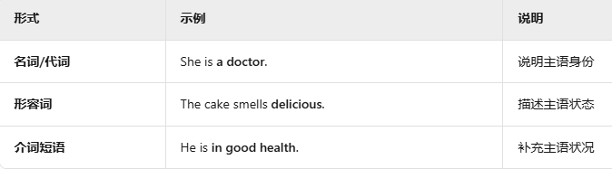  
>    - 宾语补语：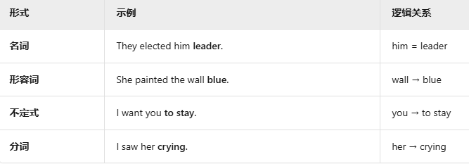 
>
> 7. 表语：位于系动词之后，说明主语身份、性质、特征或状态
>
>    - 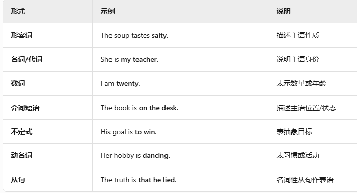  
>    - 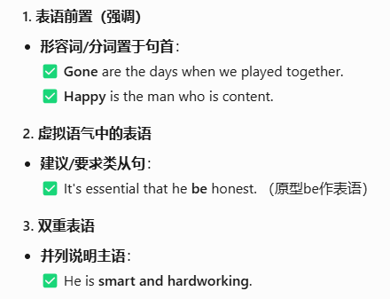  
>    - 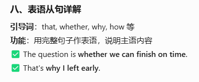 
>
> 8. 同位语：紧跟在一个名词或代词之后，进一步解释、定义或补充前面的名词或代词  My friend **John** is a great musician
>
> 9. 定语：修饰名词或代词（形容词，名词，数词）
>
> 10. 状语：修饰动词、形容词、副词或整个句子的成分，用于说明动作或状态的时间、地点、原因、方式、程度

### **Sentences**

> 复合句：用于连接两个独立分句，表达逻辑关系（独立分句 + 连接词 + 独立分句）
>
> - | **类型** | **连接词** |                   **例句**                    |
>   | :------: | :--------: | :-------------------------------------------: |
>   | 并列关系 |    and     | She loves reading, **and** he prefers sports. |
>   | 转折关系 |    but     |    It was expensive, **but** we bought it.    |
>   | 选择关系 |     or     |     You can stay here, **or** leave now.      |
>   | 因果关系 |     so     |   It rained, **so** we canceled the picnic.   |
>
> - | **逻辑关系** |                  **副词连接词**                   | **中文含义** |
>   | :----------: | :-----------------------------------------------: | :----------: |
>   |   **递进**   |     furthermore, moreover, additionally, also     |  此外/而且   |
>   |   **转折**   |     however, nevertheless, nonetheless, still     |  然而/不过   |
>   |   **因果**   | therefore, thus, consequently, accordingly, hence |  因此/所以   |
>   |   **对比**   |      meanwhile, conversely, instead, rather       |  反之/相反   |
>   |   **举例**   |             for example, for instance             |     例如     |
>   |   **总结**   |           finally, ultimately, overall            |  最终/总之   |
>   |   **强调**   |          indeed, certainly, undoubtedly           |  确实/无疑   |
>
> - eg：
>
>   1. The software is user-friendly; **furthermore**, it's compatible with all devices.
>   2. She finished the report on time; **moreover**, she included extra data analysis.
>   3. The plan seemed perfect; **however**, the execution failed.
>   4. He lacked formal training; **nevertheless**, his skills were exceptional
>   5. The road was blocked; **therefore**, we took a detour.
>   6. The experiment violated safety protocols; **consequently**, it was terminated.
>   7. He expected praise; **instead**, he received criticism.
>   8. Many languages share Latin roots; **for example**, Spanish and French.
>   9. Some animals hibernate; **for instance**, bears sleep through winter.
>   10. The evidence was irrefutable; **indeed**, the defendant confessed.
>
> 倒装句： 助动词，不及物动词或副词提前，突出句首的特定信息
>
> 1. 一般疑问句：助动词/系动词提前  **Do** you like coffee?
>
> 2. 特殊疑问句：疑问词 + 一般疑问句语序 What are you doing?
>
> 3. 否定倒装：否定词 + 助动词 + 主语 + 实义动词
>
>    **Never have I seen** such a beautiful sunset（I have **never** seen such a beautiful sunset）
>
>    **Not until midnight did he finish** his work.（He did **not** finish his work until midnight）
>
>    **Rarely do we go** to the cinema these days.（We rarely go to the cinema these days.）
>
>    **Hardly had I closed** the door when the phone rang.（I had hardly closed the door when the phone rang）
>
>    **Nowhere will you find** such friendly people（you will find such friendly people nowhere）
>
> 4. 条件倒装：Only + 状语（副词/介词短语/从句） + 助动词 + 主语
>
>    **Only when he arrived home did he** realize his mistake（He realized his mistake only when he arrived home）
>
>    **Only in this room can you** find peace（You can find peace only in this room）
>
>    **Only by working hard can one** succeed（One can succeed only by working hard.）
>
>    **Only if it rains will we** stay indoors （We will stay indoors only if it rains.）
>
> 5. 结构/程度倒装：So/(Such) + 形容词/副词（名词） + 助动词 + 主语 + that
>
>    - **So boring was the movie that** I fell asleep halfway through it.  (The movie was so boring that I fell asleep halfway through it)
>    - **Such a noise was there that** no one could sleep （There was such a noise that no one could sleep ）
>    - **Such a beautiful sight was it** that everyone stopped to admire it（It was such a beautiful sight that  everyone stopped to admire it） 
>
> 6. 虚拟条件：Were/Had/Should + 主语 + 其他
>
> 7. 让步状语倒装：形容词/名词/副词/动词原形 + as/though + 主语 + 谓语
>
>    **Try as she might**, she couldn't open the door 
>
>    **Young as he is**, he speaks five languages.（Even though he is young, he speaks five languages.）
>
>    **Child though he was**, he knew the truth（Even though he was a child, he knew the truth）
>
> 主从句：从句充当主句的成分（主/宾/表/同位/定/状语）
>
> - 主语从句（that/whether/wh-词）
>
>   eg：
>
>   1. **That the Earth revolves around the sun** is a scientific fact 
>
>   2. **Whether she will accept the offer** remains to be seen.（主谓，to be seen待观察，固定短语）
>
>   3. **Whether there will be enough food for everyone** is something we need to consider （主系表，定语从句，修饰something）
>
>      It is something we need to consider **whether there will be enough food for everyone.**
>
>   4. **Who will win the competition** is anyone's guess
>
>   5. **Who called you last night** is what I want to know. （主系表）
>
>   6. **How much it will cost** depends on the materials.
>
>      **It** depends on the materials **how much it will cost**.
>
> - 宾语从句（that/whether/if/wh-词）：wheth/if：是否含义
>
>   eg：
>
>   1. Scientists confirm **[that]** **climate change is accelerating**.
>
>   2. I wonder **whether/if he will attend the meeting.**
>
>   3. Can you tell me **whose book this is**? 
>
>   4. She didn't say **where she was going**
>
>   5. He said **(that) he was tired and that he would leave.**
>
>   6. I don’t know **whether/if he will come or not**
>
> - 表语从句：主语 + 系动词 + 引导词 + 从句
>
>   eg：
>
>   1. The main problem is **that we don't have enough time**.
>   2. The question is **what we should do next**
>   3. The issue might be **where the funds were allocated**
>   4. The issue is **whether or not it's legal.**
>   5. The reason for the delay is **why the meeting was postponed**.
>   6. The question remains **whether she will accept the offer**
>
> - 同位语从句：抽象名词 + 引导词 + 完整句子，解释抽象名词内容
>
>   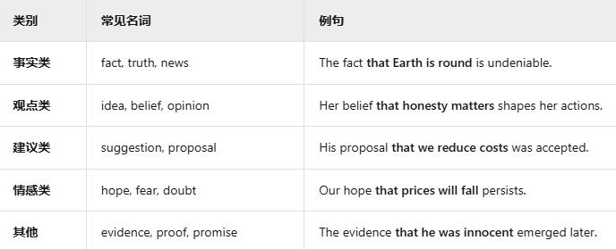 
>
>   eg：
>
>   1. The fact **that he didn't call** worried her
>   2. The question of **whether he will come** remains unanswered
>   3. The reason for **why he was late** is still unknown.
>   4. The method of **how they achieved such a result** is impressive. 
>
> - 定语从句：**先行词 + 关系词 + 从句** ，修饰名词或代词的从句
>
>    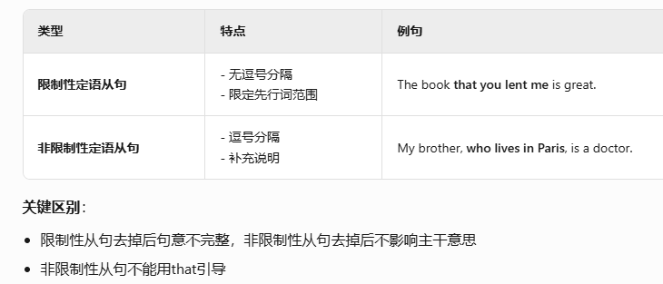 
>
>   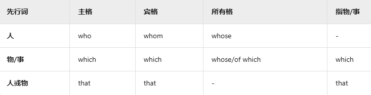 
>
>   - **that** 可替代which/who（限制性从句中）
>   - **whose** 可指人或物 = of which
>
>   eg：
>
>   1. The man **who is standing over there** is my teacher（修饰指人的名词作主语）
>   2. The person **whom I met yesterday** is very friendly. （修饰指人的名词作宾语）
>   3. The girl **whose hair is long** is my sister. （修饰所属关系，指人或物的名词）
>   4. The car **which is parked outside** is mine（修饰指物或动物的名词）
>   5. The book **that I read last week** was fascinating.（可以修饰限定人或物的名词）
>   6. I remember the day **when we first met**.
>   7. This is the town **where I grew up**.
>   8. I don't know the reason **why she is so upset**
>   9. My sister, **who lives in London**, is coming to visit next month.
>   10. I met my old friend John, **whom I hadn't seen for years**, at the conference
>   11. I bought a new laptop, **which is much faster than my old one**.
>   12. I visited Paris in the spring, **when the flowers are in full bloom**.
>
> - 状语从句：引导词 + 从句（主语 + 谓语），修饰主句的动词、形容词或整个句子，时间、条件、原因等逻辑关系
>
>   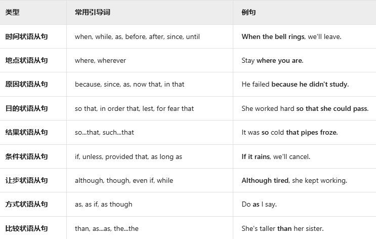 
>
>   eg：
>
>   1. **When the rain stopped**, we went out. 
>   2. **Since you don't understand,** I'll explain again.
>   3. I was reading **while she was cooking**.
>   4. You can sit **wherever you like**
>   5. He studied hard **so that he could pass the exam**.
>   6. **As soon as he arrives**, we'll start the meeting.
>   7. Put the keys **where you can easily find them.**
>   8. He got up early **so that he could catch the first bus**.
>   9. The box was **so** heavy **that I couldn't lift it.**
>   10. It was **such** a beautiful day **that we went hiking**.
>   11. You won't succeed **unless you work hard**.
>   12. This car runs faster **than that one does**.
>   13. **Even if you apologize**, I won't forgive you.
>   14. **Although it was expensive**, I bought the dress.
>

### **Composition**

> Subject：Notice
>
> 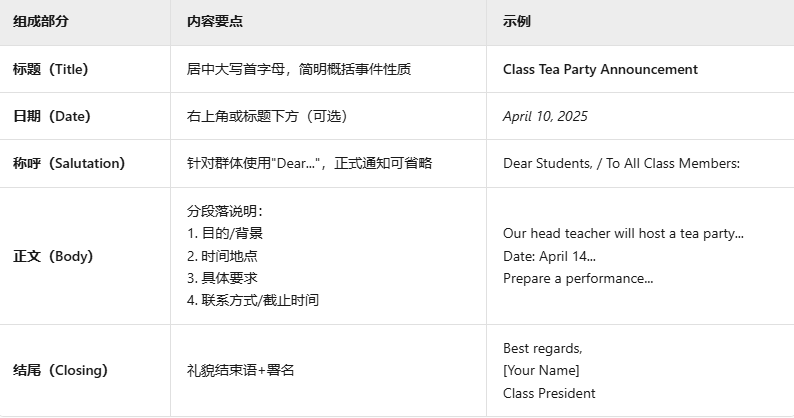 
>
> - Scene 1：
>
>   Q：班主任老师准备举行一次班级茶话会，你作为班长，写一则通知，告知同学地点和时间，并要求每个同学准备一首歌或一个笑话等表演。
>   
>   A：							**Class Tea Party**
>   
>   ​																	Date: April 10, 2025
>   
>   Dear classmates，
>   
>   **I am pleased to announce that** our head teacher plans to hold a class tea party **to promote** the interaction and communication among classmates **as well as** to enrich our extracurricular life. The tea party will be held in Classroom 302 on April 14th, 2025 (Friday) from 6:00 PM to 8:00 PM.
>   
>   **To make** this event more enjoyable and memorable, every student is encouraged to prepare a performance. It could be a song you love, a funny joke, or any other talent you'd like to share with us. This is a wonderful opportunity for everyone to show off their hidden talents and have some fun together outside of our regular study routine.
>   
>   Please confirm your attendance by April 10th and **let us know** what kind of performance you plan to bring to the party. You can reply directly to this notice or inform the class committee members. We look forward to seeing all of you there and enjoying an evening filled with laughter and joy.
>   
>   Remember, the success of this tea party depends on the participation of each one of you. Let's make it an unforgettable night!
>   
>   **Best regards**
>   
>   ​																			Your Name
>   ​																		Class President
>   
>   - Scene 2
>   
>     ​								**Class Tea Party Notice**
>   
>     Dear classmates,
>   
>     Hello everyone! To enrich our extracurricular life and strengthen the bond among classmates, our homeroom teacher has organized a tea party for us. Please find the details of the event below:
>   
>     Date and Time: April 10th, 2025 (Thursday) at 4:00 PM
>   
>     Venue: Multi-purpose Hall, 2nd Floor
>   
>     To make the tea party more enjoyable, each of you is required to prepare a small performance. It can be a song, a joke, or any other talent you’d like to share. Feel free to choose something that suits you and brings joy to everyone!
>   
>     Please make sure to arrive on time and be prepared with your performance. We look forward to seeing everyone's creativity and having a fun and memorable time together!
>   
>     **Best regards,**
>     																	 Class Monitor
>     																	 April 7th, 2025
>   
>   - Scene 3
>   
>     ​								**Class Tea Party Notice**
>   
>     ​																  Date: April 10, 2025
>   
>     Our homeroom teacher has decided to organize a class tea party **to enhance** our friendship and enrich our extracurricular life.
>   
>     Event Details:
>   
>     Date:  April 14th, 2025 (Friday) 
>   
>     Time: 6:00 PM to 8:00 PM
>   
>     Location: Classroom 302
>   
>     Requirements:
>   
>         1. Each student needs to prepare a short performance (e.g., a song, a joke, or a talent show).
>         2. Please keep your performance within 3 minutes.
>         3. Notify the class committee about your performance choice by April 14th, 2025 
>   
>     This will be a wonderful opportunity for everyone to showcase their talents and enjoy a relaxing time together. Your active participation will make this event more memorable!
>   
>     Looking forward to seeing all of you there!
>   
>     **Best regards**
>   
>     ​																		Your Name
>   
>     ​    																	Class Monitor
>   
>   - Scene 4
>   
>     ​                    **Notice of Rescheduling: International Students’ Tea Party**
>   
>     Dear international students,
>   
>     I hope this message finds you well. I am writing to inform you that the International Students’ Tea Party, originally scheduled for next Friday, has been postponed. I sincerely apologize for any inconvenience this change may cause.
>   
>     The reason for the rescheduling is due to an unexpected scheduling conflict with another important event on campus that requires the use of the same venue. We understand that this may disrupt your plans, and we appreciate your understanding and flexibility.
>   
>     The new date for the tea party will be April 17th, 2025 (Friday), at 4:00 PM, and the location will remain the same: Student Activity Center, Room 101.
>   
>     We hope that you can still join us and look forward to an enjoyable and memorable time together. Please feel free to reach out if you have any questions or concerns.
>   
>     Thank you for your understanding!
>   
>     Sincerely,
>   
>     ​																			Li Hua
>   
>     ​														President of the Student Union
>   
>     ​																	April 7th, 2025
>
> Subject：apology
>
> 1. I am writing to sincerely apologize for [事件]. This unexpected situation occurred on [日期] due to [简要原因].
>
> 2. The problem was caused by [原因]. To make up for it, we will [措施1] and [措施2]. Additionally, [进一步补偿].
>
> 3. Please accept my deepest apologies. I assure you this won't happen again. Your understanding would be greatly appreciated.
>
> 4. I deeply regret... / I owe you an apology for...
>
> 5. take full responsibility/provide a 20% discount/offer free replacement
>
> 6. This will never happen again/We value your continued trust
>
>    ~~~python
>    Apology for Missing the Meeting
>    Dear Professor Smith,  
>    I sincerely apologize for missing yesterday's group meeting. My absence was caused by an unexpected family emergency that required immediate attention.  
>    To compensate, I have reviewed the meeting minutes and will submit my project progress report by Friday. I've also arranged to discuss key points with classmates.  
>    Please accept my apologies for any inconvenience caused. I guarantee better communication in the future.  
>    Sincerely,  
>    Li Hua  
>    ~~~
>
>    Scene 1：
>
>    Dear [Friend's Name],
>
>    I am writing to sincerely apologize for accidentally staining several pages of the English book you lent me. While reading last night, I spilled coffee on it, leaving noticeable marks on chapters 3-5.
>
>    To make up for this, I have already ordered a brand-new copy of the same edition, which will arrive by Friday. Alternatively, I’m happy to compensate you for the damage.
>
>    I deeply regret my carelessness and promise to be more careful in the future. Please let me know how you’d like to resolve this.
>
>    Best regards,
>    																			Li Hua
>
>    
>
> 

### 附录 

> 序数词：1st，2nd，3rd，4th~20th，21st，22nd，23rd，30th
>
> 月份：January(Jan.) ，February(Feb.)，March（Mar.），April（Apr.），May，June（Jun.），July(Jul.)，August（Aug.），September（Sep.），October（Oct.），November（Nov.），December（Dec）
>
> 星期：Monday，Tuesday，Wednesday，Thursday，Friday，Saturday，Sunday
>
> **动词短语**
>
> |      **短语**       |   **含义**    |                   **例句**                   |               **使用要点**                |
> | :-----------------: | :-----------: | :------------------------------------------: | :---------------------------------------: |
> |     **get up**      |     起床      |       I **get up** at 6:30 every day.        |           接时间状语时不用介词            |
> |   **turn on/off**   |   打开/关闭   |    **Turn off** the lights when leaving.     |        可分短语（turn the TV on）         |
> |     **pick up**     |   接人/学会   |     She **picks up** languages quickly.      |         接知识时=learn informally         |
> |     **put on**      |     穿上      |       **Put on** your coat, it's cold.       |              反义：take off               |
> |   **run out of**    |     耗尽      |       We **ran out of** toilet paper.        |                必须接宾语                 |
> |    **clean up**     |   打扫干净    |       Let's **clean up** the kitchen.        | 可接地点或抽象概念（clean up corruption） |
> |   **throw away**    |     扔掉      |       Don't **throw away** old photos!       |        可分短语（throw them away）        |
> |     **set up**      |     建立      |        They **set up** a new company.        |              多用于组织/系统              |
> |    **take out**     |   取出/外卖   |       **Take out** the trash, please.        |          接食物时=get food to go          |
> |   **break down**    |   抛锚/崩溃   |       My car **broke down** yesterday.       |            人作主语时=情绪崩溃            |
> |     **wake up**     |     醒来      |          The noise **woke me up**.           |       可分短语（wake the baby up）        |
> |    **hang out**     |     闲逛      |         We **hung out** at the mall.         |   接人时+with（hang out with friends）    |
> |    **give away**    |   赠送/泄露   |       He **gave away** all his money.        |               接秘密=reveal               |
> |     **look up**     |     查找      |    **Look up** the word in a dictionary.     |              接信息=research              |
> |     **try on**      |     试穿      |     She's **trying on** wedding dresses.     |             只能用于衣物/饰品             |
> |   **cut down on**   |     减少      |       I'm **cutting down on** coffee.        |          习惯改变（+名词/V-ing）          |
> |    **doze off**     |    打瞌睡     |      He **dozed off** during the movie.      |                非正式场合                 |
> |     **end up**      |     最终      |      We **ended up** at a karaoke bar.       |          意外结果（+地点/V-ing）          |
> |     **fix up**      |   修理/安排   |         Can you **fix up** my bike?          |             物体维修/约会安排             |
> |     **hold on**     |     稍等      |       **Hold on**, I'll check the map.       |               电话/即时对话               |
> |    **kick off**     |     开始      |      The concert **kicks off** at 8PM.       |               活动/项目启动               |
> |   **look around**   |   四处看看    |      Let's **look around** the museum.       |                 参观场所                  |
> |     **mix up**      |     混淆      |       I always **mix up** their names.       |               信息/物品混淆               |
> |    **pass out**     |   昏倒/分发   |      He **passed out** from exhaustion.      |        昏厥（不及物）/传单（及物）        |
> |     **rip off**     |     宰客      |        This store **ripped me off**!         |                 商业欺诈                  |
> |     **show up**     |     出现      |        Only 10 people **showed up**.         |           到场（常指意外出现）            |
> |    **sort out**     |     解决      |      We need to **sort out** this mess.      |               问题/混乱处理               |
> |  **switch on/off**  |   打开/关闭   |      **Switch on** the air conditioner.      |           电器操作（英式常用）            |
> |     **tidy up**     |     整理      |        Time to **tidy up** your room.        |                 空间整理                  |
> |     **zip up**      |   拉上拉链    |      **Zip up** your jacket, it's cold.      |                 衣物操作                  |
> |     **hand in**     |     提交      |     **Hand in** your reports by Friday.      |                 作业/文件                 |
> |   **figure out**    |  解决/弄明白  |  Can you **figure out** this math problem?   |                接复杂问题                 |
> |    **carry out**    |     执行      |      We **carried out** the experiment.      |               正式项目/研究               |
> |    **point out**    |     指出      |       She **pointed out** my mistake.        |              接错误/重要细节              |
> |    **fill out**     |     填写      |     **Fill out** this application form.      |                 表格/文件                 |
> |    **look over**    |     检查      |   The lawyer **looked over** the contract.   |             快速浏览重要文件              |
> |     **put off**     |     推迟      |     Don't **put off** your assignments.      |            反义：bring forward            |
> |    **work out**     |   解决/锻炼   |        Let's **work out** a solution.        |      接问题=resolve；接运动=exercise      |
> |     **go over**     |     复习      |   **Go over** your notes before the exam.    |                 学习材料                  |
> |    **set aside**    |     留出      |       **Set aside** time for revision.       |               时间/金钱预算               |
> |    **take down**    |   记下/拆除   |     **Take down** the important points.      |      接信息=record；接物体=dismantle      |
> |     **turn in**     |     上交      |   **Turn in** your equipment when leaving.   |                 物品交还                  |
> |     **back up**     |   备份/支持   |        Always **back up** your files.        |             数据安全/团队支持             |
> |    **call off**     |     取消      |       The meeting was **called off**.        |               正式活动取消                |
> |     **draw up**     |     起草      |       We'll **draw up** the contract.        |               法律/商业文件               |
> | **follow through**  |   贯彻到底    |       She always **follows through**.        |                项目执行力                 |
> |    **hand over**    |     移交      |      **Hand over** the documents to HR.      |               责任/物品交接               |
> |    **iron out**     | 消除（问题）  |       Let's **iron out** the details.        |               解决最后障碍                |
> |  **phase in/out**   | 逐步引入/淘汰 |      We're **phasing in** new software.      |               政策/技术更新               |
> |    **reach out**    |     联系      |      **Reach out** to the client ASAP.       |                 商务沟通                  |
> |   **scale down**    |     缩减      |       The company is **scaling down**.       |                 规模调整                  |
> |  **think through**  |   全面考虑    |     **Think through** the consequences.      |                 战略决策                  |
> |    **bottle up**    | 压抑（情绪）  |      Don't **bottle up** your feelings.      |                 心理健康                  |
> |   **come clean**    |     坦白      | He finally **came clean** about the mistake. |                 承认错误                  |
> |   **drift apart**   |     疏远      |     We **drifted apart** over the years.     |                 关系淡化                  |
> |    **fall out**     |  争吵后不和   |        They **fell out** over money.         |               朋友/家人冲突               |
> |    **let down**     |    使失望     |          I won't **let you down**.           |                 承诺/信任                 |
> |    **melt down**    |   情绪崩溃    |     She **melted down** after the news.      |                 极端情绪                  |
> |    **patch up**     | 修补（关系）  |    They **patched up** their friendship.     |                   和解                    |
> |    **wind down**    |     放松      |    I **wind down** with music after work.    |                 减压活动                  |
> |    **cheer up**     |   振作起来    |    **Cheer up**! Tomorrow's another day.     |                 安慰他人                  |
> |    **break up**     |     分手      |       They **broke up** after 5 years.       |                 关系结束                  |
> |     **make up**     |   和好/化妆   |      They **made up** after the fight.       |   接人=reconcile；接脸=apply cosmetics    |
> |    **get along**    |   相处融洽    |   Do you **get along** with your roommate?   |                接人时+with                |
> | **look forward to** |     期待      |      I **look forward to** your reply.       |             必须接名词/V-ing              |
> |   **put up with**   |     忍受      |    I can't **put up with** his rudeness.     |                接负面事物                 |
> |   **go through**    |     经历      |     She's **going through** a hard time.     |                接困难/变化                |
> |    **fall for**     |   爱上/上当   |        He **fell for** her instantly.        |       接人=love；接骗局=be tricked        |
> |     **open up**     |   敞开心扉    |      It's hard for him to **open up**.       |                 情感表达                  |
> |    **calm down**    |     冷静      |   **Calm down** and tell me what happened.   |                 情绪管理                  |
> |  **check in/out**   |   入住/退房   |          We **checked in** at 3PM.           |                 酒店/机场                 |
> |    **drop off**     |   下车/送达   |    I'll **drop you off** at the station.     |                 接送服务                  |
> |     **fill up**     |    加满油     |    **Fill up** the tank before the trip.     |                 车辆维护                  |
> |    **get away**     |   短暂休假    |       We **got away** for the weekend.       |                 短途旅行                  |
> |    **pull over**    |   靠边停车    |    The police asked me to **pull over**.     |                 驾驶场景                  |
> |     **see off**     |     送行      |         They came to **see me off**.         |               机场/车站送别               |
> |    **stop over**    |   中途停留    |      We're **stopping over** in Dubai.       |               长途旅行中转                |
>
> **系动词**
>
> |       **系动词**        |           **例句**           |
> | :---------------------: | :--------------------------: |
> | be (am/is/are/was/were) |     *She is a teacher.*      |
> |          seem           |    *He **seems** tired.*     |
> |         appear          |    *It **appears** true.*    |
> |          look           |    *You **look** happy.*     |
> |          sound          |   *That **sounds** great!*   |
> |          feel           | *The fabric **feels** soft.* |
> |          taste          | *The soup **tastes** salty.* |
> |          smell          |  *Flowers **smell** sweet.*  |
> |         become          |   *He **became** famous.*    |
> |           get           |   *It's **getting** dark.*   |
> |          grow           | *The child **grew** taller.* |
> |          turn           |  *Leaves **turn** yellow.*   |
> |           go            |  *The milk **went** sour.*   |
> |          come           |  *Her dream **came** true.*  |
> |          fall           |    *He **fell** asleep.*     |
> |         remain          |  *She **remained** silent.*  |
> |          stay           |   *Please **stay** calm.*    |
> |          keep           |     *He **keeps** fit.*      |
>
> **常见过去式与过去分词**
>
> |    **类型**    | **原形 (V1)**  | **过去式 (V2)** | **过去分词 (V3)** | **中文释义** |
> | :------------: | :------------: | :-------------: | :---------------: | :----------: |
> |   **AAA型**    |      cut       |       cut       |        cut        |     切割     |
> |                |      put       |       put       |        put        |     放置     |
> |                |      hurt      |      hurt       |       hurt        |     伤害     |
> |   **ABB型**    |     bring      |     brought     |      brought      |     带来     |
> |                |      buy       |     bought      |      bought       |     购买     |
> |                |     think      |     thought     |      thought      |     思考     |
> |   **ABA型**    |      run       |       ran       |        run        |     奔跑     |
> |                |      come      |      came       |       come        |      来      |
> |                |     become     |     became      |      become       |     成为     |
> |   **ABC型**    |       go       |      went       |       gone        |      去      |
> |                |      see       |       saw       |       seen        |     看见     |
> |                |     write      |      wrote      |      written      |     写作     |
> | **特殊变化型** | be (am/is/are) |    was/were     |       been        |      是      |
> |                |       do       |       did       |       done        |      做      |
> |                |      have      |       had       |        had        |      有      |
>
> |    **原形**    | **过去式** | **过去分词** | **中文释义** |
> | :------------: | :--------: | :----------: | :----------: |
> |     arise      |   arose    |    arisen    |     出现     |
> |     awake      |   awoke    |    awoken    |     唤醒     |
> | be (am/is/are) |  was/were  |     been     |      是      |
> |      bear      |    bore    |    borne     |  忍受/携带   |
> |      beat      |    beat    |    beaten    |     击打     |
> |     begin      |   began    |    begun     |     开始     |
> |      bend      |    bent    |     bent     |     弯曲     |
> |      bet       |    bet     |     bet      |     打赌     |
> |      bite      |    bit     |    bitten    |      咬      |
> |      blow      |    blew    |    blown     |      吹      |
> |     break      |   broke    |    broken    |     打破     |
> |     choose     |   chose    |    chosen    |     选择     |
> |      draw      |    drew    |    drawn     |      画      |
> |     drink      |   drank    |    drunk     |      喝      |
> |     drive      |   drove    |    driven    |     驾驶     |
> |      eat       |    ate     |    eaten     |      吃      |
> |      fall      |    fell    |    fallen    |     掉落     |
> |      fly       |    flew    |    flown     |      飞      |
> |     forget     |   forgot   |  forgotten   |     忘记     |
> |      give      |    gave    |    given     |     给予     |
> |      know      |    knew    |    known     |     知道     |
> |    lie (躺)    |    lay     |     lain     |      躺      |
> |      ride      |    rode    |    ridden    |      骑      |
> |      ring      |    rang    |     rung     |     响铃     |
> |      sing      |    sang    |     sung     |     唱歌     |
> |     speak      |   spoke    |    spoken    |     说话     |
> |     steal      |   stole    |    stolen    |     偷窃     |
> |      swim      |    swam    |     swum     |     游泳     |
> |      take      |    took    |    taken     |      拿      |
> |      wear      |    wore    |     worn     |      穿      |
> |      win       |    won     |     won      |      赢      |

