## 英语

- ### Parts of  Speech

  > - a/an：可数名词单数，用于首次提到的名词
  >
  >   eg：I saw **a cat** in the garden，She is **an engineer**，in **a hurry**, have **a cold**
  >
  > - 零冠词：用于泛指、抽象概念或固定表达（不可数名词或复数名词）
  >
  > - the：特指已知或唯一的事物（序数词，最高级，组织群体，乐器名词）
  >
  > - 量化词：可数名词（many, a few,each, every, a number of），不可数名词（much, a little, a piece of,a large amount of,a great deal of），通用（some，any，a lot of/lots of，most，all，enough）
  >
  > - 名词复数
  >
  >   1. 以 s, ss, x, sh, ch 结尾的词：在单词末尾加 `-es`
  >   2. 以辅音字母 + y 结尾的词：将 y 改为 i，再加 `-es`
  >   3. 不规则变化：man → men, woman → women, foot → feet, tooth → teeth，sheep → sheep, deer → deer, fish → fish
  >
  > - 抽象名词：the+形容词，动名词
  >
  >    
  >
  > - 形容性物主代词：与名词连用，限定名词所属关系，不与冠词使用（My，your，his/her/its/our/their)
  >
  > - 名词性物主代词：独立表达所属关系（mine，yours，his/hers/its/ours/theirs）
  >
  >   eg：This book is mine. That car is hers. 
  >
  > - 反身代词：指代句子的主语，谓语动词执行者与承受者相同
  >
  >   eg：She cut herself while cooking，He bought a gift for himself
  >
  > - 相互代词：表示两者或更多者之间相互的行为为或关系（each other / one other)
  >
  >   eg：The students in the class respect one another，
  >
  > - 不定代词：
  >
  >    
  >
  > - 指示代词：即将提到的事/前述事 this/that(these/those)
  >
  > - 疑问代词：
  >
  >    
  >
  > - 关系代词
  >
  >   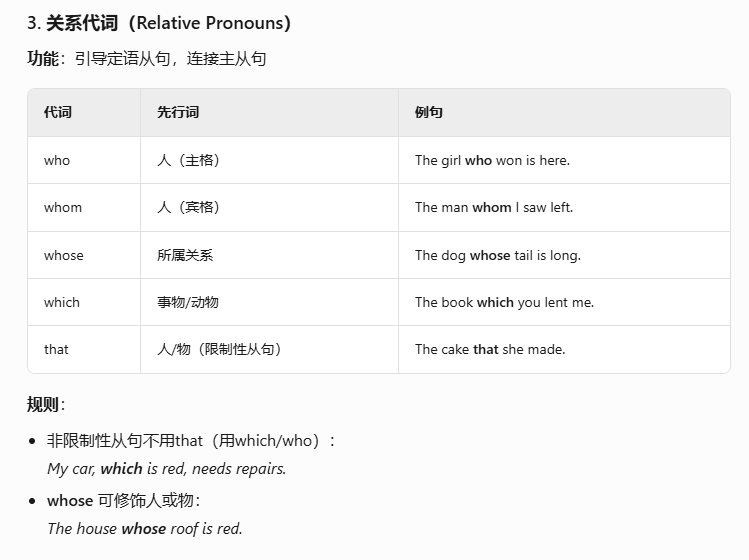  
  >
  >   - that：先行词含最高级/序数词/all/any/only/vary/人和物
  >   - which：非限制性从句（逗号），介词
  >
  > - 形容词
  >
  >    
  >
  >    
  >
  > - 副词：修饰动词、形容词、其他副词或整个句子
  >
  >   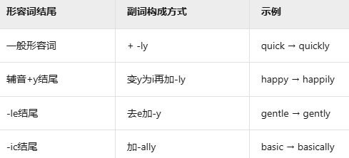 
  >
  >    
  >
  >   时间副词：now，recently，soon
  >
  >   地点副词：here，upstairs，everywhere
  >
  >   程度副词：very，almost，too
  >
  >   方式副词：carefully，well，fast
  >
  >   频率副词：always，often，rarely
  >
  > - 介词：补充名词/代词的位置，时间，地点，方式
  >
  >    
  >
  >   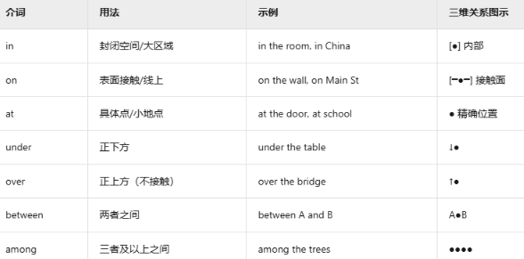  
  >
  >   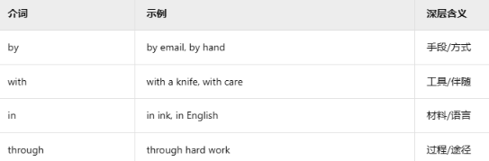 
  >
  >    
  >
  > - 连词：连接单词、短语或句子的虚词
  >
  >    
  >
  >   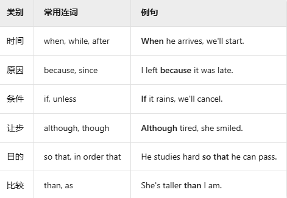 
  >
  >   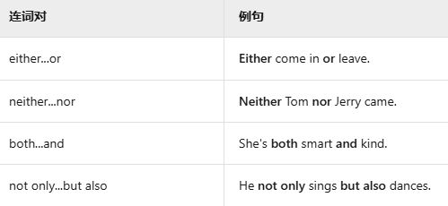 
  >
  >    
  >
  > - 助动词
  >
  >   | **助动词** | 功能                |      **主语单数**       |     **主语复数**     | **过去时** | **过去分词** |
  >   | :--------: | ------------------- | :---------------------: | :------------------: | :--------: | :----------: |
  >   |     be     | 构成进行时/被动语态 | am (I) / is (he/she/it) |  are (we/you/they)   |  was/were  |     been     |
  >   |    have    | 构成完成时          |     has (he/she/it)     | have (I/we/you/they) |    had     |     had      |
  >   |     do     | 构成疑问/否定/强调  |    does (he/she/it)     |  do (I/we/you/they)  |    did     |     done     |
  >
  > - 情态助动词：无复数变化
  >
  >    
  >
  >   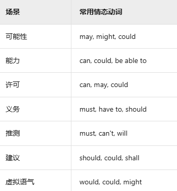 
  >
  >   - 一般时态表将来：can/may/mush =  will be allowed / will possibly / will have to 
  >   - 表达能力：could have + done  =  be able to
  >   - 虚拟语气
  >     1. （if + 过去式 ，**主语 + would/could/might + 动词原形**）：假设，与事实相反
  >     2. （If + 过去完成式, 主语 + would/could/might + have + 过去分词）：假设，与事实相反
  >
  > - 系动词：无被动语态，少数感官动词存在进行时态
  >
  >   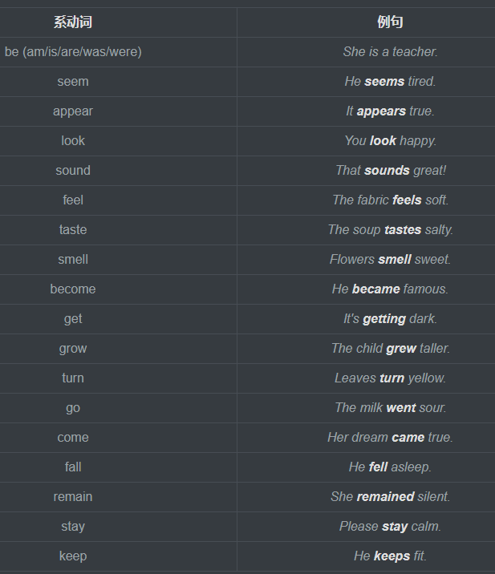 
  >
  > - 使役动词：主语让他人完成某事
  >
  >    
  >
  > - 不及物动词：无被动语态，（be /will be)
  >
  > - 及物动词：
  >
  >   过去式/过去分词：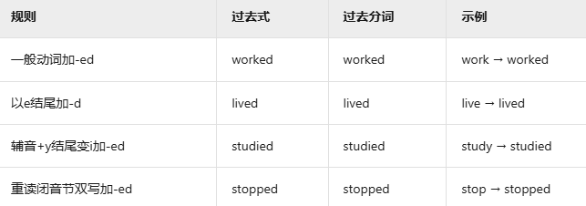 
  >
  >   1. 存在第一个助动词（be/have/will）决定过去/现在/将来时态
  >
  >   2. 存在第二个助动词（be）决定被动/进行/完成时态
  >
  >   3. 过去时态：过去某个发生的动作（yesterday，last night，two day ago，at 3 PM）
  >
  >   4. 完成时态（have/has + 过去分词）：过去发生的动作对现在的影响（already，ever，since，for）
  >
  >   5. 被动语态 （am/is/are + 过去分词）：强调动作的承受者
  >
  >   6. 完成时被动语态（have/has + been + 过去分词）：强调该动作的结果或状态
  >
  >   7. 虚拟语句：使用过去时段表达假设
  >
  >       
  >
  >       
  >
  >      eg：If she **had known** about the meeting, she would have attended it
  >
  >      ​	She acts **as if she were a queen**.
  >
  >      ​        He talks **as though he knew everything**
  >
  >      ​	She behaves **as though she might become famous overnight** 
  
- **Sentence Structure**

  > - 补语：描述**主语/宾语**状态或特征，与系动词搭配使用
  > - 表语：位于系动词之后，说明主语身份、性质、特征或状态
  > - 定语：修饰名词或代词（形容词，名词，数词）
  > - 状语：修饰动词、形容词、副词或整个句子的成分，用于说明动作或状态的时间、地点、原因、方式、程度
  > - 同位语：紧跟在一个名词或代词之后，进一步解释、定义或补充前面的名词或代词
  >
  > 非谓语：可作除谓语外其它句子成分，无人称和数的变化，
  >
  > - 不定式（主语/宾语/定语/状语）
  >   1. to + 动词原形：表目的/计划/将来/抽象概念（**To learn** English takes time and effort）
  >   2. to be done：当强调动作的承受者而非执行者（The car needs **to be washed**）
  >   3. to be doing：强调正在进行的动作，主句的动作同时发生（She pretended **to be listening**, but she was actually thinking about her vacation.）
  >   4. to have done：当强调动作已完成且关注的是动作的承受者时（It is expected that the report will **have been finished** by Friday）
  > - 动名词（名词性质，作主语/宾语/表语.介词）
  >   1. doing：I enjoy **listening** to music
  >   2. being done：表示被动和正在进行的状态（He was excited about **being chosen** for the project team.）
  >   3. having done：强调某个动作在另一个动作之前已经完成时（**Having finished** his homework, Tom went out to play with his friends.）
  > - 分词（doing/done，形容词）：表示谓语动作的状态或进展

- **Sentences**

  > 复合句：用于连接两个独立分句，表达句子逻辑关系（独立分句 + 连接词 + 独立分句）
  >
  > - and：She loves reading, **and** he prefers sports.
  > - but：It was expensive, **but** we bought it.
  > - or：You can stay here, **or** leave now.
  > - so：It rained, **so** we canceled the picnic.
  >
  > - 连接副词：
  >
  >   | **逻辑关系** |                  **副词连接词**                   | **中文含义** |
  >   | :----------: | :-----------------------------------------------: | :----------: |
  >   |   **递进**   |     furthermore, moreover, additionally, also     |  此外/而且   |
  >   |   **转折**   |     however, nevertheless, nonetheless, still     |  然而/不过   |
  >   |   **因果**   | therefore, thus, consequently, accordingly, hence |  因此/所以   |
  >   |   **对比**   |      meanwhile, conversely, instead, rather       |  反之/相反   |
  >   |   **举例**   |             for example, for instance             |     例如     |
  >   |   **总结**   |           finally, ultimately, overall            |  最终/总之   |
  >   |   **强调**   |          indeed, certainly, undoubtedly           |  确实/无疑   |
  >
  >   1. The software is user-friendly; **furthermore**, it's compatible with all devices.
  >   2. She finished the report on time; **moreover**, she included extra data analysis.
  >   3. The plan seemed perfect; **however**, the execution failed.
  >   4. He lacked formal training; **nevertheless**, his skills were exceptional
  >   5. The road was blocked; **therefore**, we took a detour.
  >   6. The experiment violated safety protocols; **consequently**, it was terminated.
  >   7. He expected praise; **instead**, he received criticism.
  >   8. Many languages share Latin roots; **for example**, Spanish and French.
  >   9. Some animals hibernate; **for instance**, bears sleep through winter.
  >   10. The evidence was irrefutable; **indeed**, the defendant confessed.
  >
  >   
  >
  > 倒装句：助动词，不及物动词或副词提前，突出句首的特定信息
  >
  > 1. 一般疑问句：助动词/系动词提前  **Do** you like coffee?
  >
  > 2. 特殊疑问句：疑问词 + 一般疑问句语序 What are you doing?
  >
  > 3. 否定倒装（用于强调否定意义或表达惊讶、怀疑等情感）：否定词 + 助动词 + 主语 + 实义动词
  >
  >    - **Never have I seen** such a beautiful sunset（I have **never** seen such a beautiful sunset）
  >    - **Not until midnight did he finish** his work.（He did **not** finish his work until midnight）
  >    - **Rarely do we go** to the cinema these days.（We rarely go to the cinema these days.）
  >
  > 4. 条件倒装（强调某一情况或条件）：Only + 状语（副词/介词短语/从句） + 助动词 + 主语
  >
  >    - **Only when he arrived home did he** realize his mistake（He realized his mistake only when he arrived home）
  >    - **Only by working hard can one** succeed（One can succeed only by working hard.）
  >
  > 5. 结构/程度倒装：So/(Such) + 形容词/副词（名词） + 助动词 + 主语 + that
  >
  >    - **So boring was the movie that** I fell asleep halfway through it.  (The movie was so boring that I fell asleep halfway through it)
  >    - **Such a noise was there that** no one could sleep （There was such a noise that no one could sleep ）
  >
  > 6. 虚拟条件：Were/Had/Should + 主语 + 其他
  >
  > 7. 让步状语倒装：形容词/名词/副词/动词原形 + as/though + 主语 + 谓语
  >
  >    - **Try as she might**, she couldn't open the door 
  >
  >    - **Young as he is**, he speaks five languages.（Even though he is young, he speaks five languages.）
  >
  >      
  >
  > 主从句：从句充当主句的成分（主/宾/表/同位/定/状语）
  >
  > 1. 主语从句（that/whether/wh-词）
  >
  >    - **That the Earth revolves around the sun** is a scientific fact 
  >    - **Whether she will accept the offer** remains to be seen.
  >    - **It is important** that we start early. （we start early is important)
  >    - **It seems** that he has changed his mind.（he seems to have changed his mind）
  >    - It annoyed everyone **that she was late**.（**That she was late** annoyed everyone）
  >    - **Who will win the competition** is anyone's guess
  >    - **How much it will cost** depends on the materials.
  >
  > 2. 宾语从句（that/whether/if/wh-词）
  >
  >    - I wonder **whether/if he will attend the meeting.**
  >    - Can you tell me **whose book this is**? 
  >    - He said **(that) he was tired and that he would leave.**
  >
  > 3. 表语从句：主语 + 系动词 + 引导词 + 从句
  >
  >    - The problem is **that we don't have enough resources**.
  >    - The question is **whether we can finish the project on time**.
  >    - The issue might be **where the funds were allocated**
  >
  > 4. 同位语从句（名词性从句）：抽象名词 + 引导词 + 完整句子
  >
  >    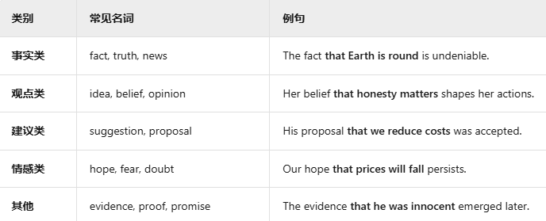 
  >
  >    - The news **that we won the game** spread quickly.（We won the game. This news spread quickly）
  >    - There is some doubt **whether he will come on time** （He may not come on time. This creates some doubt.）
  >
  > 5. 定语从句（修饰名词或代词）：**先行词 + 关系词 + 从句**
  >
  >    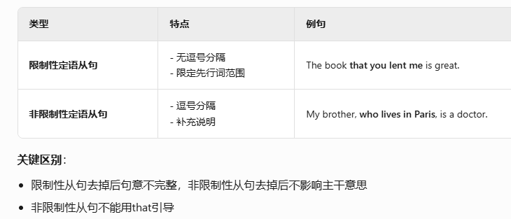 
  >
  >     
  >
  >    - The man **who is standing over there** is my teacher
  >    - The person **whom I met yesterday** is very friendly. 
  >    - The book **that I read last week** was fascinating.
  >    - This is the town **where I grew up**.
  >    - I remember the day **when we first met**.
  >    - My sister, **who lives in London**, is coming to visit next month.
  >
  > 6. 状语从句（修饰主句的动词，形容词，表达句子时间、条件、原因等逻辑关系）
  >
  >     
  >
  >    - I was reading **while she was cooking**.
  >    - **As soon as he arrives**, we'll start the meeting.
  >    - He got up early **so that he could catch the first bus**.
  >    - The box was **so** heavy **that I couldn't lift it.**
  >    - **Even if you apologize**, I won't forgive you.
  >    - **Although it was expensive**, I bought the dress.

**Composition**

> Base：
>
> 1. Nowadays（如今）With the development of... （随着...的发展）
> 2. It is widely believed that... （人们普遍认为...）
> 3. In my opinion, ... （在我看来）I firmly believe that...（我坚信...） It seems to me that（在我看来）
> 4. First of all，... （首先）This essay will discuss...（本文将讨论...）
> 5. Another important point is...（另一个重点是...）
> 6. Moreover / Furthermore, ... (此外)   What’s more, ...（更重要的是）
> 7. However （然而 ） In addition, ...（另外） On the other hand, ...（另一方面）
> 8. For example, ...（例如） For instance, ...（例如） In my experience,（根据我的经验）
> 9. According to research, ...（根据研究）Statistics show that...（数据显示...）
> 10. Therefore,...(因此）As a result, ...（结果）This clearly shows that...（这清楚地表明...）
> 11. In conclusion, ...（总之） To sum up, ...（总结来说）
> 12. It is hoped that...（希望...） I suggest that...（我建议...）I completely agree with... （完全同意）
> 13. Only by doing this can we...（只有这样我们才能...）
>
> Notice：
>
> | KeyWord                           | Mean                                   | Example                                                      |
> | --------------------------------- | -------------------------------------- | ------------------------------------------------------------ |
> | announce/inform                   | 宣布，公布；声称，郑重地说，通知，告知 | I am pleased to **announce** that ... We are pleased to inform you that |
> | attention                         | 注意；注意力，殷勤，关心               | Please **pay attention to** the following details/points Thank you for your attention. |
> | reminder                          | 提醒，使想起；                         | Please remind everyone to ...                                |
> | be postponed/canceled             | 推迟，取消                             | The meeting has been postponed until next week.              |
> | for further details,contact       | 欲知详情，请联系                       | For further details, you can contact                         |
> | The dealine for ... submission is | 提交截止时间                           | The deadline for activity submissions is June 20, 2024.      |
> | Venue/Location                    | 发生地点                               |                                                              |
> | Concerned parties                 | 相关方                                 |                                                              |
> | Workshop                          | 研讨会                                 |                                                              |
> | compete/competition               | 比赛                                   |                                                              |
> | arrange                           | 安排                                   |                                                              |
> | conduct                           | 举行                                   |                                                              |
> | require to / must                 | 必须                                   |                                                              |
> | bring / submit                    | 携带                                   |                                                              |
> | register / sign up                | 报名                                   |                                                              |
> | Exam schedule                     | 考试安排                               |                                                              |
> | promote                           | 促进，提倡；升职，晋升；促销，推广     |                                                              |
>
> Letters：
>
> 1. I’m writing to inform you that... （我写信是通知你……）
> 2. I heard that ... （听说）
> 3. As per your request...（按你方要求）
> 4. I’m so grateful for your help.（我非常感谢你的帮助。）
> 5. Wishing you all the best （祝你一切顺利。）
> 6. I hope you are doing well（我希望你一切都好)
> 7. I look forward to your reply （期待您的回复）
> 8. Should you require further information, please contact me （如需更多信息，请与我联系）
> 9. I am sorry to trouble you but I am afraid that I have to make a serious complaint （我很抱歉麻烦你，但恐怕我必须提出严重的投诉）
>
> Diary：
>
> 1. Weather：Sunny / Cloudy / Rainy / Snowy / Windy / Foggy
>    - The weather was surprisingly warm for this time of year.
> 2. Mood：Happy / Sad / Excited /Nervous/Frustrated/Grateful
>    - I felt really happy after hearing the good news.
> 3. Worked on: 致力于
> 4. Realized: 意识到
> 5. Look forward to: 期待
> 6. Hoped for: 希望
>
> Apologize ：
>
> 1. I am writing to sincerely apologize for... （我写这封信真诚地道歉）
> 2. I feel terrible about... （太对不起）
> 3. It was complete my fault because ..  （这完全是我的错）
> 4. To make up for it, I will...（为了弥补，我会的）
> 5. Once again, I am truly sorry.（再一次，我真的很抱歉。）
>
> Viewpoint：
>
> 1. In recent years, there has been growing attention about... （近几年，人们越来越关注）
> 2. It is widely believed that... （人们普遍认为……）
> 3. One of the main reasons for this is... (其中一个主要原因是…)
> 4. According to recent research (根据最近的研究)
>
> Picture：
>
> 1. The picture explains the process for the making of ... 
> 2. There are a total of ten picture in the process ... 
> 3. Beginning with the .... and engding 
> 4. The chart gives us an overall picture of the ...
> 5. The first thing we notice is that , This means that as 
> 6. We can see from the statistics given that 
>
> Travel：
>
> | KeyWord                      | Mean     |
> | ---------------------------- | -------- |
> | By Filght/Train/Subway/Ferry | 交通方式 |
> | Make a reservation hotel     | 预定酒店 |
> | Landmark                     | 地标     |
> | Scenic spot                  | 景点     |
> | Local cuisine                | 当地美食 |
>
> eg：
>
> Dear Mr. President
>
> I am writing to express my concern over the Library service on the campus. As a major in English, I find that most of the Books in English in the library are outdated.So far,I have not come across a single book published after1995. As a result, we fail to get the latest information of academic development both at home and abroad.In addition, the light in the reading room is farfrom bright, which does harm to our eyes.Worse still, there is no air-conditioning and we are sweating heavily while reading. Last but not least, the newly developed electronic information system does not work well and needs further improvement.A great number of books should have been listed in the system. There is no denying that the library has helped us a lot.But it is in urgent need of improvement. When improved, the library is certain to provide much more help with our study.
>
> Thank you for your time. I am looking forward to your reply
>
> 
>
> To whom it may concern,
>
> I am writing to you to apply for the membership of the English Club. As a sophomore from the English Department,I love English literature very much.I often attend the English Corner held on Friday in the People’s University of China and would like to discuss various topics in English with others. I am eager to be one member of the English Club and improve further my English.I know there are some requirements, but I am not clear about the details. Is it necessary for me to pay for membership?If so, how much should I pay? And how often? I have also heard that the club will host various activities, but can you give me more details. I would be very grateful if you can send me a reply as soon as Possible. Looking forward to hearing from you soon
>
> 
>
> Dear Xiao Wang,
>
> I am very glad to know that you are soon coming to Beijing to join me in the summer holiday.I have been looking forward to your arrival.
>
> Since you can stay in Beijing only for a week,I am afraid that you will have a tight schedule for visiting the numerous places of historic interest.My suggestion is that you first visit some famous places that you have the greatest interest in, such as the Palace Museum, the Summer Place, the Great Wall; then you can visit those places you think less important.I believe this kind of arrangement will make you have enough time to appreciate what you really want to see.Moreover if you really want to be a good traveler,I advise you to read some introductory books to these places before you come to see them with your own eyes. With more knowledge about these places, you will have a better understanding of Chinese history and culture.I am eager to meet you soon in Beijing. Wish you in advance a pleasant trip to Beijing
>
> 
>
>  To become a flexible reader, you must know how to select and employ **appropriate** reading strategies based on your reading objectives.
>
> Understanding when and how to apply different reading styles enables you to be an **adaptable** reader. Analytical reading is the **approach ** flexible readers use when engaging with complex or challenging material for deeper comprehension. When adopting this reading style, your pace should be slower than usual. Additionally, you should challenge yourself to fully grasp the text, often requiring multiple readings to achieve thorough understanding. At times, reading aloud can also enhance comprehension.
>
> 
>
> **English plays a vital role in the workplace.** Using it correctly and appropriately can significantly enhance one's career and professional growth.Some individuals may need or wish to learn business English before entering the workforce. For those already employed, it’s worthwhile to assess whether they can effectively utilize English in their current roles.In business, **negotiation is a practical skill**. You must understand what you want, how to bargain, and where to compromise. Knowing how to resolve conflicts and close a deal decisively is crucial to achieving favorable outcomes.Mastering workplace English facilitates **professional and efficient communication**, much like fluent translation serves clients, business partners, and suppliers. This proficiency benefits any business endeavor.
>

