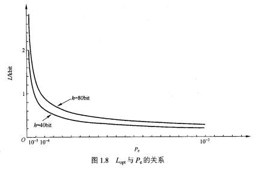
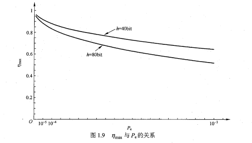
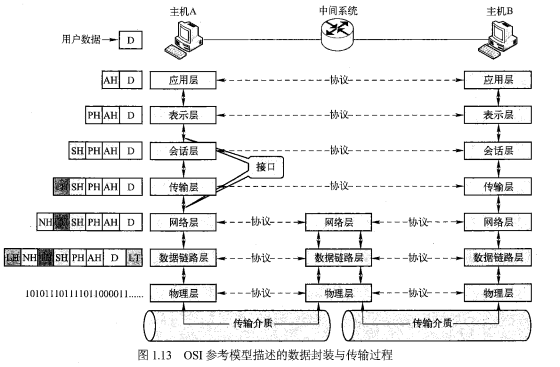

## 计算机网络概念

> _计算机网络定义: 利用通讯设备和通讯链路或者通讯网络,互连位置不同,功能自治的计算机系统_
>
> 自治:计算机系统彼此独立,不存在主从或者控制与被控制关系
>
> 互连:利用通讯链路连接两个相互独立的计算机系统
>
> #### 协议定义
>
> > - 语法(syntax)
> >
> >   > 定义实体之间交换信息的格式与结构
> >
> > - 语义
> >
> >   > 包含控制信息(地址,响应,差错检测)
> >
> > - 时序
> >
> >   > 同步处理(定义实体之间交换信息的顺序和匹配之间速度)
>
> #### 功能
>
> > - 硬件资源共享
> > - 软件资源共享
> > - 信息资源共享
>
> #### 分类
>
> > ###### 覆盖范围
> >
> > - 个域网(PAN)
> >
> >   > 蓝牙技术,个人穿戴设备共联 (1~10m)
> >
> > - 局域网(LAN)
> >
> >   > 10m~1Km 
> >
> > - 城域网(MAN)
> >
> >   > 覆盖城市网络(5~50km)
> >
> > - 广域网(WAN)
> >
> >   > 跨省市连接网络
> >
> > ###### 拓扑分类
> >
> > - 星形
> >
> >   >网络中主机点对点连接中央结点(局域网/个域网),受限于中心结点
> >
> > - 总线
> >
> >   >使用广播信道为公共线路(易产生冲突,排查困难)
> >
> > - 环形
> >
> >   > 将结点连成环,发送数据的结点负责清除其发送的数据
> >
> > - 网状
> >
> >   > 网络结构复杂,造价成本高,协议选择困难(适用于广域网)
> >
> > - 树形
> >
> > - 混合
> >
> > ###### 交换方式分类
> >
> > > - 电路
> > > - 分组
> > > - 报文
> >
> > ###### 用户属性分类
> >
> > > - 公用网
> > > - 私有网
>
> #### 网络结构
>
> > - 网络边缘(network edge)
> >
> >   - 使用终端设备
> >
> > - 接入网络(access network) 
> >
> >   - > _边缘设备接入网络技术_
> >
> >     - 电话拨号接入
> >     - ADSL非对称数字用户
> >     - 同轴电缆HFC网络接入
> >     - 局域网(光纤到户户,WIFI)
> >     - 移动接入网络(2/3/4G)
> >
> > - 核心网络(network core)
> >
> >   - 分组交换设备(路由器和交换机)
>
> #### 数据交换技术
>
> > _计算机网络的根本目的是在网络边缘的主机之间实现相互的数据交换,_
> >
> > - 电路交换
> >
> >   > 建立电路->数据传输->拆除电路 __电路建立之后两个主机的物理通道被占用__
> >
> > - 报文交换
> >
> >   > _发送方把信息附加上发送/接收主机的地址及其他控制信息,构成一个完整的报文,以报文为单位在网络结点上进行存储和转发_
> >
> > - 分组交换
> >
> >   > _将上诉报文进一步切割成较小的数据块,加上地址,序号,等控制信息构成分组(packet)发送到目的主机,进行分组重装_
> >   >
> >   > 与报文交换相比较
> >   >
> >   > - 交换设备存储容量低
> >   > - 交换速度快
> >   > - 可靠1传输效率高
> >   > - 公平传输
> >
> >   - __分组长度的确定__
> >
> >   > 1. 分组长度与延迟时间
> >   >
> >   > 2. 分组长度与误码率
> >   >
> >   >    > $P_s = (1-P_e)^{x+h}$   $P_e$ 为误码率  $P_s$ 分组传输正确概率   x+h为数据长度
> >   >    >
> >   >    > 分组传输错误要求重发概率为$(1-P_s)$ 联系多次传输错误的情况下最佳分组长度为$L_{opt}$
> >   >    >
> >   >    > > $L_{opt} = \sqrt{\frac{h}{P_e}}$ 
> >   >    > >
> >   >    > > $n_{max} = (1-\sqrt{hP_e})^2$
> >   >    > >
> >   >    > >  
> >   >    > >
> >   >    > >  
> >   >    > >
> >   >    > > __目前,有关分组数据交换的规格制定出__
> >   >    > >
> >   >    > > - 16B ~ 4096B之间
>
> #### 网络性能
>
> > ###### 速率和带宽
> >
> > > _速率: 时网络单位时间内传送的数据量,描述网络数据传输的快慢 data rate 基本单位为bit/s(位每秒)_
> > >
> > > 带宽:表示链路中或信道中最高速率
> >
> > ###### 时延(delay)
> >
> > > - 结点时延
> > >
> > >   > 结点阻塞时长
> > >
> > > - 排队时延
> > >
> > > - 传输时延
> > >
> > >   > $d_t = L / R$ 
> > >
> > > - 传播时延
> > >
> > >   > $d_p = D/V$
> >
> > ###### 时延带宽积
> >
> > >  $G = d_p \times R$
> >
> > ###### 丢包率
> >
> > ###### 吞吐量(bit/s)
>
> #### 网络体系结构
>
> >  
> >
> > - 物理层
> >
> > - 数据链层
> >
> >   > 保证相邻结点之间数据可靠有效传输(以帧为单位)
> >   >
> >   > MAC地址,CSMA\CD协议
> >
> > - 网络层
> >
> >   > 分组通过交换网络传送目的主机(数据转发和路由),IP协议
> >
> > - 传输层
> >
> >   > 计算机-网络交换点之间信息传输(端到端之间可靠数据传输,流量控制,阻塞机制等)
> >
> > - 会话层
> >
> >   > 鉴权
> >
> > - 表示层
> >
> >   > 统一字符集,压缩,数据解密,字符编码
> >
> > - 应用层
> >
> >   > 文件传输,电子邮件,提供用户网络服务
>
> #### TCP/IP参考模型
>
> > - 应用层
> >
> >   > TCP/IP 对应会话层表示层
> >
> > - 传输层
> >
> >   > 两个主机之间进程通讯
> >
> > - 网络互联层
> >
> >   > TCP/IP为核心,将数据分组发往目的网络或主机
> >
> > - 网络接口层
>
> 