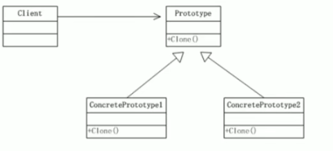

## 原型模式(ProtoType Pattern)

> **用于创建重复的对象,同时保证性能**
>
> **主要解决在运行时建立和删除原型,避免new操作**
>
> Java中使用原型模式通过复写clone方法完成(以二进制流方式进行拷贝,重新分配内存块)
>
> 
>
> #### 深拷贝与浅拷贝(Shalow/Deep)
>
> > 1. 基本数据类型和字符串的赋值为传递类型赋值
> > 2. 对象,数组赋值模式为引用类型赋值
> >
> > **深拷贝**
> >
> > > 1. 使用Cloneable接口对每一个对象进行Clone (依赖对象都实现Cloneable接口,并重写Clone)
> > > 2. 使用对象 序列化实现深拷贝(读写流方式)
>
> > __两个对象共享了一个私有变量为浅拷贝(引用)__
>
> **原型模式UML**
>
>  
>
> 
>
> **原型模式应用**
>
> - 性能比直接new好
> - 逃避构造方法的约束
> - Spring中Bean中使用是否单例/Prototype
>
> 使用场景
>
> - 类初始化时候需要消化非常多的资源
> - 数据准备
>

