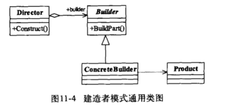

## 建造者 模式(Builder Pattern)

> 将一个__复杂对象的构建与它的表示分离,使得同样的构建过程可以创建不同的表示__
>
> _建造者模式关注的是零件类型和执行顺序_
>
> - 封装性(客户端不需要了解对象内部组成细节)
> - 建造者独立,容易扩容(ConcreateBuilder)
> - 便于控制细节风险(Director控制构造细节)
>
> ###### 使用场景
>
> > - 相同的方法,不同执行顺序,产生不同的事件结果
> > - 多个部件装配到一个对象中,产生的运行结果不同
> > - 产品类非常复杂,通过调用顺序产生不同产品
>
>  
>
> - Product 产品类
>
>   > 实现模版方法模式,存在模版方法和基本方法
>   >
>   > ~~~java
>   > /**
>   >  * 产品类
>   >  * 通过参数不同构建不同类型产品
>   >  */
>   > @Data
>   > @NoArgsConstructor
>   > @AllArgsConstructor
>   > public class Computer {
>   >     private String cpu;//必须
>   >     private String ram;//必须
>   >     private String usbCount;//可选
>   >     private String keyboard;//可选
>   >     private String display;//可选
>   > 
>   >     public Computer(String cpu, String ram) {
>   >         this.cpu = cpu;
>   >         this.ram = ram;
>   >     }
>   > 
>   >     /**
>   >      * 使用Builder构造类
>   >      *
>   >      * @param builder
>   >      */
>   >     private Computer(Builder builder) {
>   >         this.cpu = builder.cpu;
>   >         this.ram = builder.ram;
>   >         this.usbCount = builder.usbCount;
>   >         this.keyboard = builder.keyboard;
>   >         this.display = builder.display;
>   >     }
>   > 
>   >     /**
>   >      *  模版方法
>   >      */
>   >     public static class Builder {
>   >         private String cpu;//必须
>   >         private String ram;//
>   >         private String usbCount;//可选
>   >         private String keyboard;//可选
>   >         private String display;//可选
>   >         public Builder(String cup, String ram) {
>   >             this.cpu = cup;
>   >             this.ram = ram;
>   >         }
>   >         public Builder setUsbCount(String usbCount) {
>   >             this.usbCount = usbCount;
>   >             return this;
>   >         }
>   >         public Builder setKeyboard(String keyboard) {
>   >             this.keyboard = keyboard;
>   >             return this;
>   >         }
>   >         public Builder setDisplay(String display) {
>   >             this.display = display;
>   >             return this;
>   >         }
>   >         public Computer build() {
>   >             return new Computer(this);
>   >         }
>   >     }
>   > }
>   > 
>   > ~~~
>   >
>   > 
>
> - Builder抽象创造者
>
> > 规范产品的组建,一般是由子类实现
> >
> > ~~~java
> > /**
> >  * 抽象构者类(约束产品相关特性),由它来组件各种产品类型的电脑
> >  * 

> >  * (子类具体实现)
> >  */
> > public abstract class ComputerBuilder {
> >     public abstract void setUsbCount();
> >     public abstract void setKeyboard();
> >     public abstract void setDisplay();
> >     //产品组装后获取类
> >     public abstract Computer getComputer();
> > }
> > ~~~
>
> - ConcreteBuilder具体建造者
>
> > 实现抽象类定义的所有方法
> >
> > ~~~java
> > /**
> >  * 具体产品实现类与产品类依赖
> >  * 设置MACComputer具体特征
> >  */
> > public class MacComputerBuilder extends ComputerBuilder {
> >     private Computer computer = null;
> > 
> >     public MacComputerBuilder(String cpu, String ram) {
> >         computer = new Computer(cpu, ram);
> >     }
> >     @Override
> >     public void setUsbCount() {
> >         computer.setUsbCount("2个雷电接口");
> >     }
> >     @Override
> >     public void setKeyboard() {
> >         computer.setKeyboard("苹果键盘");
> >     }
> >     @Override
> >     public void setDisplay() {
> >         computer.setDisplay("原彩显示屏");
> >     }
> >     @Override
> >     public Computer getComputer() {
> >         return computer;
> >     }
> > }
> > ~~~
>
> - Director导演类
>
> > 负责安排已有模块的顺序,告诉Builder开始创建
> >
> > ~~~java
> >  private ComputerBuilder computerBuilder = new MacComputerBuilder("M1", "16g");
> >      // 组装MAC电脑 (按业务逻辑执行顺序)
> >     public Computer makeMacComputer() {
> >         //使用ComputerBuilder构造出MAC电脑(构造先后逻辑顺序定义)
> >         computerBuilder.setKeyboard();
> >         computerBuilder.setUsbCount();
> >         computerBuilder.setDisplay();
> >         return computerBuilder.getComputer();
> >     }
> > ~~~
> >
> > 
>
>  
>
> 

