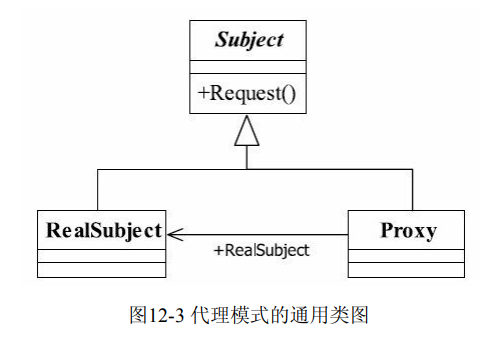
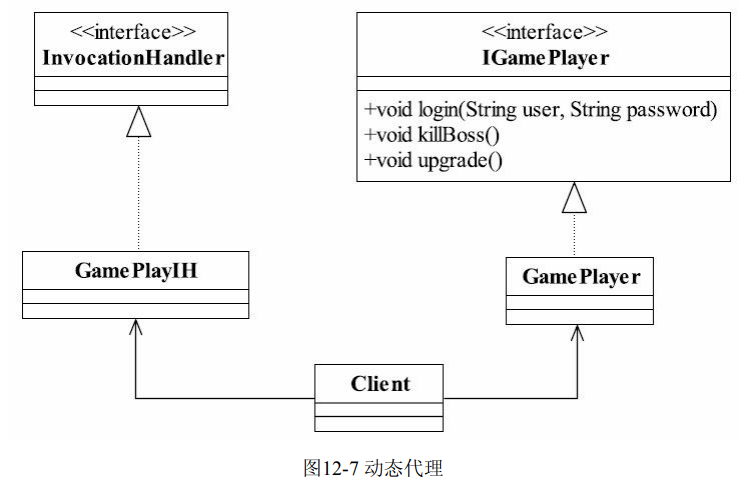

## 代理模式(Proxy Pattern)

> **为其他对象提供一种代理控制这个对象访问**
>
> 静态代理(代理类和被代理类实现统一接口,代理类组合被代理类完成接口方法增强)
>
> **代理模式,适配器与装饰者区别**
>
> > 适配器是将以实现的接口替代其他类方法(适配类继承转换类)
> >
> > 代理和被代理实现同一个接口,并使用代理类对原先实现的**方法进行控制访问(使用代理类对原先类进行访问)**
> >
> > 装饰者模式对原先的方法进行功能加强(抽象继承)
>
>  
>
> - Subject 抽象主题
>
> > 抽象类/接口,与业务进行定义
>
> - RealSubject 具体主题
>
>   > 被委托角色,业务逻辑具体执行者
>
> - Proxy代理主题
>
>   > 抽象主题的方法__限制委托__给具体实现类,并在具体实现类__之前或者之后增强工作__
>
> #### 动态代理
>
> > **基于JDK接口动态代理**
> >
> > ~~~java
> > // 生成动态代理实例   
> > Object newProxyInstance(ClassLoader loader,Class<?>[] interfaces,
> >                                           InvocationHandler h)
> > // 该方法用于获取指定代理对象所关联的InvocationHandler
> > InvocationHandler getInvocationHandler(Object proxy) 
> > //获取关联于指定类装载器和一组接口的动态代理类的类对象
> > Class getProxyClass(ClassLoader loader, Class[] interfaces) 
> > //该方法用于判断指定类是否是一个动态代理类
> > boolean isProxyClass(Class cl)    
> > ~~~
> >
> > 
> >
> > _动态代理实现代理的职责，业务逻辑Subject实现相关的 逻辑功能，两者之间没有必然的相互耦合的关系。通知Advice从另一个切面切入，最终在高 层模块也就是Client进行耦合，完成逻辑的封装任务_
>
> > **基于Cglib代理(基于继承方式实现)**
> >
> > - JDK的动态代理有一个限制,就是使用动态代理的对象必须实现一个或多个接口,如果想代理没有实现接口的类,就可以使用Cglib实现.
> > - Cglib是一个强大的高性能的代码生成包,**它可以在运行期扩展java类与实现java接口**.它广泛的被许多AOP的框架使用,例如Spring AOP和synaop,为他们提供方法的interception(拦截)
> > - Cglib包的底层是通过**使用一个小而块的字节码处理框架ASM来转换字节码并生成新的类**.不鼓励直接使用ASM,因为它要求你必须对JVM内部结构包括class文件的格式和指令集都很熟悉.
> >
> > <dependency>
> >   <groupId>cglib</groupId>
> >   <artifactId>cglib</artifactId>
> >   <version>3.3.0</version>
> > </dependency>

## AOP(面向切面编程)

> - 切面(Aspect)
>
> > 关注点的模块化,增强类地方
>
> - 连接点(JoinPoint)
>
> > 程序执行过程中指定位置(一个连接点代表一个方法执行)
>
> - 通知(Advice)
>
>   > 连接点执行的具体动作(事件) before  afterReturn  afterThrow  after  around  
>
> - 切入点(Pointcut)
>
> > 通知具体的执行位置

