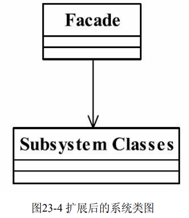
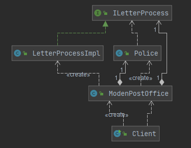

## 外观模式(FacadePattern)

> _不改变子系统对外暴露的接口,方法,只改变内部的处理逻辑,其他兄弟模块的调用产生不同的结果_
>
> 要求一个子系统的外部与其内部的通讯必须通过一个统一的对象进行,门面模式提供一个高层次的接口,使得子系统易于使用
>
> 门面模式注重统一的对象.也是提供一个访问子系统的接口,除这个接口不允许有任何访问子系统的行为发生
>
> - 减少系统的相互依赖
> - 提高安全性
> - 不符合开闭原则(对扩展不好)
>
> **使用场景**
>
> 1. 为复杂的模块/子系统提供一个供外界访问的接口
> 2. 子系统相对独立
>
>  
>
>  
>
> - Facade 门面 (ModenPostOffice)
>
> > 客户端可以调用这个角色方法,此角色知晓子系统的所有功能和职责(继承),该类会把客户端请求委派到子系统中实现(没有实际的业务逻辑)
>
> - Subsystem子系统角色(Police,LetterProcessImpl)
>
>   > 具体实现的逻辑
>
> 

