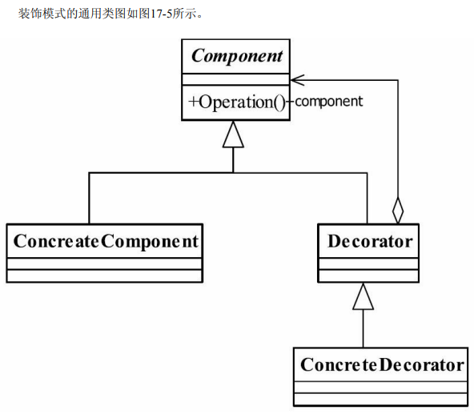
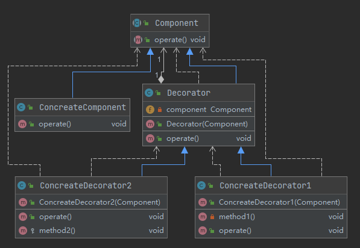

## 装饰模式(Decorator Pattern)

> 动态地给一个对象添加一些__额外的职责__(特殊的代理类),装饰器模式比子类更为灵活
>
> - __装饰者与被装饰者无任何依赖关联__
> - 装饰者时继承关系的替代方案(is-a 组合关系,代理模式)
> - **装饰模式可以动态扩展一个实现类的功能**
>
> #### **桥接模式与装饰模式区别**
>
> > - **桥接模式将结构与实现分离(侧重于类功能和实现的变化)对属性/方法进行分离**
> > - **桥接模式扩展通常在抽象类中加入其他类进行功能扩展(聚合)**
> > - **装饰者模式对与装饰的功能包装成一个独立的功能类(在原方法上加强)**
>
>  
>
> - Component抽象构件
>
> > 抽取要装饰功能方法
>
> - ConcreateComponent 
>
> > 被装饰者(继承Component),需要装饰的实现类
>
> - Decorator 装饰者
>
> > 装饰Component中方法(继承Component)
>
> - ConcreateDecorator 装饰实现类
>
> >   
> >
>
> 

