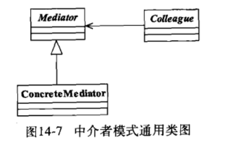
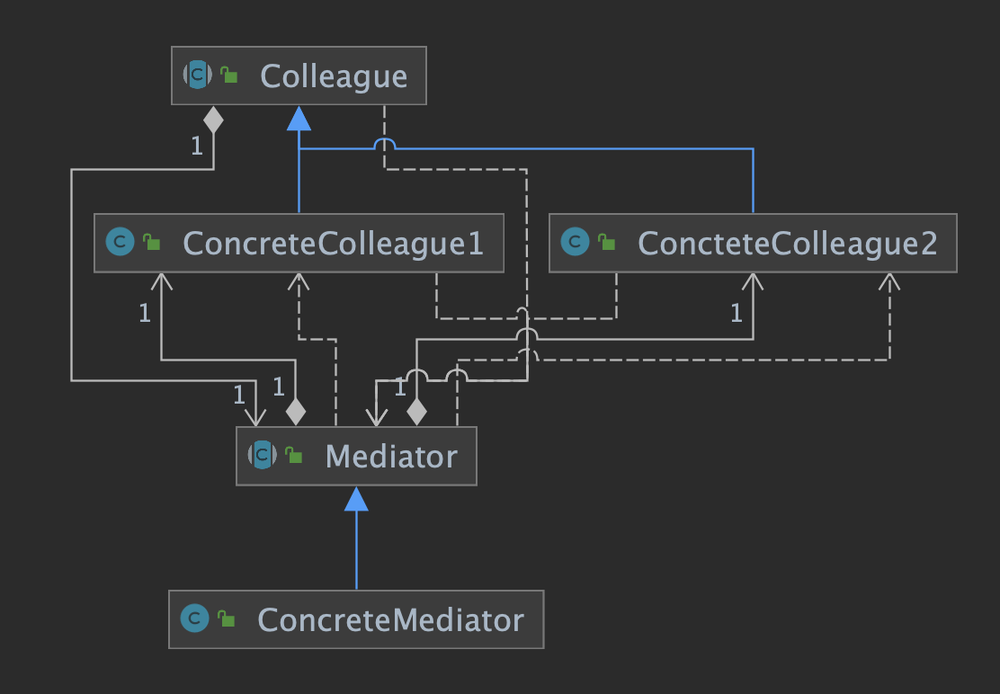

## 中介模式(Mediator Pattern)

> **降低多个对象和类之间的通信复杂性,提供一个中介类,该类通常处理不同类之间的通信,并支持松耦合,使代码易于维护**
>
> *使用一个中介对象来封装一系列的对象交付,中介者使各对象不需要显示地相互引用,独立地改变它们之间的交互*
>
> **应用实例**:
>
> -  MVC框架中C(控制器)就是M(模型)和V(视图)的中介者
>
> **使用场景:**
>
> 1. 系统中对象之间存在比较复杂的引用关系,导致它们之间的依赖关系结构混乱而且难以复用该对象
> 2. 通过一个中介类来封装多个类中的行为,不用产生太多子类
> 3. 把原有的一对多的依赖变成一对一的依赖,通信类只依赖中介者,降低类之间耦合
>
>  
>
> - Mediator(抽象中介者)
>
> > 约束各对象之间的通信
>
> - Concrete Mediator(具体中介者)
>
> > 实现对象之间通信过程
>
> - Colleague(同事角色)
>
> > 依赖于具体中介角色,使其角色之间通信
>
> 

