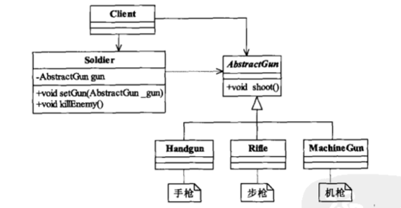

## 设计原则

#### 单一职责原则(Single Responsibility Principle)

> _There should never be more than one reason for a class to change_
>
> 单一职责原则__要求一个接口或者类只有一个原因引起变化__(一个接口或一个类负责一个功能)
>
> - 类的复杂性降低,实现职责有明确定义
> - 可读性高,复杂性降低
> - 维护成本高
> - 更改引起的风险降低
>
>  

#### 里氏替换原则(LiskovSubstitution Principle LSP)

> 继承带来的优点与缺点
>
> > - 代码共享,减少类的创建,提高代码的重用性
> > - 提高代码的可扩展性
> > - 继承存在代码侵入(子类拥有父类的所有方法)
> > - 降低代码灵活性(存在父类约束)
> > - 增强耦合性,父类更改需要考虑子类的变动
>
> 定义
>
> > 存在类型S的对象$s_1$,类型T的对象$t_1$, 使得以T定义所有的对象$t_1 都替换成 s_1$时,程序的逻辑没有发生变化,那么类型S是类型T的子类型(__所有引用基类的地方必须透明的使用其子类的对象__)
>
> - 子类必须完全实现父类的方法(类中调用其他类时,务必使用父类或接口)
>
>    
>
> - 子类可以自定义行为(子类不能代替父类出现)
>
> - 覆盖或者实现父类的方法输入参数时可以被放大(__不同类中重载__)
>
>   > ~~~java
>   > public class Father{
>   >   public Collection doSomething(HashMap map){
>   >     doSomething....;
>   >   }
>   > }
>   > 
>   > public class Son extends Father{
>   >   public Collection doSomething(Map map){
>   >     doSomething...;
>   >   }
>   > }
>   > ~~~
>   >
>   > __参数放大__,使用重载方式调用父类方法(子类方法永远不会执行)
>   >
>   > __子类方法中的前置条件必须与超类中被覆写的方法前置条件相同或者更宽松__
>
> - 覆写或实现父类的方法输出结果时可以被缩小
>
> > 子类重载或覆写父类方法,其__返回值必须一致或父类实现的子类__

#### 依赖倒置原则(Dependence Inversion Principle  DIP)

> _High level modules should not depend upon low level modules. Both should depend upon abstractions, Abstraction should not depend upon details, Details should depend upon abstraction_
>
> - 模块间的依赖通过抽象发生,实现类之间不发生直接的依赖关系,其依赖关系通过接口或抽象类产生的
> - 接口或抽象类不依赖于实现类
> - 实现类依赖接口或抽象类
>
> ###### 面向接口编程OOD(面向对象设计)
>
> _依赖倒置原则可以减少类间的耦合性,提高系统的稳定性,降低并行开发引起的风险_
>
> __依赖实现__
>
> - 构造函数传递依赖对象
>
>   ~~~java
>   public interface IDriver{
>     public void drive()
>   }
>   public class Driver implements IDriver{
>     private ICar car;
>     public Driver(ICar car){
>       this.car = car
>     }
>     public void drive(){
>       this.car.run();
>     }
>   }
>   ~~~
>
> - Setter方法传递依赖对象
>
> - 接口声明依赖对象
>
> > 任何类都不应该从具体类派生
> >
> > 尽量不要覆写基类方法

#### 接口隔离原则

> - 接口尽量小
>
> > __根据接口隔离原则拆分接口时,首先考虑是否满足单一职责原则__
>
> - 接口高内聚
>
> > __提高接口,类,模块的处理能力,减少对外的交互(不依赖其他功能)__
>
> - 定制服务
>
> > __只提供访问者需要的方法__

#### 迪米特法则(Law of Demeter LoD)

> _一个对象应该对其他对象有最少的了解_
>
> 朋友类定义:_出现在成员变量,方法的输入输出参数中的类称为朋友类,出现在方法体内部的类不属于朋友类_
>
> __类之间的依赖应该体现方法的入参和出参上(类与类之间的关系建立在类间,而不是方法上,因此一个方法尽量不引入一个类中不存在的对象)__
>
> __控制类中方法和属性的访问权限__

#### 开闭原则定义(实现通过接口约束)

> _Software entities like classes, modules and function是should be opne for extension but closed for modifications_
>
> 一个软件应该通过扩展来实现变化,而不是通过修改已存在的代码实现内部变化
>
> -  使用抽象约束
>
> > 抽象是对一组事务通用描述,通过接口或抽象类可以约束一组可能发生变化的行为
>
> - 元数据控制模块行为
>
> > ___用来描述环境和数据的数据(配置参数),控制反转(Inversion of Control),父类进行声明,扩展子类进行实现___
>
> - 封装变化
>
> > _将相同变化封装到一个接口或抽象类中,不应该有两个不通变化出现在同一个接口中_
>
> 

