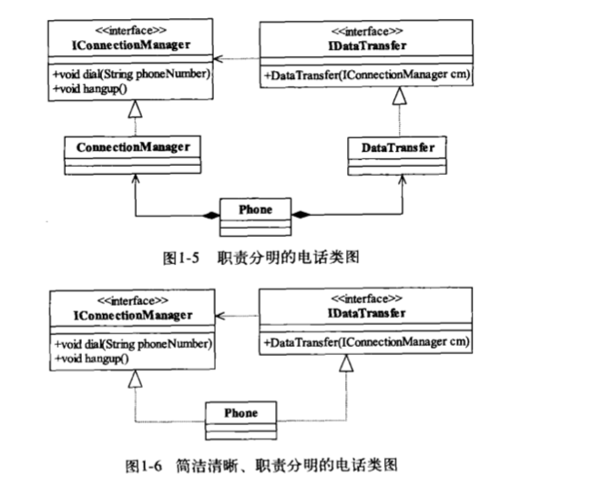

## 设计原则(耦合性,内聚性,可维护性,易扩展性,重用,灵活)

- __单一职责(SLP)__

- __接口隔离(ISP)__

- __里氏替换(LSP)__

- __依赖倒置(DIP)__

- __迪米特法__

- __开闭原则(OCP)__

- **合成复用原则(CRP)**

  

#### 单一职责原则(Single Responsibility Principle)

> 一个类应该只负责一项职责(方法/类 单一原则)
>
> - 类的复杂性降低,实现职责有明确定义
>- 可读性高,复杂性降低
> - 维护成本高
> - 更改引起的风险降低
> 
>  

#### 里氏替换原则(继承规范)

> 继承带来的优点与缺点
>
> > - 代码共享,减少类的创建,提高代码的重用性
> > - 提高代码的可扩展性
> > - 继承存在代码侵入(子类拥有父类的所有方法)
> > - 降低代码灵活性(存在父类约束)
> > - 增强耦合性,父类更改需要考虑子类的变动
>
> 定义
>
> > 存在类型S的对象$s_1$,类型T的对象$t_1$, 使得以T定义所有的对象$t_1 都替换成 s_1$时,程序的逻辑没有发生变化,那么类型S是类型T的子类型(__所有引用基类的地方必须透明的使用其子类的对象__)
>
> - 使用继承时,子类尽量不重写父类中方法
> - 原来父类和子类继承一个更通俗的基类,原因的继承关系去掉,使用聚合,组合,依赖代替继承关系
>
> ```java
> package org.example.Liskov;
> 
> /**
>  * 解决方案
>  * 创建更继承的基类
>  */
> class Base {
>   // 把基础类方法和成员放到Base类
> }
> 
> 
> class Liskov_A {
>     public int func1(int a, int b) {
>         return a - b;
>     }
> }
> 
> /**
>  *  子类重写父类方法 违反里氏原则
>  *  使其原有逻辑发生改变
>  */
> class Liskov_B extends Liskov_A {
> 
>     @Override
>     public int func1(int a, int b) {
>         return a + b;
>     }
> 
>     public int func2(int a, int b) {
>         return func1(a, b) + 9;
>     }
> }
> ```
>
> 

#### 依赖倒置原则(Dependence Inversion Principle  DIP)

> _依赖倒置原则可以减少类间的耦合性,提高系统的稳定性,降低并行开发引起的风险_
>
> - 高层模块不应该依赖底层模块,二者通过抽象/接口实现依赖关系
>
>   > 不可分割的原子逻辑为底层模块,原子逻辑组装层高级模块
>
> - 抽象不应该依赖细节,细节应该依赖抽象
>
> > 抽象:接口/抽象类(不可实例化)
> >
> > 细节:实现类(继承,实现的类)
>
> - 面向接口编程(OOD)
> - 继承时遵循里氏替换原则
>
> _Java中依赖倒置原则定义为,类间依赖通过抽象发生,实体类之间不发生直接的依赖关系,接口或抽象类不依赖实现类,实现类依赖接口或抽象类_
>
> 

#### 接口隔离原则(Interface Segregation Principe)

> - 一个类对另一个类的依赖使用接口方式实现
>
> - 客户端使用__最小依赖的接口__(客户端不使用的方法不应该提供使用)
>
>   ~~~java
>   package org.example.Segregate;
>         
>   /**
>    * 违反接口隔离原则
>    *
>    */
>   public interface UnSegregate {
>       void operation1();
>       void operation2();
>       void operation3();
>       void operation4();
>   }
>         
>   class B implements UnSegregate {
>       @Override
>       public void operation1() {
>           System.out.println("B 实现 Segregate 中 operation1 方法");
>       }
>         
>       @Override
>       public void operation2() {
>           System.out.println("B 实现 Segregate 中 operation2 方法");
>       }
>         
>       @Override
>       public void operation3() {
>           System.out.println("B 实现 Segregate 中 operation3 方法");
>       }
>         
>       @Override
>       public void operation4() {
>           System.out.println("B 实现 Segregate 中 operation4 方法");
>       }
>   }
>         
>   class D implements UnSegregate {
>         
>       @Override
>       public void operation1() {
>           System.out.println("D 实现 Segregate 中 operation1 方法");
>       }
>         
>       @Override
>       public void operation2() {
>           System.out.println("D 实现 Segregate 中 operation1 方法");
>       }
>         
>       @Override
>       public void operation3() {
>           System.out.println("D 实现 Segregate 中 operation1 方法");
>       }
>         
>       @Override
>       public void operation4() {
>           System.out.println("D 实现 Segregate 中 operation1 方法");
>       }
>   }
>         
>   /**
>    * 客户端A依赖接口UnSegregate(只使用operation1,operation2)
>    * 违反接口隔离原则
>    */
>   class A {
>       public void depend1(UnSegregate a){
>           a.operation1();
>       }
>       public void depend2(UnSegregate a){
>           a.operation2();
>       }
>         
>   }
>         
>   /**
>    * 客户端C依赖接口UnSegregate(只使用operation3,operation4)
>    * 违反接口隔离原则
>    */
>   class C {
>       public void depend3(UnSegregate a){
>           a.operation3();
>       }
>       public void depend4(UnSegregate a){
>           a.operation4();
>       }
>   }
>   ~~~
>
>   
>

#### 迪米特法则(Law of Demeter LoD)

> __一个对象应该对其他对象保存最少的了解(类与类关系密切,耦合度越大)__
>
> 只与朋友类进行通讯
>
> 朋友类定义:__出现在成员变量,方法的输入输出参数__中的类称为朋友类,出现在方法体内部的类不属于朋友类
>
> 类之间的依赖应该体现方法的入参和出参上(类与类之间的关系建立在类间,而不是方法上,因此一个方法尽量不引入一个类中不存在的对象)
>
> 降低类之间的耦合

#### 开闭原则定义(使用抽象方法/接口进行扩展约束)

> 一个软件应该通过扩展来实现变化,而不是通过修改已存在的代码实现内部变化(用抽象创建框架,用实现扩展细节)
>
> ~~~java
> /**
>  * 抽象类
>  * 使用 抽象方法/接口约束功能
>  */
> abstract class Shape {
>     public abstract void draw();
> }
> 
> class Rectangle extends Shape {
> 
>     @Override
>     public void draw() {
>         System.out.println("绘制矩形");
>     }
> }
> 
> class Triangle extends Shape {
>     @Override
>     public void draw() {
>         System.out.println("h绘制三角形");
>     }
> }
> 
> class Circle extends Shape {
>     @Override
>     public void draw() {
>         System.out.println("绘制圆形");
>     }
> }
> 
> /**
>  * 使用多态调用具体实现子类(不用修改原有代码逻辑)
>  *
>  * 使用方依赖抽象方法实现功能
>  *
>  * 实现开闭原则
>  */
> class GraphicEditor {
>     public void drawShape(Shape shape) {
>         shape.draw();
>     }
> }
> ~~~
>
> 
>
> -  使用抽象约束
>
> > 抽象是对一组事务通用描述,通过接口或抽象类可以约束一组可能发生变化的行为
>
> - 元数据控制模块行为
>
> > ___用来描述环境和数据的数据(配置参数),控制反转(Inversion of Control),父类进行声明,扩展子类进行实现___
>
> - 封装变化
>
> > _将相同变化封装到一个接口或抽象类中,不应该有两个不通变化出现在同一个接口中_

#### 合成复用原则(Composite Reuse Principle)

> 尽量使用合成/聚合的方式,而不是使用继承

